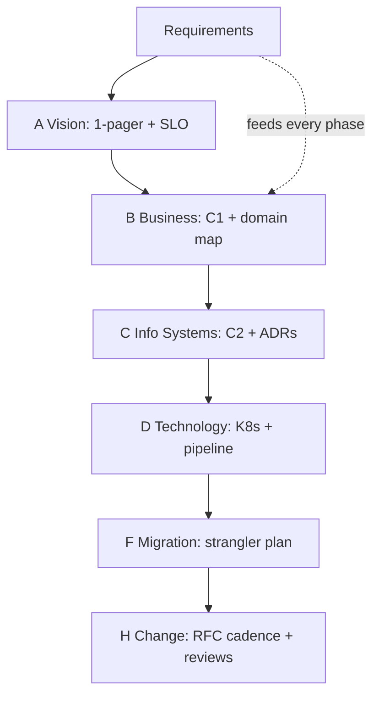

## Why it Matters

You will rarely apply TOGAF literally, but its vocabulary shows up in every enterprise interview and every audit conversation. Borrowing the useful skeleton, a repository, a principles catalogue, a repeatable ADM slice, gives just enough governance to be credible in a bank without burying a startup in ceremony.

## Diagram



## Code

```java
// Minimal ADM slice for a Spring shop:
// A Vision: 1-pager (drivers, scope, success SLO)
// B Business: C1 context + domain map (DDD strategic)
// C InfoSys: C2 containers + ADRs // D Tech: K8s runtime + pipeline
// E-H: migration plan (strangler) + governance (RFC cadence) + review
// Deliverable: C4 + ADR log + principle list — that's 80% of TOGAF value
```

## When to use / not

- Enterprise roles interviews (banks, gov).
- Portfolio with 50+ systems needing catalog discipline.
- CPSA-Foundation exam prep.

**When NOT:** Full ADM for a startup MVP; memorizing metamodel for interviews instead of tradeoffs; buying a tool before a practice.

## Trade-offs

| Pros | Cons |
|---|---|
| Shared enterprise vocabulary | Ceremony overhead if applied literally |
| Traceability biz→tech | Generic, still need C4/DDD for real design |
| Checklist against blind spots | Certification ≠ judgment |

## Vs

- **Vs C4/DDD:** TOGAF governs the *portfolio lifecycle*; C4 draws it, DDD carves it, complementary, not rivals.
- **Vs agile 'no docs':** borrow principles + repository + compliance reviews; skip 200-page templates.

## Pitfalls

- Quoting framework instead of answering the tradeoff.
- Architecture repository nobody can find (put it in Git).
- Governance as gatekeeping (review SLA + appeal path).

## Interview q&a

**Q: Name the ADM phases in one breath?**
A: Preliminary → A Vision → B Business → C Info Systems → D Technology → E Opportunities → F Migration → G Implementation → H Change (+ Requirements hub).

**Q: What iSAQB topics matter most?**
A: Quality attributes/scenarios, views/viewpoints, patterns, documentation (arc42/C4), evaluation (ATAM lite).

**Q: How do you sell this to a startup?**
A: Principles + C4 + ADRs + RFC lane = 'TOGAF-lite'; add catalog/compliance only when portfolio pain appears.

## Related

- [[01_C4-Modeling]] · [[03_Review-Process-RFC]] · [[02_Requirements-Quality-Attributes/Fitness-Functions]]

# TOGAF & ISAQB Primer, What to Borrow

> **Intent:** Borrow the vocabulary (ADM phases, viewpoints, governance) without the bureaucracy: use just enough ceremony for your risk level.
