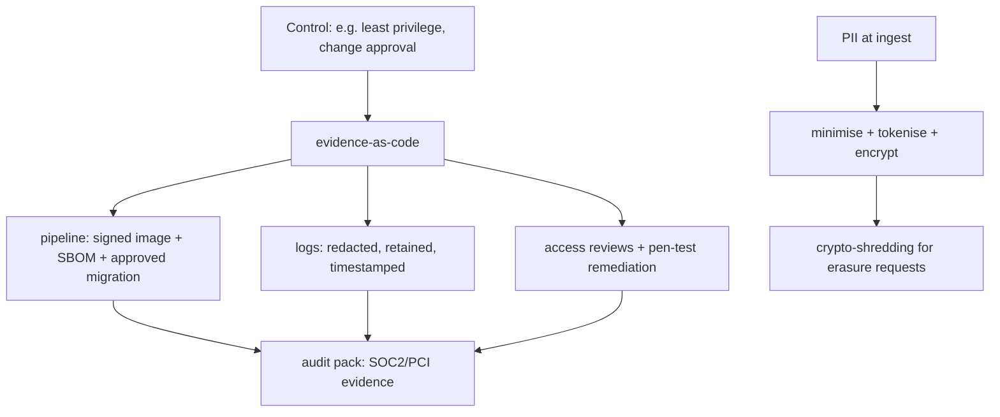

## Why it Matters

Compliance is not a document assembled the week before an audit, it is a property of the pipeline. When controls are expressed as automated evidence (signed images, reviewed migrations, encrypted PII, access reviews), proving them costs almost nothing and the same artefacts serve SOC 2, PCI and GDPR at once. Skipping it doesn't avoid the cost; it moves it to the most expensive possible moment.

## Diagram



## Code

```java
// Evidence-as-code examples:
// - Signed images + SBOM (Trivy) attached to release tag
// - Flyway migrations reviewed + applied by pipeline identity (not humans)
// - PII: @ColumnTransformer encrypt + audit log
@Entity class Customer {
 @Convert(converter = AesGcmConverter.class) String email; // encrypted at rest
}
// - Log redaction filter drops PAN/tokens; retention 90d -> cold storage
```

## When to use / not

- Handling cards (PCI DSS), PII (DPDP/GDPR), or bank data.
- SOC 2 Type II for enterprise deals.
- AI features touching personal data.

**When NOT:** Storing PAN/CVV 'temporarily'; audit screenshots assembled the night before; full-prod-data in staging.

## Trade-offs

| Pros | Cons |
|---|---|
| Unlocks enterprise/banking deals | Control toil without automation |
| Forces least-privilege + traceability | Data-residency constrains topology |
| Breach response is rehearsed | Scope creep (collect everything 'just in case') |

## Vs

- **Vs security-only:** security stops attackers; compliance *proves* it repeatedly with evidence + retention.
- **Vs anonymize-later:** tokenize/minimize at ingest; scrubbing dumps afterward always leaks.

## Pitfalls

- JWTs carrying PII into logs/CDN.
- Cross-border replication without data-residency check.
- Manual DB edits in prod (no ticket, no trace).

## Interview q&a

**Q: PCI scope killer?**
A: Never touch PAN, hosted fields/tokenization (provider holds data); segment card systems; no card data in logs.

**Q: GDPR/DPDP deletion vs backups?**
A: Crypto-shredding (per-user DEK destroy) + documented retention; backups age out per policy with attestation.

**Q: SOC 2 evidence?**
A: Change tickets + approvals, deploy logs, access reviews, pen-test + remediation, incident postmortems, all timestamped.

## Related

- [[01_Security-OAuth2-JWT]] · [[02_ADRs]] · [[05_Cloud-K8s-Deploy-Helm]]

# Compliance & Audit, SOC2, PCI, DPDP/GDPR

> **Intent:** Ship in regulated markets without slowing to a crawl: map controls to automated evidence (pipeline + logs + tickets).
