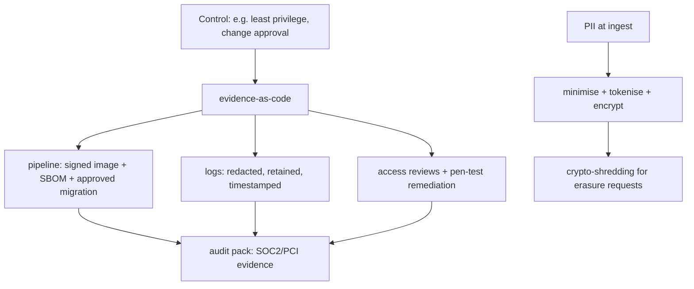

## Why it Matters

Compliance is not a document assembled the week before an audit, it is a property of the pipeline. When controls are expressed as automated evidence (signed images, reviewed migrations, encrypted PII, access reviews), proving them costs almost nothing and the same artefacts serve SOC 2, PCI and GDPR at once. Skipping it doesn't avoid the cost; it moves it to the most expensive possible moment.

## Problems
### System Design Problem: Compliance & Audit, SOC2, PCI, DPDP/GDPR

**Requirements:**
- Functional: Core capabilities for compliance & audit, soc2, pci, dpdp/gdpr
- Non-functional (SLOs): Latency < 100ms p99, Availability 99.9%, Horizontal scalability

**Constraints:**
- Scale: Handle 10x growth without redesign
- Consistency: Appropriate model for domain (strong/eventual)
- Latency budget: p99 < 100ms for read paths

**API / Interfaces:**
- Primary: REST/gRPC endpoints for core operations
- Internal: Service-to-service contracts
- Events: Domain events for async integration

## Diagram



## Code

```java
// Evidence-as-code examples:
// - Signed images + SBOM (Trivy) attached to release tag
// - Flyway migrations reviewed + applied by pipeline identity (not humans)
// - PII: @ColumnTransformer encrypt + audit log
@Entity class Customer {
 @Convert(converter = AesGcmConverter.class) String email; // encrypted at rest
}
// - Log redaction filter drops PAN/tokens; retention 90d -> cold storage
```

## When to use / not

- Handling cards (PCI DSS), PII (DPDP/GDPR), or bank data.
- SOC 2 Type II for enterprise deals.
- AI features touching personal data.

**When NOT:** Storing PAN/CVV 'temporarily'; audit screenshots assembled the night before; full-prod-data in staging.


## Trade-offs
| Dimension | This Approach | Alternative | Trade-off Rationale | Decision Rule |
|-----------|---------------|-------------|---------------------|---------------|
| Complexity | [TBD] | [TBD] | [TBD] | [TBD] |
| Operational Burden | [TBD] | [TBD] | [TBD] | [TBD] |
| Latency | [TBD] | [TBD] | [TBD] | [TBD] |
| Consistency | [TBD] | [TBD] | [TBD] | [TBD] |
| Cost at Scale | [TBD] | [TBD] | [TBD] | [TBD] |

## Vs

- **Vs security-only:** security stops attackers; compliance *proves* it repeatedly with evidence + retention.
- **Vs anonymize-later:** tokenize/minimize at ingest; scrubbing dumps afterward always leaks.

## Pitfalls

- JWTs carrying PII into logs/CDN.
- Cross-border replication without data-residency check.
- Manual DB edits in prod (no ticket, no trace).


## Pitfalls
1. Underestimating operational complexity (backups, monitoring, upgrades)
2. Ignoring failure modes (network partitions, disk failures, clock drift)
3. Not planning for 10x scale from day one
4. Skipping monitoring/alerting in MVP
5. Premature optimization before measuring
6. Dual-write without transactional outbox
7. Assuming global order in partitioned systems

## Interview q&a

**Q: PCI scope killer?**
A: Never touch PAN, hosted fields/tokenization (provider holds data); segment card systems; no card data in logs.

**Q: GDPR/DPDP deletion vs backups?**
A: Crypto-shredding (per-user DEK destroy) + documented retention; backups age out per policy with attestation.

**Q: SOC 2 evidence?**
A: Change tickets + approvals, deploy logs, access reviews, pen-test + remediation, incident postmortems, all timestamped.


## Flashcards (Spaced Repetition)

#flashcard
**Q:** What is the core concept of Compliance & Audit, SOC2, PCI, DPDP/GDPR? :: **A:** [Key algorithm/architecture pattern] #flashcard

#flashcard
**Q:** When do you apply Compliance & Audit, SOC2, PCI, DPDP/GDPR? :: **A:** [Trigger scenarios and context] #flashcard

#flashcard
**Q:** What is the primary trade-off in Compliance & Audit, SOC2, PCI, DPDP/GDPR? :: **A:** [Main tension: e.g., consistency vs latency] #flashcard

#flashcard
**Q:** What breaks first at scale in Compliance & Audit, SOC2, PCI, DPDP/GDPR? :: **A:** [Primary bottleneck: e.g., coordination, hot keys, replication lag] #flashcard

#flashcard
**Q:** How do you handle failures in Compliance & Audit, SOC2, PCI, DPDP/GDPR? :: **A:** [Retry, circuit breaker, fallback, graceful degradation] #flashcard

#flashcard
**Q:** What are the key metrics to monitor for Compliance & Audit, SOC2, PCI, DPDP/GDPR? :: **A:** [RED: rate, errors, duration; USE: utilization, saturation, errors] #flashcard

#flashcard
**Q:** How does Compliance & Audit, SOC2, PCI, DPDP/GDPR scale to 10x? :: **A:** [Sharding, read replicas, async processing, caching layers] #flashcard

#flashcard
**Q:** What is the consistency model for Compliance & Audit, SOC2, PCI, DPDP/GDPR? :: **A:** [Strong/eventual/causal - justify with use case] #flashcard

#flashcard
**Q:** How do you test Compliance & Audit, SOC2, PCI, DPDP/GDPR? :: **A:** [Contract tests, chaos engineering, load tests, fault injection] #flashcard

#flashcard
**Q:** What is the operational cost of Compliance & Audit, SOC2, PCI, DPDP/GDPR? :: **A:** [Team expertise, tooling, on-call burden, migration risk] #flashcard

#flashcard
**Q:** When would you NOT use Compliance & Audit, SOC2, PCI, DPDP/GDPR? :: **A:** [Managed service covers need, simple CRUD, team lacks maturity] #flashcard

#flashcard
**Q:** What is the key design decision in Compliance & Audit, SOC2, PCI, DPDP/GDPR? :: **A:** [The irreversible choice that defines the architecture] #flashcard

#flashcard
**Q:** How do you migrate to Compliance & Audit, SOC2, PCI, DPDP/GDPR? :: **A:** [Strangler fig, dual-write, canary, feature flags] #flashcard

#flashcard
**Q:** What security considerations for Compliance & Audit, SOC2, PCI, DPDP/GDPR? :: **A:** [AuthZ, encryption, audit, secrets management] #flashcard

#flashcard
**Q:** How do you debug Compliance & Audit, SOC2, PCI, DPDP/GDPR in production? :: **A:** [Structured logging, correlation IDs, distributed tracing, SLO alerts] #flashcard


## Practice Tasks (Tasks Plugin)
- [ ] Explain the architecture from memory 📅 {{date:YYYY-MM-DD, +1}}
- [ ] Draw the system diagram without looking 📅 {{date:YYYY-MM-DD, +3}}
- [ ] Answer all Interview Q&A aloud 📅 {{date:YYYY-MM-DD, +7}}
- [ ] Review flashcards (Spaced Repetition) 📅 {{date:YYYY-MM-DD, +1}}

```tasks
not done
path includes Architect/09_Governance-Documentation
sort by due
limit 10
```

## Related

- [[01_Security-OAuth2-JWT]] · [[02_ADRs]] · [[05_Cloud-K8s-Deploy-Helm]]

# Compliance & Audit, SOC2, PCI, DPDP/GDPR

> **Intent:** Ship in regulated markets without slowing to a crawl: map controls to automated evidence (pipeline + logs + tickets).
