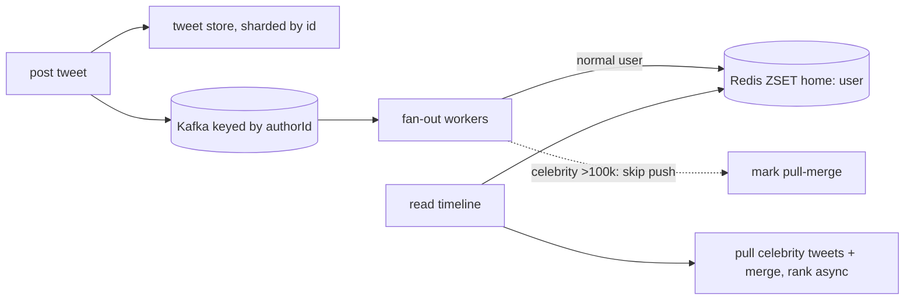

## Why it Matters

The feed drill is really a write-amplification problem disguised as a read problem: one celebrity post becomes ten million timeline writes. Everything else, hybrid fan-out, cursor pagination, ranking, follows from how you bound that amplification, which makes it the canonical answer-shape for any 1-to-N broadcast system.

## Diagram



## Code

```java
// POST /api/v1/tweets; GET /api/v1/timeline?cursor=&limit=20
@PostMapping("/api/v1/tweets") public Tweet post(@RequestBody PostTweet req) {
 Tweet t = tweetStore.save(req); // sharded by tweetId
 inbox.publish("tweet-created", t); // Kafka keyed by authorId
 return t; // fan-out is async, never blocking
}
// Fan-out worker: push to Redis timelines, except celebrities → pull-merge at read
// Timeline read: ZREVRANGE home:{user} + merged celebrity tweets, cursor pagination
```
Design: `Tweet-Svc → Kafka(tweet-created) → Fanout-Svc → Redis(home timelines, ZSET per user, trim 800) + Cassandra(tweets, user-timelines)`. **Hybrid fan-out:** normal users push; celebrities (>~100k followers) pull-merged at read time. Graph store (follow edges) in sharded Postgres/Neo4j-style adjacency.

## When to use / not

- Read-heavy with asymmetric follows (celebrity = 1 write → 10M reads); home timeline p95 < 200ms.
- Scale anchor: 200M DAU, ~500M tweets/day (~6k/s avg, 2× peak); timeline fetch ~100:1 vs post.
- **When NOT:** strict chronological completeness for all users, accept near-realtime + fallback merge.

## Trade-offs

| Pros | Cons |
|---|---|
| Push: O(1) timeline reads, low tail latency | Push: write amplification on celebrity posts |
| Pull for celebrities: bounds fan-out cost | Pull: slower reads, merge complexity |
| Redis timelines survive DB spikes | Duplication: N copies per tweet (TTL + trim) |

## Vs

- **Vs WhatsApp:** feed is 1-to-N broadcast with ranking; chat is 1-to-1 with delivery guarantees, different correctness bar.
- **Vs notification service:** both fan-out, but feed is pull-ranked while notifications are push-to-device.

## Pitfalls

- Pure push, one celebrity post DoSes the fan-out tier.
- Offset pagination on a moving timeline, duplicates/skips; use cursor.
- Synchronous fan-out on post request, p99 explodes; always async via Kafka.

## Interview q&a

**Q: Push vs pull vs hybrid?**
A: Push for normal (fast reads), pull-merge for celebrities (bounded writes). Threshold ~100k followers; popular hybrid answer scores full marks.

**Q: How do you rank / paginate?**
A: Precompute home ZSET by (score, time); cursor = last (score,id); rank in async job, never on read path. Ad/muted filters applied post-merge.

**Q: 10× spike (World Cup final)?**
A: Shed celebrity push first (force pull), extend Redis TTL, KEDA fan-out workers on Kafka lag, serve stale + `Retry-After` on post path.

## Related

- [[../07_Integration-APIs/Kafka Messaging and Idempotency|Kafka-Idempotency]] · [[../06_Data-Architecture/04_Caching-CDN|Caching-CDN]] · [[../08_NonFunctional-Ops/03_Performance-SLOs|Perf-SLOs]] · [[06_Notification-Service|Notification Service]]

# Twitter Timeline and Feed

> **Intent:** serve personalised home timelines to millions of readers while absorbing celebrity write-spikes, the fan-out interview drill.
