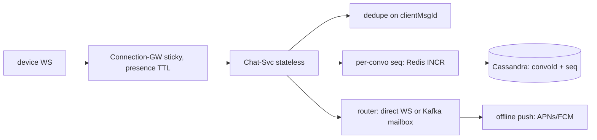

## Why it Matters

Chat is where "exactly-once" gets tested honestly: networks redeliver, so the answer is at-least-once delivery plus client-side dedupe and a per-conversation sequence number. The other axis is connection scale, millions of sticky WebSockets, which is a completely different engineering problem from the message store itself.

## Diagram



## Code

```java
// WS /chat (auth → sticky gateway) → Chat-Svc: persist → route → ack
// clientMsgId (UUID) = idempotency key; server seq per conversation = ordering
public Ack send(ChatMsg m) {
 if (dedupe.seen(m.clientMsgId())) return Ack.dup(m.clientMsgId());
 long seq = sequencer.next(m.conversationId()); // per-convo counter (Redis INCR)
 store.append(m, seq); // Cassandra per-conversation partition
 router.deliver(m); // direct WS push or Kafka(mbox) for offline
 return Ack.ok(m.clientMsgId(), seq);
}
```
Design: `Connection-GW (Netty/WS, sticky, presence in Redis) → Chat-Svc (stateless, HPA) → Cassandra(messages by convoId+seq) + Kafka(mailbox for offline/push) + Push-Svc (APNs/FCM)`. Receipts (sent/delivered/read) as separate lightweight events. E2E encryption note: server routes ciphertext, never plaintext.

## When to use / not

- Persistent connections (100M+ concurrent), small payloads, strict ordering per conversation, offline delivery.
- Scale anchor: 50B msgs/day (~600k/s avg); connection tier stateful, message tier stateless.
- **When NOT:** broadcast ranking (that's feed), ordering + receipts are the bar here.

## Trade-offs

| Pros | Cons |
|---|---|
| Per-convo seq: total order without global lock | Sticky GW: deploy/rebalance drains needed |
| clientMsgId dedupe: exact-once effect on retry | Sequence gaps on partition, need gap-fill protocol |
| Offline mailbox via Kafka: durable, replayable | Presence is eventually consistent (flaps without debounce) |

## Vs

- **Vs Twitter:** chat demands delivery + order per convo; feed demands fan-out + ranking.
- **Vs notification service:** chat is interactive (receipts, typing); notifications are fire-and-forget with prefs.

## Pitfalls

- Global sequence, single bottleneck; always per-conversation counters.
- Sync push to APNs/FCM on send path, queue it; send-ack must not wait for push.
- Storing media inline in Cassandra, metadata in DB, bytes in object store (S3), CDN URLs.

## Interview q&a

**Q: Exactly-once?**
A: At-least-once delivery + clientMsgId dedupe + per-convo seq for order = exactly-once *effect*. Never claim true exactly-once over the network.

**Q: Ordering across devices?**
A: Server seq is the truth; clients gap-fill (`GET /convo?afterSeq=`). Multi-device = mailbox per device + shared seq.

**Q: Presence at scale?**
A: Heartbeat (30s) + Redis TTL, debounce flaps (10s grace), gossip only deltas, never broadcast full roster.

## Related

- [[../07_Integration-APIs/Kafka Messaging and Idempotency|Kafka-Idempotency]] · [[../04_Design-Patterns-Building-Blocks/06_Saga-Outbox-Inbox|Saga-Outbox]] · [[../03_Architecture-Styles/04_Event-Driven-Architecture|EDA]] · [[06_Notification-Service|Notification Service]]

# WhatsApp Chat (1-to-1 + Groups)

> **Intent:** deliver messages exactly-once *effect* with presence and receipts at massive connection scale, the delivery-guarantee drill.
