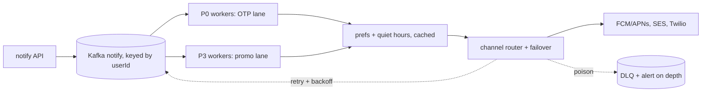

## Why it Matters

Notifications look trivial, send a message, but they concentrate every distributed-systems problem at once: provider quotas, retries that must not double-send, priority inversion (an OTP stuck behind a promo blast), and user prefs as a hard gate. It is the best drill for showing you can design a fan-out system *with taste*.

## Diagram



## Code

```java
// POST /api/v1/notify {userId, template, priority, idempotencyKey} → Kafka(notify, keyed by userId)
// Worker: prefs-check → render → send via provider → retry with backoff → DLQ
@KafkaListener(topics = "notify") public void handle(NotifyEvent e) {
 if (dedupe.seen(e.idempotencyKey()) || prefs.muted(e.userId(), e.type())) return;
 Channel c = router.pick(e); // push → SMS → email failover per priority
 Try.of(() -> providers.get(c).send(e)).recoverWith(e2 -> scheduleRetry(e, backoff(e)));
}
```
Design: `Notify-API → Kafka(notify) → Fanout-Workers (HPA on lag) → Providers (FCM/APNs, SES, Twilio) + Prefs-Svc (Postgres) + Template-Svc + DLQ + dedupe (Redis, key 72h)`. Priority lanes: P0 (OTP) separate topic/workers from P3 (promo). Per-provider token buckets respect quotas.

## When to use / not

- Every domain event may notify (ride-accepted, msg-received, price-drop); channel failover; user prefs + quiet hours.
- Scale anchor: 10M notifs/day bursty; Kafka-buffered, per-channel rate limits (SMS/SES quotas).
- **When NOT:** realtime interaction (that's chat), notifications are best-effort with SLAs per priority.

## Trade-offs

| Pros | Cons |
|---|---|
| Kafka buffer: absorbs bursts, replays failures | Multi-channel: N provider contracts + quotas |
| Idempotency keys: safe producer retries | Prefs checks per send: cache or die (Redis) |
| Priority lanes: OTP never stuck behind promo | Template sprawl, version + registry discipline |

## Vs

- **Vs Twitter fan-out:** notifications add prefs/routing/retry per recipient; feed adds ranking/merge.
- **Vs chat delivery:** notifications are one-way with failover; chat is two-way with receipts.

## Pitfalls

- No idempotency, producer retry = double SMS (money + anger).
- One shared topic/workers, promo flood delays OTP; always priority lanes.
- Rendering on the API path, templates + i18n belong in workers, API just validates + enqueues.

## Interview q&a

**Q: How do you avoid spamming a user?**
A: Prefs + quiet hours + per-user digest (token-bucket per type, e.g. max 3 promo/day) + cross-event dedupe window (same order → one thread).

**Q: Provider down (SMS gateway)?**
A: Channel failover matrix (SMS → push → email), per-provider circuit breaker, DLQ + replay. P0 gets dedicated workers + alternate vendor.

**Q: Ordering (OTP then confirmation)?**
A: Key Kafka by userId for per-user order; separate P0 topic so OTP jumps the queue.

## Related

- [[../07_Integration-APIs/Kafka Messaging and Idempotency|Kafka-Idempotency]] · [[../04_Design-Patterns-Building-Blocks/06_Saga-Outbox-Inbox|Saga-Outbox]] · [[02_Twitter-Timeline-Feed|Twitter Feed]] · [[04_WhatsApp-Chat|WhatsApp Chat]]

# Notification Service (Multi-Channel Fan-Out)

> **Intent:** deliver the right message on the right channel (push/SMS/email/WhatsApp) with prefs, dedupe, and retries, the fan-out-with-taste drill.
