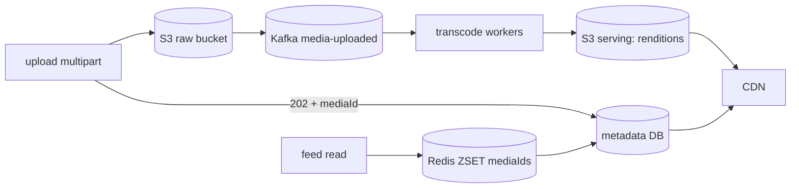

## Why it Matters

Instagram separates the people who conflate data and bytes from the ones who don't. Metadata and media live in different stores, transcode happens off the request path, and the read path is a feed problem you already solved. Say the split early and the rest of the design is about rendition management and CDN cost.

## Diagram



## Code

```java
// POST /api/v1/media (multipart) → store raw in S3 → Kafka(media-uploaded) → transcode workers → CDN URLs
@PostMapping("/api/v1/media") public UploadAck upload(@RequestParam MultipartFile f, Principal p) {
 String mediaId = ids.next(); // Snowflake-style, time-ordered
 objectStore.put("raw/" + mediaId, f.getBytes()); // S3, multipart
 inbox.publish("media-uploaded", new MediaEvent(mediaId, p.getName())); // async transcode
 return new UploadAck(mediaId); // 202 Accepted, client polls /media/{id}/status
}
// Read: GET /feed → timeline svc (Redis ZSET of mediaIds) → metadata (sharded Postgres/Cassandra) → CDN URLs
```
Design: `Upload-Svc → S3(raw) → Kafka → Transcode-Svc (thumbnails, multi-res) → S3(serving) + CDN → Feed-Svc (push fan-out like Twitter, Redis timelines) + Metadata-DB`. Celebrity pull-merge identical to Twitter drill.

## When to use / not

- Writes are large (photos/video) but reads dominate 100:1; feed p95 < 300ms, upload may take seconds.
- Scale anchor: ~500M daily actives, ~100M photos/day; metadata in DB, bytes in object store, never mix them.
- **When NOT:** strict chronological completeness, rank + cache, merge celebrities like Twitter.

## Trade-offs

| Pros | Cons |
|---|---|
| Object store: unbounded bytes, CDN offload ~95% | Two-phase upload: client must handle pending/failed transcode |
| Async transcode: upload ack stays fast | Storage explosion (5+ renditions per photo), lifecycle rules |
| Feed reuse of Twitter hybrid fan-out | Hot celebrity media needs edge pre-warm |

## Vs

- **Vs Twitter feed:** same fan-out, plus a media pipeline (transcode, renditions, CDN). Text tweets skip all of that.
- **Vs YouTube:** photos are small + many; video is large + few, chunked upload + long transcode belong to YouTube.
- **Vs Dropbox:** Instagram serves the *same* bytes to millions; Dropbox syncs *private* bytes per user, opposite caching story.

## Pitfalls

- Synchronous transcode on upload request, p99 death; always async.
- Storing images as DB blobs, kills the DB; object store + URL only.
- One CDN key per mediaId without versioning, stale renditions after re-encode; version keys.

## Interview q&a

**Q: Where do the bytes live?**
A: S3-style object store (raw + serving buckets), metadata (mediaId → owner, CDN URLs, status) in sharded DB. DB rows stay small; bytes never touch Postgres.

**Q: Upload spikes (New Year)?**
A: 202-accept + queue; KEDA transcode workers on Kafka lag; degrade gracefully (serve original while thumbnails queue).

**Q: How is this different from Twitter?**
A: Fan-out identical; the new hard part is the media pipeline, multipart upload, idempotent retries (client upload-id), rendition matrix, CDN cache-busting by versioned keys.

## Related

- [[02_Twitter-Timeline-Feed|Twitter Feed]] · [[08_YouTube-Video-Streaming|YouTube]] · [[09_Dropbox-File-Sync|Dropbox]] · [[../06_Data-Architecture/04_Caching-CDN|Caching-CDN]] · [[https://github.com/Jeevan-kumar-Raj/Grokking-System-Design/blob/master/designs/instagram.md|Grokking: Instagram (diagrams)]]

# Instagram (Media-Heavy Feed)

> **Intent:** serve a media-heavy social feed where upload/transcode is async but reads are instant, the object-store + CDN drill. (Grokking topic: Instagram.)
