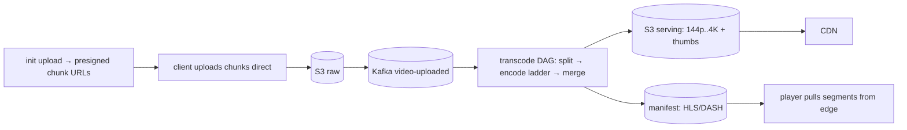

## Why it Matters

YouTube tests whether you will proxy bytes through your own servers, the answer is never. Upload goes direct to object storage via presigned URLs, transcode is a DAG of parallel encodes, and playback is segmented adaptive bitrate served from the edge. Storage economics, not API design, is the hard part.

## Diagram



## Code

```java
// POST /api/v1/videos/init → upload URLs per chunk; PUT chunks → Kafka(video-uploaded) → transcode DAG
@PostMapping("/api/v1/videos/init") public InitUpload init(@RequestBody InitReq r, Principal p) {
 String videoId = ids.next();
 var urls = objectStore.multipartInit("raw/" + videoId, r.chunks()); // presigned URLs, client uploads direct
 return new InitUpload(videoId, urls); // server never proxies bytes
}
// Transcode worker: raw → 144p..4K renditions + thumbnails → manifest (HLS/DASH) → CDN
// Playback: GET /watch?v= → metadata + manifest URL → player pulls segments from edge
```
Design: `Upload-Svc (presigned URLs) → S3(raw chunks) → Kafka → Transcode-Svc (DAG: split → parallel encode → merge, spot GPUs) → S3(serving) + CDN → Metadata-DB (videoId → manifests, views counter via Kafka aggregation)`. Popular videos pre-warmed to edge; long tail stays in origin.

## When to use / not

- Extreme write/read asymmetry: one upload → millions of views; upload takes minutes, playback start < 2s.
- Scale anchor: ~500hrs uploaded/min (Grokking-era figure); views 1000:1 vs uploads; storage in exabytes, chunk everything.
- **When NOT:** low-latency live interaction (that's chat), VOD tolerates seconds of pipeline delay.

## Trade-offs

| Pros | Cons |
|---|---|
| Direct-to-S3 upload: server never bottlenecks bytes | Transcode latency (minutes), needs pending/progress UX |
| HLS/DASH segments: adaptive bitrate, edge-cacheable | Rendition explosion (6+ per video), lifecycle + cost discipline |
| View counting async: playback never waits | View-fraud: dedupe + windowed counting pipeline |

## Vs

- **Vs Instagram:** both media pipelines, but video needs chunked upload + long transcode DAG + segmented playback; photos are single-shot.
- **Vs Dropbox:** YouTube serves identical segments to millions (CDN dream); Dropbox syncs private deltas (CDN useless).

## Pitfalls

- Proxying video bytes through Spring Boot, OOM + bandwidth death; presigned URLs only.
- Synchronous view-count increment, hot row; aggregate via Kafka windows.
- Single rendition, mobile users on 3G stall; always adaptive ladder.

## Interview q&a

**Q: How does playback stay smooth?**
A: HLS/DASH manifests + short segments (2–10s) cached at edge; player adapts bitrate to throughput. Origin serves only cache misses.

**Q: Upload of a 10GB file?**
A: Chunked resumable upload (presigned URLs, client upload-id for idempotent retry), server-side assemble, checksum per chunk. Never proxy bytes through app servers.

**Q: 10× viral spike?**
A: Edge pre-warm top-N, extend segment TTL, throttle transcode of long-tail (serve 720p while 4K queues), async view counters.

## Related

- [[07_Instagram-Media-Feed|Instagram]] · [[09_Dropbox-File-Sync|Dropbox]] · [[../06_Data-Architecture/04_Caching-CDN|Caching-CDN]] · [[../08_NonFunctional-Ops/06_Cost-FinOps|FinOps]] · [[https://github.com/Jeevan-kumar-Raj/Grokking-System-Design/blob/master/designs/youtube.md|Grokking: Youtube (diagrams)]]

# YouTube (Video Upload + Streaming)

> **Intent:** ingest huge video files once, serve them as adaptive-bitrate streams to millions, the transcode + CDN drill. (Grokking topic: Youtube.)
