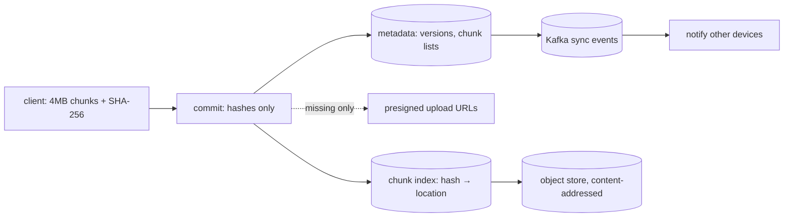

## Why it Matters

Dropbox inverts the caching intuition: bytes are private and per-user, so a CDN is useless and *deduplication* is the win. Hash-before-upload means unchanged data never crosses the wire, and content-addressed storage means identical chunks are stored once. The design is about minimising bytes moved, not maximising bytes served.

## Diagram



## Code

```java
// Client splits file → SHA-256 per 4MB chunk → POST /api/v1/files/commit {chunks[]} → server returns missing chunk URLs
@PostMapping("/api/v1/files/commit") public CommitPlan commit(@RequestBody CommitReq r, Principal p) {
 List<String> missing = r.chunks().stream().filter(c -> !chunkIndex.exists(c.sha())).toList();
 metadata.saveVersion(p.getName(), r.path(), r.chunks()); // version history in metadata DB
 notifyDevices(p.getName(), r.path()); // Kafka(sync-event) → push to other devices
 return new CommitPlan(missingUploadUrls(missing)); // only novel bytes cross the wire
}
```
Design: `Sync-Svc → Metadata-DB (Postgres: users, files, versions, chunk lists) + Chunk-Index (hash → location) + Object-Store (S3 chunks, content-addressed) + Kafka(sync events) → Notify-Svc`. Cross-user dedupe: identical chunk hash stored once. Delta sync via rsync-style rolling checksum for edits.

## When to use / not

- Private per-user bytes, multi-device consistency, edits must propagate as deltas not full re-uploads.
- Scale anchor: metadata QPS high, byte volume in exabytes; 4MB chunks are the Grokking-standard split.
- **When NOT:** public broadcast (that's Instagram/YouTube), CDN barely helps; dedupe + deltas are the win.

## Trade-offs

| Pros | Cons |
|---|---|
| Content-addressed chunks: dedupe across users, resume free | Small-file overhead (a 1KB file still costs a chunk + metadata) |
| Delta sync: edits move KBs not GBs | Conflict forks (two offline edits) need version-vector merge UX |
| Metadata/bytes split: listing never touches S3 | Encryption-at-rest per chunk complicates cross-user dedupe |

## Vs

- **Vs Instagram/YouTube:** private sync (dedupe + deltas) vs public broadcast (CDN + renditions). Opposite optimisations.
- **Vs Pastebin:** both store blobs, but Dropbox versions + syncs; Pastebin is write-once + TTL.

## Pitfalls

- Whole-file upload on every save, battery + bandwidth death; chunk + delta always.
- Metadata and chunks in one store, listing slows as bytes grow; split them.
- Synchronous cross-device push on commit path, queue sync events; commit-ack stays fast.

## Interview q&a

**Q: How do you avoid re-uploading unchanged data?**
A: Client-side 4MB chunking + SHA-256; commit sends hashes first, server asks only for missing chunks. Edits use delta (rolling checksum) so a 1-byte change moves one chunk.

**Q: Two devices edit offline?**
A: Version vectors per file; last-writer-wins with conflict copy (`file (conflict).docx`), same UX as Dropbox. Never silently merge bytes.

**Q: Sharing a link?**
A: Capability URL (unpredictable token) → metadata ACL check → CDN-served read-only copy; revocation = token tombstone.

## Related

- [[07_Instagram-Media-Feed|Instagram]] · [[08_YouTube-Video-Streaming|YouTube]] · [[../06_Data-Architecture/01_SQL-vs-NoSQL-Selection|SQL-vs-NoSQL]] · [[https://github.com/Jeevan-kumar-Raj/Grokking-System-Design/blob/master/designs/dropbox.md|Grokking: Dropbox (diagrams)]]

# Dropbox (File Sync + Sharing)

> **Intent:** sync private files across a user's devices with minimal bytes moved, the chunking + delta-sync drill. (Grokking topic: Dropbox.)
