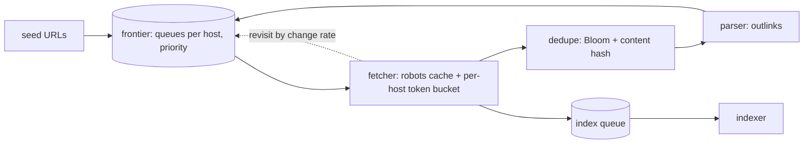

## Why it Matters

A crawler's throughput is set by politeness, not bandwidth: a ≥1s-per-host gap means scale comes from host diversity, so the frontier, sharded queues per host with adaptive revisit, *is* the system. It is also the drill where deduplication and trap defence separate a design that runs from one that eats itself.

## Diagram



## Code

```java
// Frontier: priority queues per host (Kafka keyed by host) → Fetcher pool → dedupe (Bloom + content hash) → indexer queue
@KafkaListener(topics = "frontier") public void fetch(CrawlUrl u) {
 if (!robots.allowed(u.host(), u.path()) || seen.bloomMaybe(u.url())) return;
 politeness.acquire(u.host()); // per-host token bucket, ≥1s gap
 var page = http.get(u.url(), TIMEOUT_10s); // bounded fetch, size cap
 if (contentHash.isNew(page)) // SimHash/SHA — skip near-duplicates
 inbox.publish("page-fetched", page); // → parser extracts outlinks → back to frontier
 frontier.scheduleRevisit(u, changeRate(u));// adaptive: news hourly, docs monthly
}
```
Design: `Seed-Svc → Frontier (DNS-hash sharded queues, priority by PageRank-ish score) → Fetcher-Svc (HPA, per-host throttle) → Dedupe (Bloom pre-filter + Cassandra URL-seen + content store) → Parser-Svc → Index-queue`. Trap defence: depth caps, duplicate-content clustering, spam-score quarantine.

## When to use / not

- Bounded fresh coverage (e.g. 15B pages/mo per Grokking) with per-host politeness, robots.txt, and change-driven refetch.
- Scale anchor: politeness delay (≥1s/host) is the true bottleneck, parallelism comes from host diversity, not threads.
- **When NOT:** realtime indexing of a firehose (that's Twitter-Search), crawler trades freshness for coverage.

## Trade-offs

| Pros | Cons |
|---|---|
| Per-host queues: politeness falls out naturally | Frontier state is huge, needs durable prioritised storage |
| Bloom pre-filter: cheap URL-seen at billions scale | Bloom false positives skip live pages (size for <1%, back with DB check) |
| Adaptive revisit: freshness where it pays | Crawler traps (calendars, faceted search) need explicit guards |

## Vs

- **Vs Twitter-Search:** crawler discovers documents slowly; search serves an inverted index fast. Crawl → index → serve is the pipeline.
- **Vs Yelp:** both store web-scale corpora, but Yelp's data is curated POIs; crawler's is adversarial and duplicative.

## Pitfalls

- Single global FIFO frontier, one slow host blocks everything; shard by host.
- No fetch caps (size/time/depth), one 10GB page or infinite calendar eats a worker.
- Refetching everything on a fixed cron, change-rate scheduling is the expected answer.

## Interview q&a

**Q: How do you avoid hammering one site?**
A: Frontier partitioned by host with per-host delay queues (≥1s), robots.txt cache, backoff on 429/5xx. Throughput scales with distinct hosts, not fetcher threads.

**Q: How do you avoid storing the whole web twice?**
A: URL-seen (Bloom + persistent set) plus content dedupe (checksum/SimHash near-dup clustering). Canonicalise URLs (trailing slash, params, case) before hashing.

**Q: Freshness vs coverage?**
A: Change-rate-driven revisit (news sites hourly, static docs monthly); priority score = importance × staleness. Say the tradeoff explicitly.

## Related

- [[12_Yelp-Geo-Reviews|Yelp]] · [[../07_Integration-APIs/Kafka Messaging and Idempotency|Kafka-Idempotency]] · [[../06_Data-Architecture/01_SQL-vs-NoSQL-Selection|SQL-vs-NoSQL]] · [[https://github.com/Jeevan-kumar-Raj/Grokking-System-Design/blob/master/designs/web-crawler.md|Grokking: Web Crawler (diagrams)]]

# Web Crawler (url Frontier at Scale)

> **Intent:** fetch billions of pages politely without re-crawling the web every hour, the frontier + dedupe drill. (Grokking topic: Web Crawler.)
