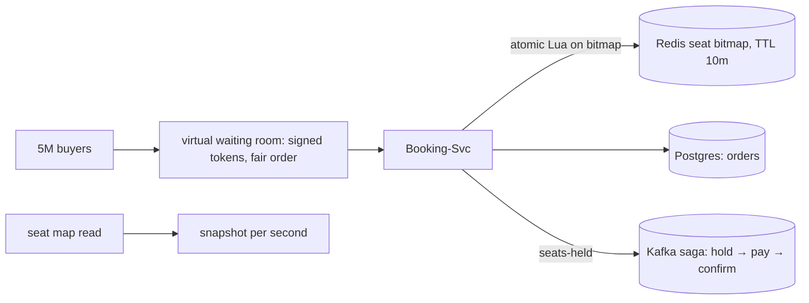

## Why it Matters

This is the concurrency drill with a fairness requirement: the hard part is not storing seats, it is that five million buyers want the same fifty thousand of them in the same minute. A waiting room plus one atomic hold primitive converts a thundering herd into a queue, and correctness is proven by making the *only* contested operation atomic.

## Diagram



## Code

```java
// POST /api/v1/events/{id}/hold {seats[]} + idempotency key → 10-min lease; POST /pay confirms → saga
@PostMapping("/api/v1/events/{id}/hold") public Hold hold(@PathVariable String id, @RequestBody HoldReq r) {
 String key = "hold:" + id; // Lua script: check seat bitmap free → SET with 10-min TTL, atomic
 var seats = redis.eval(HOLD_LUA, key, r.seats(), r.idemKey(), HOLD_TTL);
 if (seats.empty()) throw new SoldOutException(waitlistToken(r)); // virtual waiting room position
 inbox.publish("seats-held", new Held(id, r.user(), seats)); // → payment saga with expiry compensation
 return new Hold(seats, Duration.ofMinutes(10));
}
```
Design: `Waiting-Room (queue tokens, fair order) → Booking-Svc → Redis seat-bitmap (per event, Lua atomic hold, TTL) + Postgres (orders, payments) + Saga (hold → pay → confirm / expire → release)`. Read path (seat map) from CDN-cached snapshot refreshed per second, never live-scan the bitmap per user.

## When to use / not

- Flash-sale contention on finite inventory; fairness (queue order) matters as much as correctness.
- Scale anchor: on-sale spike 100× baseline for minutes; 50k seats, 5M buyers, 99% get "sold out", gracefully.
- **When NOT:** oversell-tolerant inventory (that's e-commerce flash sale with reserve-then-confirm), seats are exact.

## Trade-offs

| Pros | Cons |
|---|---|
| Redis bitmap + Lua: atomic holds at spike speed | Bitmap per event in memory, shard mega-events, TTL aggressively |
| Waiting room: fairness + overload shedding in one | Queue UX complexity (positions, ETAs, bots jumping the line) |
| Saga with expiry: holds auto-release, no orphan locks | Payment-time races need idempotent confirm + reconciliation job |

## Vs

- **Vs e-commerce flash sale:** both spike, but seats are exact-inventory (no oversell) while carts tolerate reserve-then-confirm.
- **Vs Uber matching:** both lease scarce supply, but seats are static rows while drivers move, no geo index here.

## Pitfalls

- `SELECT … FOR UPDATE` on seat rows at spike, row-lock meltdown; gate with Redis first.
- Holds without TTL, abandoned carts eat inventory; 10-min lease + saga compensation.
- Live seat-map queries per user, snapshot + CDN; live reads only at hold time.

## Interview q&a

**Q: How do you prevent double-booking?**
A: Single atomic primitive (Redis Lua on seat bitmap) grants holds; DB is the record, Redis is the gate. Confirm path is idempotent on payment-id; nightly reconciliation heals drift.

**Q: How do buyers survive the spike?**
A: Virtual waiting room (signed queue tokens, estimated wait), CDN seat-map snapshots, shed load at gateway (rate-limit + queue-full fast-fail), scale stateless tiers on queue depth.

**Q: Bots?**
A: CAPTCHA/attestation at room entry, per-account hold caps, device fingerprinting, hold-to-order conversion alarms. Say it, interviewers expect it.

## Related

- [[05_Rate-Limiter|Rate Limiter]] · [[../04_Design-Patterns-Building-Blocks/06_Saga-Outbox-Inbox|Saga-Outbox]] · [[../99_Revision/Case-Studies|Case Studies: Flash Sale]] · [[https://github.com/Jeevan-kumar-Raj/Grokking-System-Design/blob/master/designs/ticketmaster.md|Grokking: Ticketmaster (diagrams)]]

# Ticketmaster (High-Contention Booking)

> **Intent:** sell the same 50k seats to millions of buyers without double-booking, the contention + queue drill. (Grokking topic: Ticketmaster.)
