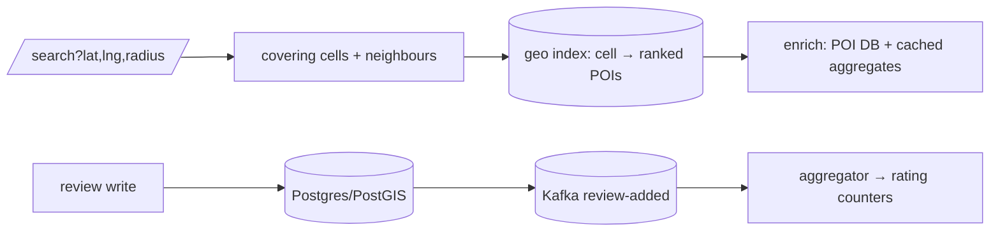

## Why it Matters

Yelp is the drill where the naive query is the failure: sorting a hundred-million-row table by distance never finishes. Bounding the search to a small set of geo cells first turns it into an index lookup, and everything after, neighbour expansion, offline ranking, async review aggregation, is polish on that one decision.

## Diagram



## Code

```java
// GET /api/v1/search?lat=&lng=&radius=2km&tag=sushi&sort=rating
@GetMapping("/api/v1/search") public SearchRes search(@RequestParam double lat, @RequestParam double lng, …) {
 var cells = geo.coveringCells(lat, lng, radius); // S2/geohash cell set (+ neighbours)
 var ids = poiIndex.search(cells, tag, sort, limit); // Elastic/secondary index: cell → ranked POIs
 return enrich(ids); // details from POI DB + cached rating aggregates
}
// Review write: POST /reviews → DB + Kafka(review-added) → aggregator updates POI rating counters
```
Design: `Search-Svc → Geo-Index (Elastic/Lucene with lat/lon + cell, or S2-sharded secondary index) + POI-DB (Postgres/PostGIS, sharded by cell) + Aggregator (Kafka review events → rating/distribution counters in Redis/DB) + CDN (tiles, photos)`. Static POI data precomputed into grid-segment indexes (Grokking: quad-tree/grid split).

## When to use / not

- Geo-filtered reads dominate; writes (reviews/photos) are light and async-aggregated.
- Scale anchor: ~100M POIs, reads 100:1; quadkey/S2 cells bound every query to a small candidate set.
- **When NOT:** realtime moving supply (that's Uber), POIs are static rows, indexable offline.

## Trade-offs

| Pros | Cons |
|---|---|
| Cell-bounded queries: ms latency regardless of corpus size | Boundary effects, always search neighbour cells |
| Async aggregates: review writes never block reads | Ratings eventually consistent (state it, cache it) |
| Read replicas + CDN absorb city-level hotspots | Sparse areas waste fine cells, adaptive grid density |

## Vs

- **Vs Uber:** static POIs (index offline, serve fast) vs moving drivers (live geo writes). Same cell trick, different write path.
- **Vs Web Crawler:** curated POI corpus vs adversarial web, no dedupe war here, ranking is ratings + distance.

## Pitfalls

- Full-table distance sort, the classic fail; cells first, rank second.
- Synchronous aggregate update on review write, hot POI rows; Kafka aggregation.
- Ignoring boundary/edge cases, neighbour cells and dateline/poles get asked as follow-ups.

## Interview q&a

**Q: How do you bound the search?**
A: Geohash/S2 covering cells for radius + neighbour expansion; index keyed by cell so each query scans hundreds of candidates, not millions. Quad-tree/grid segmentation is the Grokking-expected vocabulary.

**Q: Ranking?**
A: Score = f(distance, rating, review count, hours-open, sponsored) computed offline per segment; personalisation re-ranks top-K only.

**Q: Review spam?**
A: Async moderation pipeline (text/photo classifiers), user-trust scores, rate-limits per account, aggregate only from approved reviews.

## Related

- [[03_Uber-Location-Tracking|Uber]] · [[10_Web-Crawler|Web Crawler]] · [[../06_Data-Architecture/01_SQL-vs-NoSQL-Selection|SQL-vs-NoSQL]] · [[https://github.com/Jeevan-kumar-Raj/Grokking-System-Design/blob/master/designs/yelp.md|Grokking: Yelp (diagrams)]]

# Yelp (Nearby Search + Reviews)

> **Intent:** answer "best sushi near me" in ms over millions of POIs, the geo-search + review-aggregation drill. (Grokking topic: Yelp.)
