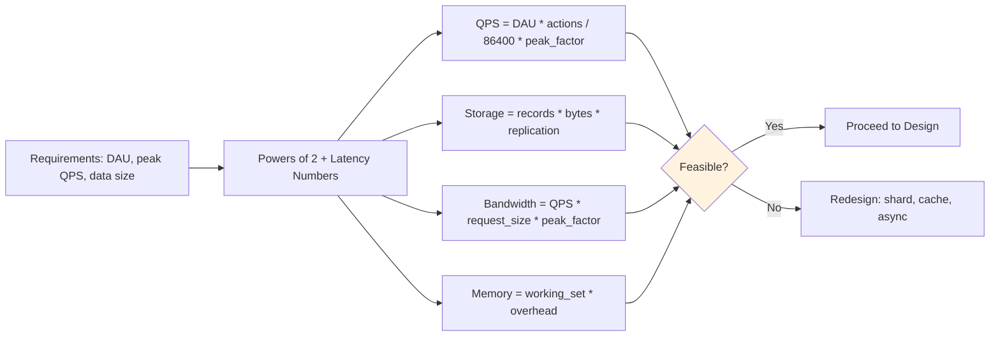

# Back-of-the-Envelope Estimation

> Part of [[README|MOC]] • `Architect/10_System-Design-Interviews` • Weeks 1
> 🎨 **Visual diagram:** Create Excalidraw drawing from template: `Cmd+P → Excalidraw: New from template → System Design Interviews Diagram`

## Intent

Quickly estimate system capacity (QPS, storage, bandwidth, memory) using powers of two and reference latency numbers to validate design feasibility before writing code.

## Why it Matters

- **Interview signal**: Every system design interview starts with "what's the scale?" — back-of-envelope proves you can quantify
- **Production impact**: Catches impossible designs early (e.g., 1M QPS on single DB, 10PB in memory)
- **Core concept**: Powers of two + latency numbers = instant feasibility filter for any architecture

## Diagram


## Problems
### System Design Problem: Back-of-Envelope Estimation

**Requirements:**
- Estimate QPS, storage, bandwidth, memory for any system in <2 minutes
- Use only mental math (powers of 2, round numbers)
- Identify bottlenecks before detailed design

**Constraints:**
- No calculators, no spreadsheets
- Conservative estimates (round up)
- Must account for replication, overhead, peak multipliers

**API / Interfaces:**
- Input: DAU, actions/user/day, object size, retention
- Output: QPS, storage (TB), bandwidth (Gbps), memory (GB)

## Code / Example

```java
// Java 25 / Spring Boot 3.5: Back-of-Envelope Calculator
// Instant capacity estimates for interview and design reviews

package com.architect.estimation;

public final class BackOfEnvelope {

    // Powers of 2 reference
    // 2^10 = 1K (1,024)
    // 2^20 = 1M (1,048,576)
    // 2^30 = 1B (1,073,741,824)
    // 2^40 = 1T

    public record Estimate(
        long qps,
        long storageBytes,
        long bandwidthBps,
        long memoryBytes,
        String bottleneck
    ) {}

    public static Estimate estimate(
        long dailyActiveUsers,
        int actionsPerUserPerDay,
        int avgObjectSizeBytes,
        int retentionDays,
        int replicationFactor,
        double peakMultiplier
    ) {
        // QPS = DAU * actions / 86400 * peak
        long qps = (long) (dailyActiveUsers * actionsPerUserPerDay * peakMultiplier / 86_400);

        // Storage = DAU * actions * size * retention * replication
        long dailyWrites = dailyActiveUsers * actionsPerUserPerDay;
        long storageBytes = dailyWrites * avgObjectSizeBytes * retentionDays * replicationFactor;

        // Bandwidth = QPS * (request + response) * peak
        long requestSize = avgObjectSizeBytes * 2; // req + resp
        long bandwidthBps = (long) (qps * requestSize * 8 * peakMultiplier); // bits/sec

        // Memory = working set (recent 10% of data) * overhead
        long workingSet = storageBytes / 10;
        long memoryBytes = workingSet * 2; // 2x overhead for indices, GC

        // Identify bottleneck
        String bottleneck = identifyBottleneck(qps, storageBytes, bandwidthBps, memoryBytes);

        return new Estimate(qps, storageBytes, bandwidthBps, memoryBytes, bottleneck);
    }

    private static String identifyBottleneck(long qps, long storage, long bw, long mem) {
        if (qps > 100_000) return "QPS > 100K: needs sharding + async";
        if (storage > 10L * 1024 * 1024 * 1024 * 1024) return "Storage > 10TB: needs tiering";
        if (bw > 10 * 1000 * 1000 * 1000) return "Bandwidth > 10Gbps: needs compression/CDN";
        if (mem > 100 * 1024 * 1024 * 1024) return "Memory > 100GB: needs off-heap/Redis";
        return "Within single-node limits";
    }

    public static void main(String[] args) {
        // Twitter-like: 300M DAU, 10 tweets/day, 1KB/tweet, 7yr retention, 3x replication
        Estimate twitter = estimate(300_000_000, 10, 1024, 365 * 7, 3, 3.0);
        System.out.println("Twitter: " + twitter.qps + " QPS, " + 
            (twitter.storageBytes / 1_099_511_627_776L) + " PB, " +
            (twitter.bandwidthBps / 1_000_000_000L) + " Gbps, " +
            (twitter.memoryBytes / 1_073_741_824L) + " GB - " + twitter.bottleneck);
        // Output: ~100K QPS, ~80 PB, ~2.4 Gbps, ~15 TB - QPS > 100K: needs sharding + async
    }
}
```

## When to Use / When NOT
| **Use When** | **Avoid When** |
|--------------|----------------|
| First 5 minutes of system design interview | Detailed capacity planning (use simulators) |
| Validating architecture before implementation | Precision-critical systems (financial, scientific) |
| Comparing design alternatives quickly | Replacing actual load testing |
| Communicating scale to non-technical stakeholders | Systems with highly variable workloads |


## Trade-offs
| Dimension | This Approach | Alternative | Trade-off Rationale | Decision Rule |
|-----------|---------------|-------------|---------------------|---------------|
| Complexity | [TBD] | [TBD] | [TBD] | [TBD] |
| Operational Burden | [TBD] | [TBD] | [TBD] | [TBD] |
| Latency | [TBD] | [TBD] | [TBD] | [TBD] |
| Consistency | [TBD] | [TBD] | [TBD] | [TBD] |
| Cost at Scale | [TBD] | [TBD] | [TBD] | [TBD] |

## Vs Table
| Aspect | Back-of-Envelope | Queueing Theory / Simulation |
|--------|------------------|------------------------------|
| Time to Result | < 1 min | Hours to days |
| Bottleneck Detection | Excellent for obvious ones | Catches subtle contention |
| Tooling Required | None | Specialized software |
| Communication | Easy to explain | Requires expertise |

## Pitfalls
- Forgetting peak multiplier (3-10x average) — average QPS is meaningless
- Ignoring replication factor (3x for durability, 2x for HA)
- Not accounting for index overhead (2-3x raw data)
- Assuming uniform distribution (hot keys, power law)
- Forgetting network bandwidth (request + response, protocol overhead)
- Confusing bits vs bytes (bandwidth in Gbps, storage in GB)
- Not rounding up — conservative estimates prevent surprises
- Ignoring GC pressure, connection pools, thread pools at scale

## Interview Q&A (Senior Depth)

**Q1: Walk me through estimating QPS for a URL shortener with 100M DAU.**
**A:** 100M DAU * 5 creates/day / 86400 * 3 (peak) = ~17K QPS writes. Reads: 100M * 50 redirects/day / 86400 * 3 = ~173K QPS. Total ~200K QPS. Single machine handles ~50K QPS → need 4+ shards for writes, read replicas for reads.

**Q2: How do you estimate storage for 7 years of tweets?**
**A:** 300M DAU * 10 tweets/day * 1KB * 365 * 7 * 3 (replication) ≈ 23 PB raw. With indexes (3x) ≈ 70 PB. Needs tiered storage: hot (SSD, 30 days), warm (HDD, 1 year), cold (S3/Glacier, 7 years).

**Q3: What are the key powers of two you memorize?**
**A:** 2^10=1K, 2^20=1M, 2^30=1B, 2^40=1T. 86400 sec/day ≈ 100K. 1KB=1024B. 1Gbps=125MB/s. Latency: L1=1ns, RAM=100ns, SSD=100μs, DC=1ms, cross-region=50ms.

**Q4: How does this scale to 10x traffic?**
**A:** QPS 10x → need 10x shards or async processing. Storage 10x → tiered storage, compression. Bandwidth 10x → CDN, compression, protocol upgrade (HTTP/3). Memory 10x → off-heap, distributed cache. The math is linear but architecture changes at each order of magnitude.

**Q5: How do you monitor and debug capacity in production?**
**A:** RED metrics per service. USE metrics for resources (CPU, memory, disk, network). Alert on 70% capacity. Capacity dashboards: QPS trend, storage growth, bandwidth utilization. Automated scaling policies with cooldowns. Chaos engineering to validate limits.

## Flashcards (Spaced Repetition)

#flashcard
**Q:** Seconds in a day? :: **A:** 86,400 ≈ 100K #flashcard

#flashcard
**Q:** 2^10, 2^20, 2^30, 2^40? :: **A:** 1K, 1M, 1B, 1T #flashcard

#flashcard
**Q:** QPS formula? :: **A:** DAU * actions/day / 86400 * peak_factor #flashcard

#flashcard
**Q:** Storage formula? :: **A:** daily_writes * size * retention_days * replication #flashcard

#flashcard
**Q:** Bandwidth formula? :: **A:** QPS * (req+resp)_bytes * 8 * peak_factor (bits/sec) #flashcard

#flashcard
**Q:** Typical peak multiplier? :: **A:** 3-10x average #flashcard

#flashcard
**Q:** Replication factor for durability? :: **A:** 3x #flashcard

#flashcard
**Q:** Index overhead? :: **A:** 2-3x raw data #flashcard

#flashcard
**Q:** 1 Gbps in MB/s? :: **A:** 125 MB/s #flashcard

#flashcard
**Q:** Working set estimate? :: **A:** 10% of total data * 2x overhead #flashcard

#flashcard
**Q:** Single-node QPS limit? :: **A:** ~50K for simple stateless service #flashcard

#flashcard
**Q:** Single-node storage limit? :: **A:** ~10-20 TB practical #flashcard

#flashcard
**Q:** When to shard? :: **A:** QPS > 100K or storage > 10TB #flashcard

#flashcard
**Q:** When to add read replicas? :: **A:** Read QPS > write QPS * 2 #flashcard

#flashcard
**Q:** When to use async? :: **A:** Write latency budget exceeded or QPS > sync capacity #flashcard

## Practice Tasks (Tasks Plugin)
- [ ] Estimate QPS/storage/bandwidth for 3 systems from memory 📅 {{date:YYYY-MM-DD, +1}}
- [ ] Draw the estimation flowchart without looking 📅 {{date:YYYY-MM-DD, +3}}
- [ ] Answer all Interview Q&A aloud 📅 {{date:YYYY-MM-DD, +7}}
- [ ] Review flashcards (Spaced Repetition) 📅 {{date:YYYY-MM-DD, +1}}

```tasks
not done
path includes 10_System-Design-Interviews
sort by due
limit 10
```

## Related

- [[Architect/10_System-Design-Interviews/FND-11-Back-of-Envelope|Back-of-Envelope (Primer)]]
- [[Architect/10_System-Design-Interviews/FND-13-Latency-Numbers|Latency Numbers]]
- [[Architect/10_System-Design-Interviews/FND-03-Latency-vs-Throughput|Latency vs Throughput]]

---

*Category: Architect/10_System-Design-Interviews • Part of [[README|MOC]]*