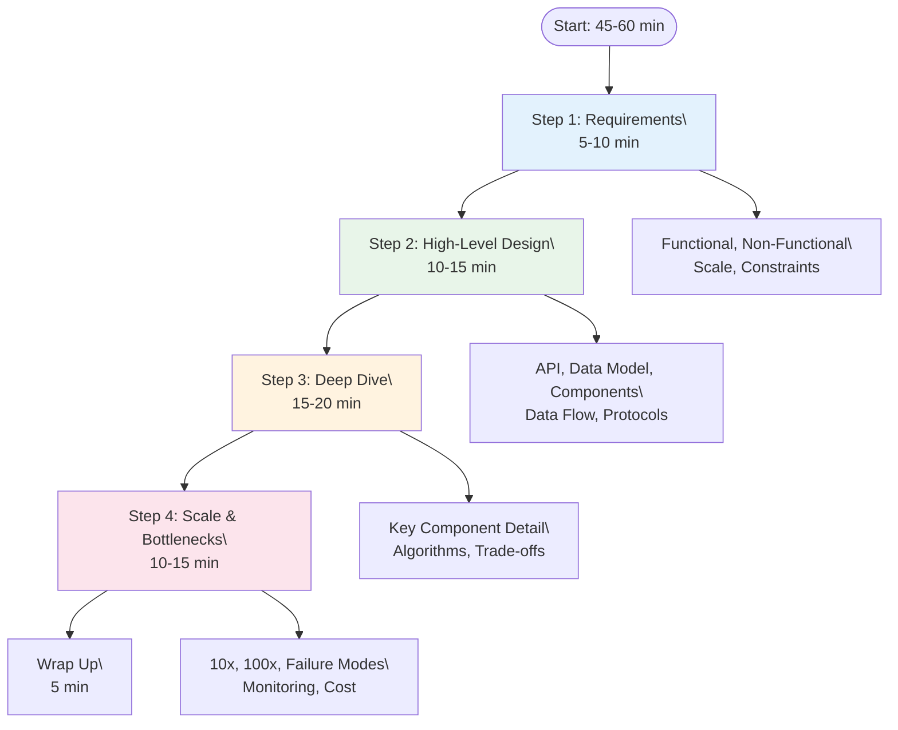

# System Design Interview Framework

> Part of [[README|MOC]] • `Architect/10_System-Design-Interviews` • Weeks 2
> 🎨 **Visual diagram:** Create Excalidraw drawing from template: `Cmd+P → Excalidraw: New from template → System Design Interviews Diagram`

## Intent

A repeatable 4-step framework (Requirements → High-Level Design → Deep Dive → Scale) that structures any system design interview, ensuring you cover all signal areas interviewers evaluate.

## Why it Matters

- **Interview signal**: Unstructured answers miss 50% of evaluation criteria (scalability, trade-offs, failure modes)
- **Production impact**: Same framework applies to real architecture reviews and RFC writing
- **Core concept**: Constraints drive decisions; every choice traces back to a requirement

## Diagram


## Problems
### System Design Problem: System Design Interview Framework

**Requirements:**
- Structure any system design question into 4 phases
- Cover all evaluation dimensions (correctness, scalability, trade-offs, operations)
- Time-box each phase to fit 45-60 minute interview

**Constraints:**
- Must work for any system (URL shortener, Twitter, payment system)
- Must surface trade-offs explicitly
- Must demonstrate senior depth in deep dive

**API / Interfaces:**
- Input: Vague problem statement ("Design Twitter")
- Output: Complete architecture with justification

## Code / Example

```java
// Java 25 / Spring Boot 3.5: Interview Framework Template
// Use as mental checklist during interview

package com.architect.interview;

import java.util.*;

public final class InterviewFramework {

    public record Requirements(
        List<String> functional,
        Map<String, String> nonFunctional, // SLOs
        long qps,
        long storageTB,
        List<String> constraints
    ) {}

    public record HighLevelDesign(
        List<String> apis,
        String dataModel,
        List<String> components,
        String dataFlow,
        String protocol
    ) {}

    public record DeepDive(
        String component,
        String algorithm,
        List<String> tradeoffs,
        String failureHandling
    ) {}

    public record ScalePlan(
        long targetScale,
        List<String> bottlenecks,
        List<String> solutions,
        String monitoringStrategy
    ) {}

    // Step 1: Requirements Clarification
    public static Requirements clarifyRequirements(String problem) {
        // Ask: What's in scope? DAU? Peak QPS? Latency SLO? Consistency?
        // Write down: Functional, Non-functional, Scale estimates, Constraints
        return new Requirements(
            List.of("Core use cases"),
            Map.of("latency_p99", "100ms", "availability", "99.99%"),
            10_000, 1, List.of("No single point of failure")
        );
    }

    // Step 2: High-Level Design
    public static HighLevelDesign highLevelDesign(Requirements req) {
        // APIs, Data model (SQL vs NoSQL), Components, Data flow
        return new HighLevelDesign(
            List.of("POST /shorten", "GET /:id"),
            "key-value: short_code -> long_url",
            List.of("API Gateway", "Shortener Service", "Cache (Redis)", "DB (PostgreSQL)"),
            "Client -> Gateway -> Service -> Cache/DB",
            "HTTP/REST"
        );
    }

    // Step 3: Deep Dive (pick ONE component)
    public static DeepDive deepDive(String component) {
        // Go deep on the hardest/most interesting component
        // Algorithm, trade-offs, failure modes, alternatives
        return new DeepDive(
            "Shortener Service",
            "Base62 encoding of auto-increment ID / Snowflake",
            List.of("Collision handling", "Custom aliases", "Analytics"),
            "Retry with idempotency key, circuit breaker to DB"
        );
    }

    // Step 4: Scale & Bottlenecks
    public static ScalePlan scalePlan(HighLevelDesign hld, long targetScale) {
        // 10x, 100x, 1000x - what breaks?
        return new ScalePlan(
            targetScale,
            List.of("DB write bottleneck", "Cache stampede", "ID exhaustion"),
            List.of("Sharding by hash(short_code)", "Redis cluster", "64-bit Snowflake IDs"),
            "RED metrics per shard, SLO alerts, distributed tracing"
        );
    }

    public static void main(String[] args) {
        System.out.println("=== SYSTEM DESIGN INTERVIEW FRAMEWORK ===");
        System.out.println("Step 1: Requirements (5-10 min)");
        System.out.println("Step 2: High-Level Design (10-15 min)");
        System.out.println("Step 3: Deep Dive (15-20 min)");
        System.out.println("Step 4: Scale & Bottlenecks (10-15 min)");
    }
}
```

## When to Use / When NOT
| **Use When** | **Avoid When** |
|--------------|----------------|
| Any system design interview | Coding interviews (different format) |
| Architecture review meetings | Exploratory discussions without decision |
| Writing RFCs/ADRs | Already have detailed design doc |


## Trade-offs
| Dimension | This Approach | Alternative | Trade-off Rationale | Decision Rule |
|-----------|---------------|-------------|---------------------|---------------|
| Complexity | [TBD] | [TBD] | [TBD] | [TBD] |
| Operational Burden | [TBD] | [TBD] | [TBD] | [TBD] |
| Latency | [TBD] | [TBD] | [TBD] | [TBD] |
| Consistency | [TBD] | [TBD] | [TBD] | [TBD] |
| Cost at Scale | [TBD] | [TBD] | [TBD] | [TBD] |

## Vs Table
| Aspect | 4-Step Framework | "Just Start Drawing" |
|--------|------------------|----------------------|
| Requirements Coverage | Explicit | Often forgotten |
| Trade-off Visibility | Built into deep dive | Implicit |
| Failure Discussion | Dedicated phase | Rarely covered |
| Interviewer Confidence | High | Variable |

## Pitfalls
- Skipping Step 1 (requirements) — leads to solving wrong problem
- Spending too long on high-level diagram — no time for deep dive
- Not picking a specific component for deep dive — stays superficial
- Forgetting failure modes in Step 4 — junior signal
- Not using back-of-envelope numbers — unquantified claims
- Rigidly following steps when interviewer wants to dive deep — adapt!

## Interview Q&A (Senior Depth)

**Q1: Walk me through your approach to any system design question.**
**A:** 4 steps: 1) Clarify requirements (functional, non-functional, scale, constraints) — write them down. 2) High-level design (APIs, data model, components, data flow) — draw diagram. 3) Deep dive on hardest component (algorithm, trade-offs, alternatives). 4) Scale to 10x/100x (bottlenecks, solutions, monitoring). Time-box each phase.

**Q2: How do you handle a vague problem like "Design a chat system"?**
**A:** Step 1 clarifies: 1-on-1? Groups? Channels? Message history? Push notifications? E2E encryption? Scale? Latency? Each answer changes architecture. WhatsApp (E2E, offline) ≠ Slack (threads, search, integrations) ≠ Discord (voice, low latency).

**Q3: What do you do if interviewer interrupts during deep dive?**
**A:** Adapt! The framework is a mental scaffold, not a script. If they want to dive into consistency, pause deep dive, discuss CAP, then return. The phases are evaluation buckets — fill them in any order.

**Q4: How do you show senior depth in trade-offs?**
**A:** Name the specific tension (CAP, latency vs consistency, build vs buy), cite the constraint driving it, give the decision rule. "We chose eventual consistency because 100ms p99 latency budget + cross-region = synchronous consensus impossible. Decision rule: if latency budget < 50ms cross-region, async replication."

**Q5: What if you don't know the answer to a deep dive question?**
**A:** Say "I haven't implemented this at scale, but here's how I'd reason: [first principles]. The trade-off is X vs Y. I'd prototype both and measure." Honest reasoning > fake confidence.

## Flashcards (Spaced Repetition)

#flashcard
**Q:** 4 steps of system design interview? :: **A:** Requirements → High-Level Design → Deep Dive → Scale & Bottlenecks #flashcard

#flashcard
**Q:** Time allocation for 45-min interview? :: **A:** 5-10 / 10-15 / 15-20 / 10-15 / 5 wrap #flashcard

#flashcard
**Q:** Step 1 output? :: **A:** Functional reqs, Non-functional (SLOs), Scale estimates, Constraints #flashcard

#flashcard
**Q:** Step 2 output? :: **A:** APIs, Data model, Component diagram, Data flow, Protocol #flashcard

#flashcard
**Q:** Step 3 focus? :: **A:** ONE component deep: algorithm, trade-offs, failure modes, alternatives #flashcard

#flashcard
**Q:** Step 4 questions? :: **A:** What breaks at 10x? 100x? Failure modes? Monitoring? Cost? #flashcard

#flashcard
**Q:** Most common mistake? :: **A:** Skipping requirements clarification #flashcard

#flashcard
**Q:** How to show senior depth? :: **A:** Name tension, cite constraint, give decision rule #flashcard

#flashcard
**Q:** What if interviewer interrupts? :: **A:** Adapt — framework is scaffold, not script #flashcard

#flashcard
**Q:** Deep dive selection? :: **A:** Hardest/most differentiating component #flashcard

#flashcard
**Q:** Back-of-envelope in interview? :: **A:** Use in Step 1 for scale, Step 4 for validation #flashcard

#flashcard
**Q:** Failure modes to discuss? :: **A:** Network partition, disk full, GC pause, dependency cascade, clock drift #flashcard

#flashcard
**Q:** Monitoring strategy? :: **A:** RED (rate, errors, duration) per service, USE (utilization, saturation, errors) per resource #flashcard

#flashcard
**Q:** How to handle "I don't know"? :: **A:** Reason from first principles, state trade-offs, propose validation #flashcard

## Practice Tasks (Tasks Plugin)
- [ ] Run through framework on 3 problems from memory 📅 {{date:YYYY-MM-DD, +1}}
- [ ] Time-box each step: 5/15/20/15 minutes 📅 {{date:YYYY-MM-DD, +3}}
- [ ] Answer all Interview Q&A aloud 📅 {{date:YYYY-MM-DD, +7}}
- [ ] Review flashcards (Spaced Repetition) 📅 {{date:YYYY-MM-DD, +1}}

```tasks
not done
path includes 10_System-Design-Interviews
sort by due
limit 10
```

## Related

- [[Architect/10_System-Design-Interviews/FND-10-Interview-Approach|Interview Approach (Primer)]]
- [[Architect/10_System-Design-Interviews/FND-11-Back-of-Envelope|Back-of-Envelope Estimation]]
- [[FND-02-Performance-vs-Scalability|Performance vs Scalability]]

---

*Category: Architect/10_System-Design-Interviews • Part of [[README|MOC]]*