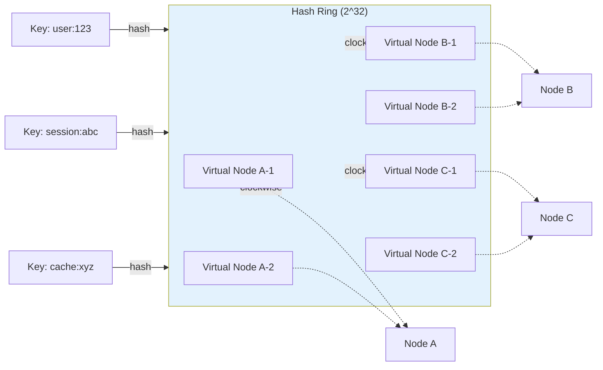

# Consistent Hashing

> Part of [[README|MOC]] • `Architect/10_System-Design-Interviews` • Weeks 2
> 🎨 **Visual diagram:** Create Excalidraw drawing from template: `Cmd+P → Excalidraw: New from template → System Design Interviews Diagram`

## Intent

Distribute keys across nodes with minimal reshuffling on node addition/removal — only K/N keys move (vs all keys with modulo hashing), enabling elastic scaling of caches, shards, and load balancers.

## Why it Matters

- **Interview signal**: Core building block for distributed caches, sharding, load balancing — appears in 50%+ system design interviews
- **Production impact**: Prevents cache stampede and data reshuffling during deployments, scaling events, failures
- **Core concept**: Hash ring + virtual nodes = uniform distribution + minimal disruption

## Diagram


## Problems
### System Design Problem: Consistent Hashing

**Requirements:**
- Distribute keys across N nodes uniformly
- Minimize key movement on node add/remove (target: K/N)
- Support heterogeneous node capacities
- O(log N) or O(1) lookup

**Constraints:**
- Nodes can join/leave dynamically
- Keys are arbitrary strings
- Must handle hot keys (skewed access)

**API / Interfaces:**
- `getNode(key) -> Node`
- `addNode(node) -> keysMoved`
- `removeNode(node) -> keysMoved`

## Code / Example

```java
// Java 25 / Spring Boot 3.5: Consistent Hashing with Virtual Nodes
// Production-ready ring with TreeMap for O(log N) lookup

package com.architect.hashing;

import java.security.MessageDigest;
import java.util.*;
import java.util.concurrent.ConcurrentHashMap;
import java.util.concurrent.ConcurrentSkipListMap;

public final class ConsistentHashRing<T extends Node> {

    private final int virtualNodes;
    private final ConcurrentSkipListMap<Long, T> ring = new ConcurrentSkipListMap<>();
    private final ConcurrentHashMap<T, Set<Long>> nodeVirtualNodes = new ConcurrentHashMap<>();
    private final MessageDigest md5;

    public ConsistentHashRing(int virtualNodes) {
        this.virtualNodes = virtualNodes;
        try {
            this.md5 = MessageDigest.getInstance("MD5");
        } catch (Exception e) {
            throw new IllegalStateException("MD5 not available", e);
        }
    }

    public void addNode(T node) {
        Set<Long> vnodes = ConcurrentHashMap.newKeySet();
        for (int i = 0; i < virtualNodes; i++) {
            long hash = hash("vn-" + node.id() + "-" + i);
            ring.put(hash, node);
            vnodes.add(hash);
        }
        nodeVirtualNodes.put(node, vnodes);
    }

    public void removeNode(T node) {
        Set<Long> vnodes = nodeVirtualNodes.remove(node);
        if (vnodes != null) {
            vnodes.forEach(ring::remove);
        }
    }

    public T getNode(String key) {
        if (ring.isEmpty()) return null;
        long hash = hash(key);
        Map.Entry<Long, T> entry = ring.ceilingEntry(hash);
        return entry != null ? entry.getValue() : ring.firstEntry().getValue();
    }

    public List<T> getNodes(String key, int replicaCount) {
        if (ring.isEmpty()) return List.of();
        long hash = hash(key);
        List<T> result = new ArrayList<>();
        Set<T> seen = new HashSet<>();
        
        for (Map.Entry<Long, T> entry : ring.tailMap(hash).entrySet()) {
            if (seen.add(entry.getValue())) {
                result.add(entry.getValue());
                if (result.size() >= replicaCount) break;
            }
        }
        for (Map.Entry<Long, T> entry : ring.headMap(hash).entrySet()) {
            if (seen.add(entry.getValue())) {
                result.add(entry.getValue());
                if (result.size() >= replicaCount) break;
            }
        }
        return result;
    }

    private long hash(String key) {
        byte[] digest = md5.digest(key.getBytes());
        // Use first 8 bytes as long (MD5 = 16 bytes)
        return ((long) (digest[3] & 0xFF) << 24) |
               ((long) (digest[2] & 0xFF) << 16) |
               ((long) (digest[1] & 0xFF) << 8) |
               ((long) (digest[0] & 0xFF));
    }

    public interface Node {
        String id();
        int capacity(); // For weighted virtual nodes
    }

    // Weighted virtual nodes based on capacity
    public void addWeightedNode(T node) {
        int weight = Math.max(1, node.capacity() / 100); // 1 vnode per 100 capacity units
        Set<Long> vnodes = ConcurrentHashMap.newKeySet();
        for (int i = 0; i < weight; i++) {
            long hash = hash("vn-" + node.id() + "-" + i);
            ring.put(hash, node);
            vnodes.add(hash);
        }
        nodeVirtualNodes.put(node, vnodes);
    }

    public static void main(String[] args) {
        ConsistentHashRing<CacheNode> ring = new ConsistentHashRing<>(150);
        
        ring.addNode(new CacheNode("cache-1", 1000));
        ring.addNode(new CacheNode("cache-2", 1000));
        ring.addNode(new CacheNode("cache-3", 1000));
        
        // Test distribution
        Map<String, Integer> counts = new HashMap<>();
        for (int i = 0; i < 10000; i++) {
            String key = "key-" + i;
            CacheNode node = ring.getNode(key);
            counts.merge(node.id(), 1, Integer::sum);
        }
        System.out.println("Distribution: " + counts);
        // Should be ~3333 each
        
        // Add node - only ~2500 keys should move
        ring.addNode(new CacheNode("cache-4", 1000));
    }

    record CacheNode(String id, int capacity) implements Node {}
}
```

## When to Use / When NOT
| **Use When** | **Avoid When** |
|--------------|----------------|
| Distributed caches (Redis Cluster, Memcached) | Small fixed cluster (<5 nodes, stable) |
| Database sharding (Vitess, Cassandra) | Range queries needed (use range partitioning) |
| Load balancer session affinity | Strict ordering required |
| CDN request routing | Single-node systems |


## Trade-offs
| Dimension | This Approach | Alternative | Trade-off Rationale | Decision Rule |
|-----------|---------------|-------------|---------------------|---------------|
| Complexity | [TBD] | [TBD] | [TBD] | [TBD] |
| Operational Burden | [TBD] | [TBD] | [TBD] | [TBD] |
| Latency | [TBD] | [TBD] | [TBD] | [TBD] |
| Consistency | [TBD] | [TBD] | [TBD] | [TBD] |
| Cost at Scale | [TBD] | [TBD] | [TBD] | [TBD] |

## Vs Table
| Aspect | Consistent Hashing | Rendezvous Hashing (HRW) |
|--------|-------------------|-------------------------|
| Lookup | O(log N) ring walk | O(N) score computation |
| Memory | O(N * vnodes) | O(N) |
| Hot Key Handling | Separate mechanism | Natural (highest score) |
| Node Weights | Virtual node count | Weight in score function |
| Used By | Dynamo, Cassandra, Redis | Memcached, Kafka, Consul |

## Pitfalls
- Insufficient virtual nodes → skewed distribution (use 100-200 per node)
- No hot key mitigation → single node overload (add local cache, split keys)
- MD5 collisions rare but possible — use SHA-256 for security-sensitive
- Not handling node weights → heterogeneous clusters unbalanced
- Forgetting replication — need `getNodes(key, replicaCount)` for N replicas
- Ring lookup not thread-safe without concurrent structure
- Virtual node metadata memory at massive scale (millions of vnodes)

## Interview Q&A (Senior Depth)

**Q1: Walk me through consistent hashing and why it's better than modulo.**
**A:** Modulo: hash(key) % N — adding/removing node changes N, ALL keys remap. Consistent hashing: hash ring [0, 2^32), nodes placed on ring, key maps to next clockwise node. Only keys between old/new node move (~K/N). Virtual nodes (100-200 per physical) fix skew.

**Q2: How do you handle hot keys (e.g., celebrity tweet)?**
**A:** Consistent hashing distributes keys uniformly but not access. Solutions: 1) Local cache (Guava/Caffeine) on hot key readers. 2) Key splitting: `key:part1`, `key:part2` across nodes. 3) Separate "hot key" tier (dedicated cache nodes). 4) Request coalescing (single fetch, broadcast to waiters).

**Q3: How does replication work with consistent hashing?**
**A:** `getNodes(key, N)` returns next N distinct nodes clockwise. Primary = first, replicas = next N-1. On write: send to all N (sync) or primary + async to replicas. On read: try primary, fallback to replicas. Handle replica divergence with version vectors / last-write-wins.

**Q4: What happens when a node fails?**
**A:** Ring detects via health check. Keys that mapped to failed node now map to next clockwise node (its replica). No reshuffle of other keys. Virtual nodes of failed node removed from ring. Replica promotion automatic.

**Q5: How do you handle heterogeneous node capacities?**
**A:** Weighted virtual nodes: assign vnode count proportional to capacity (CPU, memory, network). 2x capacity = 2x virtual nodes. Or use Rendezvous Hashing (HRW) where score = hash(key, node) * weight.

## Flashcards (Spaced Repetition)

#flashcard
**Q:** Consistent hashing vs modulo? :: **A:** Modulo reshuffles ALL keys on scale; consistent hashing moves only K/N keys #flashcard

#flashcard
**Q:** How many virtual nodes per physical node? :: **A:** 100-200 for good distribution #flashcard

#flashcard
**Q:** Lookup complexity? :: **A:** O(log N) with TreeMap/ring #flashcard

#flashcard
**Q:** How to handle hot keys? :: **A:** Local cache, key splitting, dedicated hot tier, request coalescing #flashcard

#flashcard
**Q:** Replication in consistent hashing? :: **A:** Next N distinct nodes clockwise on ring #flashcard

#flashcard
**Q:** Node failure handling? :: **A:** Keys remap to next clockwise node (replica), others unchanged #flashcard

#flashcard
**Q:** Heterogeneous capacities? :: **A:** Weighted virtual nodes (capacity ∝ vnode count) or Rendezvous Hashing #flashcard

#flashcard
**Q:** MD5 vs SHA-256? :: **A:** MD5 faster, sufficient for distribution; SHA-256 for security #flashcard

#flashcard
**Q:** Rendezvous Hashing (HRW)? :: **A:** Score = hash(key, node) * weight; pick max. O(N) lookup, no ring. #flashcard

#flashcard
**Q:** Used in production by? :: **A:** DynamoDB, Cassandra, Redis Cluster, Kafka, Consul, Memcached #flashcard

#flashcard
**Q:** When NOT to use? :: **A:** Range queries needed, small stable cluster, strict ordering #flashcard

#flashcard
**Q:** Key splitting for hot keys? :: **A:** key → key:0, key:1, key:2 distributed to different nodes #flashcard

#flashcard
**Q:** Virtual node memory at scale? :: **A:** 1000 nodes * 150 vnodes = 150K entries — negligible #flashcard

#flashcard
**Q:** Clockwise vs counter-clockwise? :: **A:** Convention — clockwise standard; consistent direction matters #flashcard

## Practice Tasks (Tasks Plugin)
- [ ] Implement consistent hashing ring from memory 📅 {{date:YYYY-MM-DD, +1}}
- [ ] Explain virtual nodes and hot key mitigation 📅 {{date:YYYY-MM-DD, +3}}
- [ ] Answer all Interview Q&A aloud 📅 {{date:YYYY-MM-DD, +7}}
- [ ] Review flashcards (Spaced Repetition) 📅 {{date:YYYY-MM-DD, +1}}

```tasks
not done
path includes 10_System-Design-Interviews
sort by due
limit 10
```

## Related

- [[Architect/10_System-Design-Interviews/BB-06-Key-Value-Store|Key-Value Store]]
- [[Architect/10_System-Design-Interviews/DB-05-Sharding|Database Sharding]]
- [[BB-02-Back-of-Envelope-Estimation|Back-of-Envelope Estimation]]

---

*Category: Architect/10_System-Design-Interviews • Part of [[README|MOC]]*