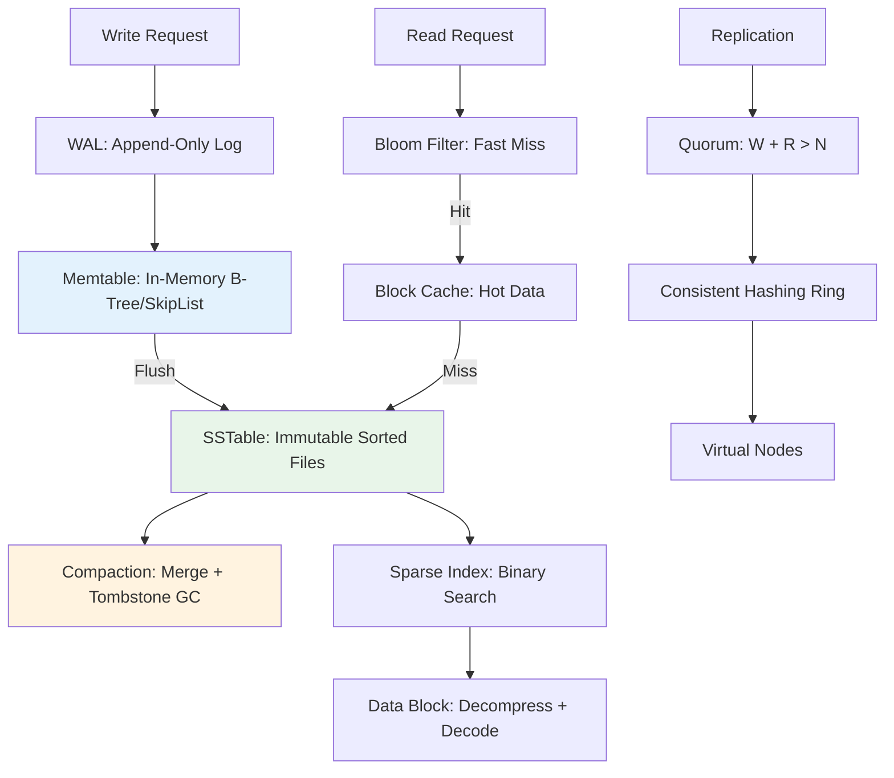

# Key-Value Store Design

> Part of [[README|MOC]] • `Architect/10_System-Design-Interviews` • Weeks 3
> 🎨 **Visual diagram:** Create Excalidraw drawing from template: `Cmd+P → Excalidraw: New from template → System Design Interviews Diagram`

## Intent

Design a distributed key-value store (like DynamoDB, Cassandra, Redis) using LSM trees for write optimization, consistent hashing for partitioning, and quorum replication for durability — supporting high write throughput with tunable consistency.

## Why it Matters

- **Interview signal**: KV store is the "Hello World" of distributed systems — tests LSM trees, CAP, replication, partitioning
- **Production impact**: Backbone of modern infrastructure (Redis, Cassandra, RocksDB, DynamoDB, etcd)
- **Core concept**: Write path (memtable → WAL → SSTable → compaction) vs read path (bloom filter → cache → SSTable)

## Diagram


## Problems
### System Design Problem: Distributed Key-Value Store

**Requirements:**
- Put(key, value), Get(key), Delete(key), Scan(prefix)
- 1M+ writes/sec, 10M+ reads/sec
- Tunable consistency (eventual to strong)
- Horizontal scaling, automatic failover
- TTL support, secondary indexes (optional)

**Constraints:**
- Keys up to 1KB, values up to 1MB
- 99.99% availability, p99 < 10ms
- Cross-DC replication
- Schema-less

**API / Interfaces:**
- `put(key, value, ttl?)`
- `get(key) -> value`
- `delete(key)`
- `scan(prefix, limit) -> Iterator`

## Code / Example

```java
// Java 25 / Spring Boot 3.5: LSM-Tree Key-Value Store Core
// Simplified RocksDB-style implementation

package com.architect.kvstore;

import java.io.*;
import java.nio.file.*;
import java.util.*;
import java.util.concurrent.*;
import java.util.concurrent.atomic.AtomicLong;

public final class LSMKVStore {

    private final Path dataDir;
    private final Memtable memtable;
    private final List<SSTable> sstables = new CopyOnWriteArrayList<>();
    private final BloomFilter bloomFilter;
    private final BlockCache blockCache;
    private final CompactionManager compaction;
    private final WAL wal;

    public LSMKVStore(Path dataDir, long memtableSize, int blockCacheSize) {
        this.dataDir = dataDir;
        this.memtable = new Memtable(memtableSize);
        this.bloomFilter = new BloomFilter(1_000_000, 0.01);
        this.blockCache = new BlockCache(blockCacheSize);
        this.wal = new WAL(dataDir.resolve("wal.log"));
        this.compaction = new CompactionManager(this);
        this.compaction.start();
    }

    public void put(byte[] key, byte[] value) {
        // 1. Write to WAL (durability)
        wal.append(key, value, System.currentTimeMillis());
        
        // 2. Write to memtable
        memtable.put(key, value);
        
        // 3. Update bloom filter
        bloomFilter.add(key);
        
        // 4. Flush if memtable full
        if (memtable.isFull()) {
            flushMemtable();
        }
    }

    public Optional<byte[]> get(byte[] key) {
        // 1. Check memtable (most recent)
        Optional<byte[]> val = memtable.get(key);
        if (val.isPresent()) return val.filter(v -> !isTombstone(v));
        
        // 2. Check bloom filter (fast negative)
        if (!bloomFilter.mightContain(key)) return Optional.empty();
        
        // 3. Check block cache
        val = blockCache.get(key);
        if (val.isPresent()) return val.filter(v -> !isTombstone(v));
        
        // 4. Search SSTables (newest first)
        for (SSTable sstable : sstables) {
            val = sstable.get(key);
            if (val.isPresent()) {
                blockCache.put(key, val.get());
                return val.filter(v -> !isTombstone(v));
            }
        }
        return Optional.empty();
    }

    public void delete(byte[] key) {
        put(key, TOMBSTONE); // Tombstone marker
    }

    private void flushMemtable() {
        SSTable sstable = memtable.flushToSSTable(dataDir);
        sstables.add(0, sstable); // Newest first
        memtable.clear();
        wal.rotate();
        compaction.trigger();
    }

    private boolean isTombstone(byte[] value) {
        return Arrays.equals(value, TOMBSTONE);
    }

    private static final byte[] TOMBSTONE = new byte[0];

    // Simplified components
    static class Memtable {
        private final ConcurrentSkipListMap<byte[], byte[]> map = new ConcurrentSkipListMap<>(BytesComparator.INSTANCE);
        private final long maxSize;
        private long currentSize = 0;

        Memtable(long maxSize) { this.maxSize = maxSize; }

        void put(byte[] key, byte[] value) {
            map.put(key.clone(), value.clone());
            currentSize += key.length + value.length;
        }

        Optional<byte[]> get(byte[] key) {
            return Optional.ofNullable(map.get(key));
        }

        boolean isFull() { return currentSize >= maxSize; }

        SSTable flushToSSTable(Path dir) throws IOException {
            // Write sorted entries to SSTable file with sparse index
            return new SSTable(Files.createTempFile(dir, "sst-", ".sst"), map);
        }

        void clear() { map.clear(); currentSize = 0; }
    }

    static class SSTable {
        private final Path file;
        private final Map<byte[], Long> sparseIndex = new HashMap<>(); // key -> file offset
        private final BloomFilter localBloom;

        SSTable(Path file, Map<byte[], byte[]> data) { /* write sorted data */ this.file = file; this.localBloom = new BloomFilter(data.size(), 0.01); }

        Optional<byte[]> get(byte[] key) { /* binary search sparse index, read block */ return Optional.empty(); }
    }

    static class BloomFilter { /* probabilistic set membership */ 
        BloomFilter(int expected, double fpp) {}
        void add(byte[] key) {}
        boolean mightContain(byte[] key) { return true; }
    }

    static class BlockCache { /* LRU cache for data blocks */
        BlockCache(int size) {}
        Optional<byte[]> get(byte[] key) { return Optional.empty(); }
        void put(byte[] key, byte[] value) {}
    }

    static class WAL { /* Write-Ahead Log for durability */
        WAL(Path path) {}
        void append(byte[] key, byte[] value, long ts) {}
        void rotate() {}
    }

    static class CompactionManager { /* Background merge + GC */
        CompactionManager(LSMKVStore store) {}
        void start() {}
        void trigger() {}
    }

    enum BytesComparator implements Comparator<byte[]> {
        INSTANCE;
        public int compare(byte[] a, byte[] b) { /* lexicographic */ return 0; }
    }
}
```

## When to Use / When NOT
| **Use When** | **Avoid When** |
|--------------|----------------|
| High write throughput, simple access patterns | Complex queries, joins, transactions |
| Time-series, caching, session storage | Relational data with foreign keys |
| Event sourcing, audit logs | ACID transactions across keys |
| Metadata, configuration, feature flags | Small dataset fitting in single Postgres |


## Trade-offs
| Dimension | This Approach | Alternative | Trade-off Rationale | Decision Rule |
|-----------|---------------|-------------|---------------------|---------------|
| Complexity | [TBD] | [TBD] | [TBD] | [TBD] |
| Operational Burden | [TBD] | [TBD] | [TBD] | [TBD] |
| Latency | [TBD] | [TBD] | [TBD] | [TBD] |
| Consistency | [TBD] | [TBD] | [TBD] | [TBD] |
| Cost at Scale | [TBD] | [TBD] | [TBD] | [TBD] |

## Vs Table
| Aspect | LSM (RocksDB, Cassandra) | B-Tree (InnoDB, BoltDB) |
|--------|--------------------------|------------------------|
| Write Path | Memtable → WAL → SSTable | In-place page update |
| Compaction | Background merge | None (page splits) |
| Crash Recovery | WAL replay | Redo/Undo log |
| Read Optimization | Bloom filter, block cache | Buffer pool |

## Pitfalls
- Write amplification from compaction (10-50x) — tune level sizes, use tiered compaction
- Read amplification from many SSTable levels — bloom filters, block cache critical
- Tombstone accumulation — compaction must garbage collect
- Bloom filter false positives — tune FPP (0.01 typical)
- Memtable flush blocking writes — use dual memtables (active + immutable)
- SSTable file handle exhaustion — limit open files, use mmap
- Clock skew in distributed timestamps — use hybrid logical clocks (HLC)
- Hot partitions — consistent hashing + virtual nodes + key splitting

## Interview Q&A (Senior Depth)

**Q1: Walk me through the write path in an LSM-tree KV store.**
**A:** Write → WAL (fsync for durability) → Memtable (skip list/B-tree) → when full, flush to immutable SSTable (sorted, compressed, bloom filter, sparse index) → background compaction merges SSTables, drops tombstones. Reads check memtable → bloom filter → block cache → SSTables (newest first).

**Q2: How does compaction work and what are the strategies?**
**A:** Leveled (L0→L1→L2...): each level 10x size, minimizes space amp but high write amp. Tiered (size-tiered): merge same-size files, lower write amp, higher space amp. Universal: single sorted run, best for time-series. Choose based on workload: write-heavy → tiered, read-heavy → leveled.

**Q3: How do you achieve tunable consistency in distributed KV?**
**A:** Quorum: W + R > N for strong consistency. Dynamo-style: N=3, W=2, R=2 (strong), or W=1, R=1 (eventual). Hinted handoff for unavailable replicas. Read repair on mismatch. Vector clocks / version vectors for conflict resolution. Last-write-wins (LWW) with hybrid logical clocks for simplicity.

**Q4: How do you handle range scans efficiently?**
**A:** SSTables are sorted — scan merges iterators from memtable + relevant SSTables (like merge sort). Use sparse index to seek start key. Limit SSTables via bloom filter + key range metadata in manifest. For distributed: consistent hashing doesn't support range scans → use range partitioning (Cassandra token ranges) or separate index.

**Q5: What's the difference between Redis and RocksDB/Cassandra?**
**A:** Redis: in-memory, single-threaded, sub-ms latency, rich data structures, persistence optional. RocksDB: embedded LSM, multi-threaded, disk-optimized, no network. Cassandra: distributed LSM, tunable consistency, wide rows, CQL. Choose Redis for cache/leaderboard, RocksDB for embedded state, Cassandra for multi-DC write-heavy.

## Flashcards (Spaced Repetition)

#flashcard
**Q:** LSM tree write path? :: **A:** WAL → Memtable → SSTable (flush) → Compaction #flashcard

#flashcard
**Q:** LSM tree read path? :: **A:** Memtable → Bloom Filter → Block Cache → SSTables (newest first) #flashcard

#flashcard
**Q:** What is a memtable? :: **A:** In-memory sorted structure (skip list/B-tree), flushed to disk when full #flashcard

#flashcard
**Q:** What is an SSTable? :: **A:** Sorted String Table — immutable, compressed, sorted file with sparse index + bloom filter #flashcard

#flashcard
**Q:** Compaction strategies? :: **A:** Leveled (space efficient), Tiered (write efficient), Universal (time-series) #flashcard

#flashcard
**Q:** Write amplification? :: **A:** Bytes written to disk / bytes written by user. LSM: 10-50x. B-Tree: ~1-4x #flashcard

#flashcard
**Q:** Space amplification? :: **A:** Disk space / live data size. LSM: 10-30% (tombstones, old versions). B-Tree: low #flashcard

#flashcard
**Q:** How to handle tombstones? :: **A:** Compaction drops tombstones when all versions older than GC window #flashcard

#flashcard
**Q:** Bloom filter purpose? :: **A:** Fast negative lookup — avoid reading SSTable for non-existent keys #flashcard

#flashcard
**Q:** Quorum formula? :: **A:** W + R > N for strong consistency. N=3, W=2, R=2 typical #flashcard

#flashcard
**Q:** Hinted handoff? :: **A:** Store writes for down replica locally, replay when it recovers #flashcard

#flashcard
**Q:** Read repair? :: **A:** On read quorum, detect stale replicas, async update them #flashcard

#flashcard
**Q:** Vector clocks vs LWW? :: **A:** Vector clocks track causality, LWW uses timestamp (clock skew risk) #flashcard

#flashcard
**Q:** When to use LSM vs B-Tree? :: **A:** Write-heavy → LSM. Read-heavy, random updates → B-Tree #flashcard

## Practice Tasks (Tasks Plugin)
- [ ] Implement memtable + SSTable flush from memory 📅 {{date:YYYY-MM-DD, +1}}
- [ ] Explain compaction strategies trade-offs 📅 {{date:YYYY-MM-DD, +3}}
- [ ] Answer all Interview Q&A aloud 📅 {{date:YYYY-MM-DD, +7}}
- [ ] Review flashcards (Spaced Repetition) 📅 {{date:YYYY-MM-DD, +1}}

```tasks
not done
path includes 10_System-Design-Interviews
sort by due
limit 10
```

## Related

- [[Architect/10_System-Design-Interviews/BB-05-Consistent-Hashing|Consistent Hashing]]
- [[Architect/10_System-Design-Interviews/DB-05-Sharding|Database Sharding]]
- [[Architect/07_Integration-APIs/Kafka Messaging and Idempotency|Messaging and Idempotency]]

---

*Category: Architect/10_System-Design-Interviews • Part of [[README|MOC]]*