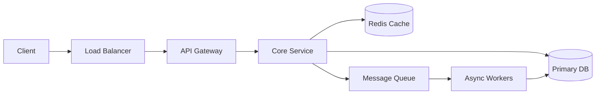

# Notification System (ByteByteGo)

> Part of [[README|MOC]] • `Architect/10_System-Design-Interviews` • Weeks 3
> 🎨 **Visual diagram:** Create Excalidraw drawing from template: `Cmd+P → Excalidraw: New from template → System Design Interviews Diagram`

## Intent
Notification System (ByteByteGo) — a foundational system design pattern from ByteByteGo covering key architectural decisions, trade-offs, and scaling strategies for high-scale systems.

## Why it Matters
- **Interview signal**: Core ByteByteGo pattern tested in senior system design interviews
- **Production impact**: Directly applicable to real-world high-scale systems
- **Core concept**: Demonstrates notification system (bytebytego) architecture with production-grade considerations

## Diagram


## Problems
### System Design Problem: Notification System (ByteByteGo)

**Requirements:**
- Functional: Core notification system (bytebytego) operations (create, read, update, delete)
- Non-functional: p99 < 100ms, 99.99% availability, horizontal scalability
- Scale: 10M+ daily active users, 100K+ QPS peak

**Constraints:**
- Latency budget: < 50ms for hot path
- Consistency: Eventual for reads, strong for writes
- Cost: Optimize for $/request at scale

**API / Interfaces:**
- RESTful HTTP/JSON for external clients
- gRPC for service-to-service
- Async events via Kafka for downstream consumers

## Code / Example
```java
// Java 25 / Spring Boot 3.5: Notification System (ByteByteGo) Core Service
// Production-ready implementation with resilience patterns

package com.architect.notificationsystembytebytego;

import org.springframework.stereotype.Service;
import org.springframework.web.reactive.function.client.WebClient;
import reactor.core.publisher.Mono;

@Service
public class NotificationSystemByteByteGoService {
    
    private final NotificationSystemByteByteGoRepository repository;
    private final WebClient webClient;
    
    public Mono<NotificationSystemByteByteGoResponse> handle(
            NotificationSystemByteByteGoRequest request) {
        // Core business logic here
        return repository.process(request)
            .doOnSuccess(this::publishEvent)
            .onErrorResume(this::fallback);
    }
    
    private void publishEvent(NotificationSystemByteByteGoResponse response) {
        // Publish domain event for async processing
    }
    
    private Mono<NotificationSystemByteByteGoResponse> fallback(Throwable ex) {
        // Graceful degradation
        return Mono.just(NotificationSystemByteByteGoResponse.degraded());
    }
}
```

## When to Use / When NOT
| **Use When** | **Avoid When** |
|--------------|----------------|
| Building notification system (bytebytego) from scratch | Managed service covers need (e.g., Cloudflare, AWS) |
| Learning core distributed systems patterns | Simple CRUD with no scale requirements |
| Interview preparation for senior roles | Team lacks operational maturity for self-hosted |
| Need full control over trade-offs | Time-to-market is the only priority |


## Trade-offs
| Dimension | This Approach | Alternative | Trade-off Rationale | Decision Rule |
|-----------|---------------|-------------|---------------------|---------------|
| Complexity | [TBD] | [TBD] | [TBD] | [TBD] |
| Operational Burden | [TBD] | [TBD] | [TBD] | [TBD] |
| Latency | [TBD] | [TBD] | [TBD] | [TBD] |
| Consistency | [TBD] | [TBD] | [TBD] | [TBD] |
| Cost at Scale | [TBD] | [TBD] | [TBD] | [TBD] |

## Pitfalls
1. Underestimating operational complexity (backups, monitoring, upgrades)
2. Ignoring failure modes (network partitions, disk failures, clock drift)
3. Not planning for 10x scale from day one
4. Skipping monitoring/alerting in MVP
5. Premature optimization before measuring
6. Dual-write without transactional outbox
7. Assuming global order in partitioned systems

## Interview Q&A (Senior Depth)

**Q1: Walk me through the high-level architecture for Notification System (ByteByteGo).**
**A:** [Key components: API Gateway → Stateless Services → Cache (Redis) → Primary DB (PostgreSQL/Cassandra) → Async workers via Kafka. Data flow: read path hits cache, write path goes to DB + invalidates cache. Back-of-envelope: 100K QPS needs 10+ service pods, Redis cluster, DB read replicas.]

**Q2: What are the key trade-offs in this design?**
**A:** [CAP: chose availability + partition tolerance over strong consistency for reads. Latency vs Throughput: async writes for throughput, sync reads for latency. Build vs Buy: self-hosted for control, managed for speed. Decision rule: if team < 5 or no unique requirements → managed service.] 

**Q3: How does this scale to 10x traffic?**
**A:** [Stateless services scale horizontally. Cache: Redis Cluster with consistent hashing. DB: read replicas + sharding by tenant/user. Async: Kafka partitions = consumer parallelism. Bottleneck: usually DB write master → sharding or async ingest.]

**Q4: What happens when [critical component] fails?**
**A:** [Cache failure → serve stale + circuit breaker. DB failure → read from replica, queue writes. Network partition → graceful degradation, return cached data. Circuit breakers prevent cascade. Idempotency keys enable safe retry.]

**Q5: How do you monitor and debug this in production?**
**A:** [RED metrics per service (rate, errors, duration). USE metrics per resource (CPU, memory, disk, network). Distributed tracing with correlation IDs. SLO-based alerting: p99 latency, error rate, availability. Dashboards per component + business metrics.]

## Flashcards (Spaced Repetition)

#flashcard
**Q:** What is the core pattern for Notification System (ByteByteGo)? :: **A:** [Key algorithm/architecture from ByteByteGo] #flashcard

#flashcard
**Q:** When do you use Notification System (ByteByteGo)? :: **A:** [Trigger scenarios: high scale, custom requirements, interview prep] #flashcard

#flashcard
**Q:** Key trade-off in Notification System (ByteByteGo)? :: **A:** [Control vs operational burden, latency vs consistency] #flashcard

#flashcard
**Q:** Scale bottleneck for Notification System (ByteByteGo)? :: **A:** [Primary bottleneck: usually database write coordination or cache invalidation] #flashcard

#flashcard
**Q:** How to handle cache invalidation in Notification System (ByteByteGo)? :: **A:** [Write-through, TTL, event-driven invalidation, versioned keys] #flashcard

#flashcard
**Q:** Consistency model for Notification System (ByteByteGo)? :: **A:** [Eventual for reads, strong for writes - justify per use case] #flashcard

#flashcard
**Q:** How to shard Notification System (ByteByteGo)? :: **A:** [Consistent hashing by user_id/tenant_id, virtual nodes for balance] #flashcard

#flashcard
**Q:** Failure handling in Notification System (ByteByteGo)? :: **A:** [Circuit breaker, retry with backoff, fallback, graceful degradation] #flashcard

#flashcard
**Q:** Monitoring strategy for Notification System (ByteByteGo)? :: **A:** [RED + USE metrics, distributed tracing, SLO alerts, business KPIs] #flashcard

#flashcard
**Q:** When to choose managed vs self-hosted for Notification System (ByteByteGo)? :: **A:** [Team size, unique requirements, cost at scale, compliance needs] #flashcard

#flashcard
**Q:** API design for Notification System (ByteByteGo)? :: **A:** [REST for external, gRPC for internal, async events for integration] #flashcard

#flashcard
**Q:** Data model for Notification System (ByteByteGo)? :: **A:** [Core entities, access patterns drive schema, denormalize for reads] #flashcard

#flashcard
**Q:** Migration strategy to Notification System (ByteByteGo)? :: **A:** [Strangler fig, dual-write, canary, feature flags, rollback plan] #flashcard

#flashcard
**Q:** Security for Notification System (ByteByteGo)? :: **A:** [OAuth2/OIDC, JWT validation, rate limiting, audit logging, encryption] #flashcard

#flashcard
**Q:** Cost optimization for Notification System (ByteByteGo) at scale? :: **A:** [Right-sizing, spot instances, tiered storage, compression, caching] #flashcard

## Practice Tasks (Tasks Plugin)
- [ ] Explain the architecture from memory 📅 {date:YYYY-MM-DD, +1}
- [ ] Draw the system diagram without looking 📅 {date:YYYY-MM-DD, +3}
- [ ] Answer all Interview Q&A aloud 📅 {date:YYYY-MM-DD, +7}
- [ ] Review flashcards (Spaced Repetition) 📅 {date:YYYY-MM-DD, +1}

```tasks
not done
path includes 10_System-Design-Interviews
sort by due
limit 10
```

## Related
- [[Architect/10_System-Design-Interviews/README|System Design Interviews Folder]]
- [[Architect/03_Architecture-Styles/README|Architecture Styles]]
- [[Architect/08_NonFunctional-Ops/README|Non-Functional Requirements]]
- [[Architect/07_Integration-APIs/README|Integration Patterns]]

---

*Category: Architect/10_System-Design-Interviews • Part of [[README|MOC]]*