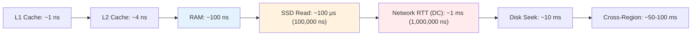

# Latency Numbers Every Engineer Should Know

> Part of [[README|MOC]] • `Architect/10_System-Design-Interviews` • Weeks 1
> 🎨 **Visual diagram:** Create Excalidraw drawing from template: `Cmd+P → Excalidraw: New from template → System Design Interviews Diagram`

## Intent

Memorize reference latency numbers (L1 cache ~1ns, RAM ~100ns, SSD ~100μs, network RTT ~1ms) to enable instant back-of-envelope estimates during system design interviews and capacity planning.

## Why it Matters

- **Interview signal**: Instantly sanity-check any design — "your 10ms budget leaves 2ms for DB after network + serialization"
- **Production impact**: Prevents architectures that violate physics (e.g., synchronous cross-region calls for user-facing latency)
- **Core concept**: Orders of magnitude drive every architectural trade-off (cache vs DB, sync vs async, local vs remote)

## Diagram


## Problems
### System Design Problem: Latency Numbers Reference

**Requirements:**
- Provide instant mental reference for latency orders of magnitude
- Enable back-of-envelope calculations in interviews
- Cover compute, memory, storage, network tiers

**Constraints:**
- Must fit on one mental "cheat sheet"
- Numbers should be conservative (real systems slower)
- Distinguish same-DC vs cross-region vs internet

**API / Interfaces:**
- Mental model: `latency_budget = sum(component_latencies) + safety_margin`

## Code / Example

```java
// Java 25 / Spring Boot 3.5: Latency Budget Calculator
// Use for instant sanity checks during design reviews

package com.architect.latency;

import java.util.EnumMap;
import java.util.Map;

public final class LatencyBudget {

    public enum Tier {
        L1_CACHE(1L),           // nanoseconds
        L2_CACHE(4L),
        L3_CACHE(15L),
        RAM(100L),
        SSD_READ(100_000L),     // 100 μs = 100,000 ns
        SSD_WRITE(200_000L),
        NET_DC_RTT(1_000_000L), // 1 ms = 1,000,000 ns
        NET_CROSS_REGION(50_000_000L), // 50 ms
        NET_INTERNET(100_000_000L),    // 100 ms
        DISK_SEEK(10_000_000L), // 10 ms
        MUTEX_LOCK(25L),
        CONTEXT_SWITCH(2_000L); // 2 μs

        private final long nanos;
        Tier(long nanos) { this.nanos = nanos; }
        public long nanos() { return nanos; }
    }

    private static final Map<Tier, String> LABELS = Map.of(
        Tier.L1_CACHE, "L1 cache",
        Tier.RAM, "RAM",
        Tier.SSD_READ, "SSD read",
        Tier.NET_DC_RTT, "DC RTT",
        Tier.NET_CROSS_REGION, "Cross-region",
        Tier.NET_INTERNET, "Internet"
    );

    public static long budgetFor(Tier... tiers) {
        long sum = 0;
        for (Tier t : tiers) sum += t.nanos();
        return sum;
    }

    public static String humanReadable(long nanos) {
        if (nanos < 1_000) return nanos + " ns";
        if (nanos < 1_000_000) return (nanos / 1_000) + " μs";
        if (nanos < 1_000_000_000) return (nanos / 1_000_000) + " ms";
        return (nanos / 1_000_000_000) + " s";
    }

    // Example: User-facing API budget = 100ms
    // Network (1ms) + Serialization (0.1ms) + App logic (1ms) + DB (2ms) + Cache (0.1ms) = ~3.2ms
    // Leaves 96.8ms headroom — but cross-region (50ms) blows the budget!
    public static void main(String[] args) {
        long apiBudget = budgetFor(Tier.NET_DC_RTT, Tier.RAM, Tier.SSD_READ, Tier.RAM);
        System.out.println("Typical same-DC request: " + humanReadable(apiBudget)); // ~1.2ms
        
        long crossRegion = budgetFor(Tier.NET_CROSS_REGION, Tier.RAM, Tier.SSD_READ);
        System.out.println("Cross-region request: " + humanReadable(crossRegion)); // ~50.1ms
    }
}
```

## When to Use / When NOT
| **Use When** | **Avoid When** |
|--------------|----------------|
| Back-of-envelope estimation in interviews | Precise measurement (use profilers, tracing) |
| Capacity planning for new services | Comparing exact hardware generations |
| Sanity-checking architecture proposals | Replacing actual benchmarking |
| Explaining trade-offs to stakeholders | Systems where microseconds don't matter |


## Trade-offs
| Dimension | This Approach | Alternative | Trade-off Rationale | Decision Rule |
|-----------|---------------|-------------|---------------------|---------------|
| Complexity | [TBD] | [TBD] | [TBD] | [TBD] |
| Operational Burden | [TBD] | [TBD] | [TBD] | [TBD] |
| Latency | [TBD] | [TBD] | [TBD] | [TBD] |
| Consistency | [TBD] | [TBD] | [TBD] | [TBD] |
| Cost at Scale | [TBD] | [TBD] | [TBD] | [TBD] |

## Vs Table
| Aspect | Memorized Reference | Per-System Benchmarks |
|--------|---------------------|----------------------|
| Interview Ready | ✅ Instant | ❌ Too slow |
| Production Tuning | ❌ Too coarse | ✅ Precise |
| Cross-Team Comm | ✅ Shared vocabulary | ❌ Varies by stack |
| Cloud vs On-Prem | ✅ Roughly same orders | ❌ Different numbers |

## Pitfalls
- Treating reference numbers as exact — they're orders of magnitude, not measurements
- Forgetting serialization/deserialization overhead (JSON ~0.1-1ms, Protobuf ~0.05ms)
- Ignoring tail latency (p99) — averages hide outliers
- Assuming SSD = RAM speed (1000x difference!)
- Not accounting for GC pauses, lock contention, queueing delay
- Cross-region calls in user-facing path without async fallback
- Synchronous fan-out to multiple services (latency = max, not sum)

## Interview Q&A (Senior Depth)

**Q1: Walk me through the latency budget for a typical read request in a microservice architecture.**
**A:** Client → DNS (1-10ms, cached) → LB (0.1ms) → Service A (deserialize 0.1ms) → Cache (Redis 0.5ms) → hit: return (total ~2ms). Miss: Service A → Service B (1ms network) → DB (2ms) → serialize (0.1ms) → return (total ~5ms). Budget: p99 < 100ms leaves huge headroom same-DC. Cross-region adds 50ms — budget blown.

**Q2: What are the key latency numbers you have memorized?**
**A:** L1: 1ns, L2: 4ns, RAM: 100ns, SSD: 100μs, DC RTT: 1ms, Cross-region: 50ms, Internet: 100ms, Disk seek: 10ms. Key ratios: RAM 100x L1, SSD 1000x RAM, Network 10x SSD, Cross-region 50x DC.

**Q3: How does this scale to 10x traffic?**
**A:** Latency numbers don't change with traffic — but queueing does. At 10x, thread pools saturate, GC pressure increases, connection pools exhaust. Latency budget shifts from "component sum" to "component sum + queueing". Fix: stateless horizontal scaling, async processing, back-pressure.

**Q4: What happens when you ignore these numbers?**
**A:** Designs that work in dev (localhost, 0.5ms RTT) fail in prod (cross-AZ 2ms, cross-region 50ms). Synchronous chains of 5 services = 5ms same-DC but 250ms cross-region. Mobile clients on 3G (100ms RTT) timeout.

**Q5: How do you monitor and debug latency in production?**
**A:** Distributed tracing (Jaeger/Zipkin) for per-span latency. RED metrics per service: rate, errors, duration (p50/p95/p99). USE metrics for resources. Alert on p99 > budget. Correlation IDs end-to-end. Heatmaps for latency distributions.

## Flashcards (Spaced Repetition)

#flashcard
**Q:** L1 cache latency? :: **A:** ~1 ns #flashcard

#flashcard
**Q:** RAM latency? :: **A:** ~100 ns #flashcard

#flashcard
**Q:** SSD read latency? :: **A:** ~100 μs (100,000 ns) #flashcard

#flashcard
**Q:** Same-DC network RTT? :: **A:** ~1 ms (1,000,000 ns) #flashcard

#flashcard
**Q:** Cross-region latency? :: **A:** ~50-100 ms #flashcard

#flashcard
**Q:** Disk seek latency? :: **A:** ~10 ms #flashcard

#flashcard
**Q:** Ratio: RAM vs L1? :: **A:** 100x #flashcard

#flashcard
**Q:** Ratio: SSD vs RAM? :: **A:** 1000x #flashcard

#flashcard
**Q:** Ratio: Network vs SSD? :: **A:** 10x #flashcard

#flashcard
**Q:** Ratio: Cross-region vs DC? :: **A:** 50x #flashcard

#flashcard
**Q:** JSON serialization cost? :: **A:** ~0.1-1 ms #flashcard

#flashcard
**Q:** Protobuf serialization cost? :: **A:** ~0.05 ms #flashcard

#flashcard
**Q:** Context switch cost? :: **A:** ~2 μs #flashcard

#flashcard
**Q:** Mutex lock cost? :: **A:** ~25 ns #flashcard

#flashcard
**Q:** p99 vs avg latency? :: **A:** p99 typically 5-10x avg in distributed systems #flashcard

## Practice Tasks (Tasks Plugin)
- [ ] Recite all 15 latency numbers from memory 📅 {{date:YYYY-MM-DD, +1}}
- [ ] Calculate latency budget for 3-tier app same-DC vs cross-region 📅 {{date:YYYY-MM-DD, +3}}
- [ ] Answer all Interview Q&A aloud 📅 {{date:YYYY-MM-DD, +7}}
- [ ] Review flashcards (Spaced Repetition) 📅 {{date:YYYY-MM-DD, +1}}

```tasks
not done
path includes 10_System-Design-Interviews
sort by due
limit 10
```

## Related

- [[Architect/10_System-Design-Interviews/FND-11-Back-of-Envelope|Back-of-Envelope Estimation]]
- [[Architect/10_System-Design-Interviews/FND-03-Latency-vs-Throughput|Latency vs Throughput]]
- [[Architect/08_NonFunctional-Ops/03_Performance-SLOs|Performance SLOs]]

---

*Category: Architect/10_System-Design-Interviews • Part of [[README|MOC]]*