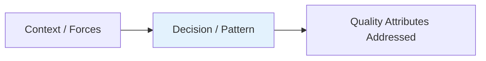

# Spotify Data Pipeline

> Part of [[README|Architect MOC]] • `Architect/11_Real-World-Case-Studies`
> 🎨 **Visual diagram:** Create Excalidraw drawing from template: `Cmd+P → Excalidraw: New from template → Architecture Diagram`

## Intent
One sentence: what problem does this solve? Define the **key term** in **bold**.

## Why it Matters
- Interview signal: Real-world architecture discussion entry point
- Production impact: Battle-tested patterns at massive scale
- Architecture force: The unique constraints that shaped this design

## Diagram


## Problems
### System Design Problem: Spotify Data Pipeline

**Requirements:**
- Functional:
- Non-functional (SLOs):

**Constraints:**
- Scale:
- Consistency:
- Latency budget:

**API / Interfaces:**

## Code / Example
```java
// Java 25 / Spring Boot 3.5: Core concept for Spotify Data Pipeline
// Architecture pattern - implementation varies by system

record SpotifyDataPipelineConfig(
    String component,
    int capacity,
    String strategy
) {
    static SpotifyDataPipelineConfig ofDefaults() {
        return new SpotifyDataPipelineConfig(
            "Spotify Data Pipeline",
            10000,
            "default"
        );
    }
}
```

### Concrete Example
- **Input:** Design requirements
- **Output:** Architecture diagram + component specs
- **Explanation:** See note for step-by-step design

## When to Use / When NOT
| **Use When** | **Avoid When** |
|--------------|----------------|
| Building this system from scratch | Managed service covers need (AWS SQS, Cloudflare, etc.) |
| Learning architecture patterns | Simple CRUD applications |
| Interview preparation | Requirements don't match |
| Need full control over trade-offs | Team lacks operational maturity |


## Trade-offs
| Dimension | This Approach | Alternative | Trade-off Rationale | Decision Rule |
|-----------|---------------|-------------|---------------------|---------------|
| Complexity | [TBD] | [TBD] | [TBD] | [TBD] |
| Operational Burden | [TBD] | [TBD] | [TBD] | [TBD] |
| Latency | [TBD] | [TBD] | [TBD] | [TBD] |
| Consistency | [TBD] | [TBD] | [TBD] | [TBD] |
| Cost at Scale | [TBD] | [TBD] | [TBD] | [TBD] |

## Vs Table
| Aspect | This Design | Managed Service | Decision Rule |
|--------|-------------|-----------------|---------------|
| Flexibility | Full | Limited | Need custom logic? → Self-host |
| Time to Market | Weeks | Hours | Prototype? → Managed |
| Cost at Scale | Optimizable | Fixed/marginal | High volume? → Self-host |
| Team Cognitive Load | High | Low | Team size/experience? |

## Pitfalls
- Underestimating operational complexity (backups, monitoring, upgrades)
- Ignoring failure modes (network partitions, disk failures, clock drift)
- Not planning for 10x scale from day one
- Skipping monitoring/alerting in MVP
- Premature optimization before measuring
- Dual-write without transactional outbox
- Assuming global order in partitioned systems

## Interview Q&A (Senior Depth)

**Q1: Walk me through the high-level architecture for Spotify Data Pipeline.**
**A:** [Key components, data flow, boundaries. Use back-of-envelope to justify scale.]

**Q2: What are the key trade-offs in this design?**
**A:** [CAP, Latency vs Throughput, Build vs Buy, SQL vs NoSQL, Sync vs Async. Cite specific choices.]

**Q3: How does this scale to 10x traffic?**
**A:** [Stateless services, sharding, read replicas, caching layers, async processing via message queues. Identify bottlenecks.]

**Q4: What happens when [critical component] fails?**
**A:** [Retries, circuit breakers, fallback, graceful degradation, data recovery, replay.]

**Q5: How do you monitor and debug this in production?**
**A:** [RED metrics: rate, errors, duration. USE metrics: utilization, saturation, errors. Structured logging, correlation IDs. SLO-based alerting.]

## Flashcards (Spaced Repetition)

#flashcard
**Q:** What is the core pattern for Spotify Data Pipeline? :: **A:** [Key algorithm/architecture] #flashcard

#flashcard
**Q:** When do you use Spotify Data Pipeline? :: **A:** [Trigger scenarios] #flashcard

#flashcard
**Q:** Key trade-off in Spotify Data Pipeline? :: **A:** [Main trade-off] #flashcard

#flashcard
**Q:** Scale bottleneck for Spotify Data Pipeline? :: **A:** [Primary bottleneck] #flashcard

#flashcard
**Q:** How does Spotify Data Pipeline handle failure? :: **A:** [Failure handling strategy] #flashcard

#flashcard
**Q:** Consistency model in Spotify Data Pipeline? :: **A:** [Consistency guarantees] #flashcard

#flashcard
**Q:** Data partitioning strategy in Spotify Data Pipeline? :: **A:** [Partitioning approach] #flashcard

#flashcard
**Q:** How does Spotify Data Pipeline achieve low latency? :: **A:** [Latency optimization techniques] #flashcard

#flashcard
**Q:** Monitoring strategy for Spotify Data Pipeline? :: **A:** [Key metrics and alerts] #flashcard

#flashcard
**Q:** Evolution of Spotify Data Pipeline over time? :: **A:** [Architecture evolution] #flashcard

## Practice Tasks (Tasks Plugin)
- [ ] Explain the architecture from memory 📅 {date:YYYY-MM-DD, +1}
- [ ] Draw the system diagram without looking 📅 {date:YYYY-MM-DD, +3}
- [ ] Answer all Interview Q&A aloud 📅 {date:YYYY-MM-DD, +7}
- [ ] Review flashcards (Spaced Repetition) 📅 {date:YYYY-MM-DD, +1}

```tasks
not done
path includes {file.folder}
sort by due
limit 10
```

## Related
- [[Architect/10_System-Design-Interviews/README|System Design Interviews]]
- [[Architect/03_Architecture-Styles/README|Architecture Styles]]
- [[Architect/08_NonFunctional-Ops/README|Non-Functional Requirements]]

## ✅ Completion Checklist
- [ ] Intent written (one sentence + key term in **bold**)
- [ ] Why it Matters filled (interview signal, production impact, architecture force)
- [ ] Diagram created (Excalidraw or Mermaid)
- [ ] Problems section complete (requirements, constraints, API)
- [ ] Code example added (Java 25 / Spring Boot 3.5)
- [ ] Trade-offs table filled (all 5 dimensions)
- [ ] Pitfalls listed (5+ items)
- [ ] Interview Q&A answered (all 5 questions with senior depth)
- [ ] Flashcards created (10+ cards with #flashcard syntax)
- [ ] Practice tasks scheduled (Tasks plugin)

```dataviewjs
const page = dv.current();
const criteria = page.completion_criteria || {};
const done = Object.values(criteria).filter(v => v === true).length;
const total = Object.keys(criteria).length;
dv.paragraph(`**Progress: ${done}/${total} (${Math.round(done/total*100)}%)**`);
```

---

*Category: Architect/11_Real-World-Case-Studies • Part of [[README|Architect MOC]]*

