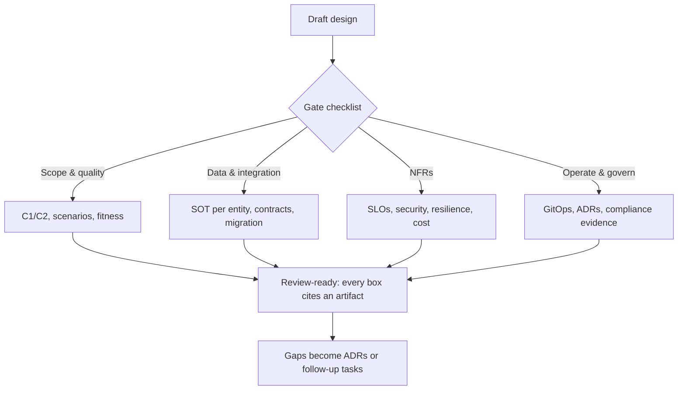

## Why it Matters

A design is not done when it works; it's done when it survives review. This checklist is the pre-submission gate, the questions a senior reviewer or interviewer will ask anyway, answered before they're asked, so "done" means evidence rather than intention.

## Diagram



## Code

```yaml

## When to use / NOT

- **Use:** before calling any design complete — tick every box, and treat an unticked one as a follow-up task or an ADR, not an omission.
- **Use:** in interview practice as the closing structure for a system-design answer: scope → data → NFRs → operate. It makes a 40-minute answer cover what a senior panel scores on.
- **Use:** as a review checklist in real design reviews — it converts "looks fine" into a list of evidence.

**When NOT:** do not treat it as a document to fill in once — it is a gate that runs per design decision, and a checked box from six months ago is not evidence about the system today. Do not tick from memory: each item should cite an artifact (diagram, ADR, dashboard link, Helm value), because un-cited checks are how designs pass review and fail in production.

## Trade-offs

| Pros | Cons |
|---|---|
| Turns "done" from a feeling into evidence | Tempts box-ticking without understanding the artifact |
| Surfaces gaps before review, saving review cycles | Long list can bury the top-3 risks under completeness |
| Works identically for capstone, review, and interview | Must be re-run per decision; a stale pass is false assurance |

## Vs

| Companion | Difference |
|---|---|
| [[Interview-Bank]] | Questions to answer; this is the design gate those answers must satisfy |
| [[Case-Studies]] | Applied designs *under constraint*; this is the generic gate they all pass |
| [[../09_Governance-Documentation/03_Review-Process-RFC\|Review/RFC]] | The social process around the checklist — who reviews, who decides |

## Pitfalls

- Ticking boxes without citing an artifact — cite the ADR, dashboard, or manifest.
- Completeness over priority: a fully checked list with no top-3 risks named is still not a design.
- One-time use — re-run it per design decision, and supersede stale passes.

## Interview Q&A

**Q: How do you know when a design is "done"?**
A: When each gate section has cited evidence and the remaining gaps are owned — a C1/C2 pair, quality scenarios with measures, named fitness functions, a state map with a justified consistency choice, versioned contracts with idempotency stated, a migration plan with rollback, SLOs with burn-rate alerts, security controls, resilience plus a named chaos test, a unit-cost metric, GitOps with canary and pinned images, ADRs for the irreversible calls, and a compliance scope with an evidence location. Anything unticked is either an ADR or a task with an owner — that's what makes it done rather than merely drawn.

**Q: Which box do candidates most often leave empty in a system-design interview?**
A: The rollback/migration plan and the cost model. Candidates design the steady state and forget the transition — expand-migrate-contract, backfill, and a rollback path — and they never name a unit-cost metric. Those two are what separate a senior answer from a mid-level one, and they're cheap to add if you hold 5 minutes for them at the end.

**Q: A reviewer says your design "looks reasonable". Is it done?**
A: Not until "looks reasonable" becomes specific evidence: run the checklist and ask which box gave them confidence. A vague approval doesn't survive an incident, and the checklist's job is exactly to replace impressions with artifacts.

**Q: How is this different from a definition-of-done checklist?**
A: Scope and consequences. A DoD covers a ticket (merged, tested, documented); this covers a *design decision* — data ownership, consistency stance, failure modes, compliance scope — the things that outlive the ticket and show up in the next ADR, the next audit, or the next incident review.

## Related

- [[Interview-Bank]] · [[Case-Studies]] · [[../09_Governance-Documentation/03_Review-Process-RFC\|Review/RFC]]
- Inputs: [[../02_Requirements-Quality-Attributes/Quality-Scenarios\|Quality Scenarios]] · [[../02_Requirements-Quality-Attributes/Fitness-Functions\|Fitness Functions]] · [[../09_Governance-Documentation/02_ADRs\|ADRs]]
- NFRs: [[../08_NonFunctional-Ops/03_Performance-SLOs\|SLOs]] · [[../08_NonFunctional-Ops/05_Cloud-K8s-Deploy-Helm\|K8s Deploy]]

# CI-side evidence of a passed gate (the checklist's automated twin):

boundary-test: # ArchUnit / Spring Modulith verify in CI
 modules: [order, inventory, payment]
 rule: no cross-module access to *.internal
load-gate: # k6/Gatling, scenario from Quality-Scenarios
 script: checkout_p99_300ms_500rps.js
 fail_on: p(99) > 300
security-scan: # OWASP dep-check + gitleaks + image CVE
 block_on: HIGH
deploy: # Helm + canary + probes + PDB, pinned images
 strategy: canary
 rollback_on: slo_burn_rate > 14.4
```

# Capstone Checklist, Design Gate

Tick before calling any design done (`completed: true` only when all pass).

## Scope & Quality

- [ ] C1 context + C2 containers drawn (actors, boundaries, protocols)
- [ ] Quality scenarios written (stimulus→response→measure) + top-3 risks
- [ ] Fitness functions named (what fails the build?)

## Data & Integration

- [ ] State map: system-of-record per entity; consistency choice (CAP/PACELC) justified
- [ ] Contracts versioned (REST/OAS or proto); idempotency + ordering stated
- [ ] Migration plan: expand-migrate-contract + rollback + backfill

## NFRs

- [ ] SLOs (p50/p95/p99 + availability) + burn-rate alerts + dashboard link
- [ ] Security: OAuth scopes, secrets mgmt, PII encryption/redaction
- [ ] Resilience: breaker/bulkhead/fallback + chaos test named
- [ ] Cost: unit-cost metric + rightsizing/HPA-KEDA story

## Operate & Govern

- [ ] Helm + GitOps + canary + probes/PDBs; image pin + CVE gate
- [ ] ADRs for irreversible calls; RFC link; runbook + GameDay date
- [ ] Compliance scope named (PCI/SOC2/DPDP) with evidence location
```dataview
TASK FROM "Architect/99_Revision/Capstone-Checklist" WHERE !completed
```