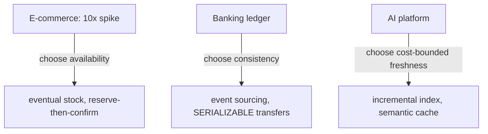

## Why it Matters

Patterns in isolation don't transfer; three applied designs do. Each case below forces the trade-offs onto a real constraint, survival at any cost, correctness at any cost, cost-governed AI, so the *why* of each pattern is visible instead of just the *what*.

## Diagram



## Code

```java
// Three systems, three consistency stances in code:

// 1. Flash sale: availability — reserve then confirm, stale counts tolerated
@Transactional
public Order place(Cart c) { orders.save(c.reserve()); outbox.save(event(c)); } // counts sync later

// 2. Banking: consistency — append-only ledger, idempotent by design
@Transactional
public void transfer(TransferCmd c) {
 if (ledger.contains(c.idempotencyKey())) return; // replay-safe
 ledger.append(new Debit(c.from(), c.amount(), c.idempotencyKey()));
 ledger.append(new Credit(c.to(), c.amount(), c.idempotencyKey()));
}

// 3. AI platform: cost — semantic cache before a GPU call
@Cacheable(value = "semantics", key = "T(Hash).sha256(#prompt)", unless = "#result == null")
public Answer ask(String prompt) { return llm.call(prompt); } // cache hit = no token cost
```

## When to use / not

**Use when:**
- Revising for case-study style interviews ("design X under constraint Y").
- Choosing a stance before a design review: availability, consistency or cost first.

**When NOT:**
- Copying a case wholesale, the stance is derived from the constraint, not the industry.
- Treating "eventual consistency" as the answer everywhere; banking below deliberately refuses it.


## Trade-offs
| Dimension | This Approach | Alternative | Trade-off Rationale | Decision Rule |
|-----------|---------------|-------------|---------------------|---------------|
| Complexity | [TBD] | [TBD] | [TBD] | [TBD] |
| Operational Burden | [TBD] | [TBD] | [TBD] | [TBD] |
| Latency | [TBD] | [TBD] | [TBD] | [TBD] |
| Consistency | [TBD] | [TBD] | [TBD] | [TBD] |
| Cost at Scale | [TBD] | [TBD] | [TBD] | [TBD] |

## Vs

| Dimension | Flash sale | Banking | AI platform |
|---|---|---|---|
| Consistency | eventual, bounded | strong, serializable | eventually indexed |
| Scaling unit | gateway + Kafka intake | ledger append throughput | GPU + retrieval QPS |
| Failure mode | degraded cart | reject the transaction | stale answer, cached |
| Cost driver | peak autoscaling | audit + HA replication | tokens + GPU hours |

## Pitfalls

- Applying the flash-sale answer to banking, the two stances are opposites.
- Naming patterns without naming the constraint that justifies them.
- Forgetting the tradeoff line: a case study without a stated sacrifice reads as hand-waving.

## Interview q&a

**Q: Which case tested your tradeoff thinking most?**
A: Banking, the constraint is never "make it fast", it is "never be wrong", so every optimisation has to preserve the invariant: append-only ledger, idempotent commands, async only for notifications.

**Q: How do you decide consistency per system?**
A: By the cost of being wrong: money moved wrongly is unacceptable (strong), a stale stock count is a reconciliation job (eventual). State the cost, and the stance follows.


## Flashcards (Spaced Repetition)

#flashcard
**Q:** What is the core concept of Case Studies? :: **A:** [Key algorithm/architecture pattern] #flashcard

#flashcard
**Q:** When do you apply Case Studies? :: **A:** [Trigger scenarios and context] #flashcard

#flashcard
**Q:** What is the primary trade-off in Case Studies? :: **A:** [Main tension: e.g., consistency vs latency] #flashcard

#flashcard
**Q:** What breaks first at scale in Case Studies? :: **A:** [Primary bottleneck: e.g., coordination, hot keys, replication lag] #flashcard

#flashcard
**Q:** How do you handle failures in Case Studies? :: **A:** [Retry, circuit breaker, fallback, graceful degradation] #flashcard

#flashcard
**Q:** What are the key metrics to monitor for Case Studies? :: **A:** [RED: rate, errors, duration; USE: utilization, saturation, errors] #flashcard

#flashcard
**Q:** How does Case Studies scale to 10x? :: **A:** [Sharding, read replicas, async processing, caching layers] #flashcard

#flashcard
**Q:** What is the consistency model for Case Studies? :: **A:** [Strong/eventual/causal - justify with use case] #flashcard

#flashcard
**Q:** How do you test Case Studies? :: **A:** [Contract tests, chaos engineering, load tests, fault injection] #flashcard

#flashcard
**Q:** What is the operational cost of Case Studies? :: **A:** [Team expertise, tooling, on-call burden, migration risk] #flashcard

#flashcard
**Q:** When would you NOT use Case Studies? :: **A:** [Managed service covers need, simple CRUD, team lacks maturity] #flashcard

#flashcard
**Q:** What is the key design decision in Case Studies? :: **A:** [The irreversible choice that defines the architecture] #flashcard

#flashcard
**Q:** How do you migrate to Case Studies? :: **A:** [Strangler fig, dual-write, canary, feature flags] #flashcard

#flashcard
**Q:** What security considerations for Case Studies? :: **A:** [AuthZ, encryption, audit, secrets management] #flashcard

#flashcard
**Q:** How do you debug Case Studies in production? :: **A:** [Structured logging, correlation IDs, distributed tracing, SLO alerts] #flashcard


## Practice Tasks (Tasks Plugin)
- [ ] Explain the architecture from memory 📅 {{date:YYYY-MM-DD, +1}}
- [ ] Draw the system diagram without looking 📅 {{date:YYYY-MM-DD, +3}}
- [ ] Answer all Interview Q&A aloud 📅 {{date:YYYY-MM-DD, +7}}
- [ ] Review flashcards (Spaced Repetition) 📅 {{date:YYYY-MM-DD, +1}}

```tasks
not done
path includes Architect/99_Revision
sort by due
limit 10
```

## Related

- Stances: [[../06_Data-Architecture/02_Consistency-CAP-PACELC|CAP/PACELC]] · [[../06_Data-Architecture/03_Event-Sourcing-CQRS|Event Sourcing & CQRS]]
- NFRs: [[../08_NonFunctional-Ops/03_Performance-SLOs|SLOs]] · [[../08_NonFunctional-Ops/06_Cost-FinOps|FinOps]]
- Governance: [[../09_Governance-Documentation/02_ADRs|ADRs]] · [[Capstone-Checklist|Capstone Checklist]]

# Case Studies, 3 Applied Designs

## Case 1: E-commerce Flash Sale (10x Spike)

- **Context:** 5k→50k rps for 2h, checkout p95<800ms, PG primary melts.
- **Design:** CDN + read replicas; Kafka order-intake (keyed by customer); outbox → inventory reserve with idempotency keys; KEDA on lag; canary deploy; Redis last-known-price fallback.
- **NFRs:** SLO 99.9% checkout; OTel burn-rate alerts; WAF + rate-limit at gateway.
- **Tradeoff:** Eventual stock counts (oversell guard via reserve-then-confirm) for survival.
- Links: [[../08_NonFunctional-Ops/03_Performance-SLOs|Perf]] · [[../08_NonFunctional-Ops/04_Resilience-Chaos|Chaos]] · [[../06_Data-Architecture/04_Caching-CDN|Caching]]

## Case 2: Core Banking Ledger (Never Wrong)

- **Context:** Money moves; auditors + DPDP; zero lost writes.
- **Design:** Modular monolith first; event-sourcing for ledger (append-only) + CQRS read models; Postgres SERIALIZABLE for transfers; mTLS + OAuth client-credentials; Flyway expand-migrate-contract; HSM-backed keys.
- **NFRs:** Strong consistency (PACELC: choose consistency on partition); SOC2/PCI evidence-as-code; per-txn audit trail.
- **Tradeoff:** Throughput for correctness; async only at edges (notifications).
- Links: [[../06_Data-Architecture/03_Event-Sourcing-CQRS|ES-CQRS]] · [[../09_Governance-Documentation/05_Compliance-Audit|Compliance]] · [[Architect/09_Governance-Documentation/02_ADRs.md|ADRs]]

## Case 3: ai Platform (rag + Evals)

- **Context:** RAG over 10M docs, p95 chat<2s, GPU bill exploding, hallucinations risky.
- **Design:** Gateway (BFF) → retrieval svc (vector DB + rerank) → LLM svc (prompt registry, evals); async ingest pipeline (Kafka); Redis semantic cache; FinOps: spot GPUs, scale-to-zero, unit cost per 1k queries.
- **NFRs:** Groundedness evals in CI; PII redaction pre-index; trace per prompt (OTel gen_ai attrs).
- **Tradeoff:** Freshness vs cost (incremental index, not realtime-everything).
- Links: [[../08_NonFunctional-Ops/06_Cost-FinOps|FinOps]] · [[../08_NonFunctional-Ops/02_Observability-OTel-Prometheus|OTel]] · [[Architect/09_Governance-Documentation/03_Review-Process-RFC.md|RFC]]
