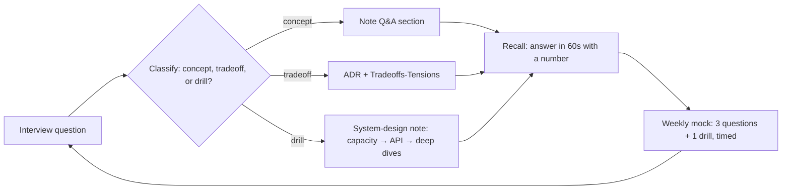

## Why it Matters

An interview is not a knowledge test; it's a performance under time pressure against unknown questions. A bank of indexed, *answerable* questions is what converts passive study into recall-on-demand, the index matters more than the volume, because in the room you need the right note in seconds, not a bigger list.

## Diagram



## Code

```text
Spaced-repetition schedule, no tooling needed:
- Same-day: answer the question aloud, then read the note's Q&A section.
- +3 days: re-answer cold; if you stall, re-read the source section, not the summary.
- +7 days: answer while whiteboarding the diagram from memory.
- Retire a question only after two clean cold recalls; keep the weak ones cycling.
```

## When to use / not

- **Use:** in timed weekly mocks, pick three questions plus one full system-design drill, and record where you stall; that stall point is the note to re-read.
- **Use:** the day before an interview loop for a final sweep of the rapid links, not to learn anything new.
- **Use:** as the vault's index, every entry links forward to the source note, so the bank stays a router rather than a second copy of the content.

**When NOT:** do not memorise answers verbatim, interviewers grade justification and trade-off reasoning, and a rehearsed monologue dies at the first follow-up question. Do not add questions you can't answer from a linked note; an orphan entry is a false confidence generator.

## Trade-offs

| Pros | Cons |
|---|---|
| One index for the whole syllabus; recall improves fast | Goes stale as notes change, re-link when sections move |
| Exposes weak spots (the questions you skip are the weak ones) | Breadth can crowd depth: drills need full 45-minute sessions, not flips |
| Works as a pre-interview confidence check | Memorised answers sound memorised |

## Vs

| Companion | Use it for |
|---|---|
| [[Capstone-Checklist]] | The design-gate checklist *behind* each answer, what a complete answer must cover |
| [[Case-Studies]] | Trade-off answers with a real constraint attached, the shape senior rounds ask for |
| [[../10_System-Design-Interviews/README\|System Design MOC]] | Full 45-minute drills; this bank handles the short-form questions |

## Pitfalls

- Collecting questions faster than you can answer them, the bank's value is recall rate, not row count.
- Answering in your head only; say it aloud or write it, fluency is the actual skill being tested.
- Skipping the drills; short answers don't build the end-to-end design muscle.

## Interview q&a

**Q: How do you prepare for an architect interview if you only have two weeks?**
A: Index, don't inventory. Run the bank's rapid links as timed cold recalls, 60 seconds per question, aloud, and log every stall. Those stalls define the whole second week: re-read those source notes, then run three full system-design drills to time, using the MOC loop (scope → capacity → API → high-level → two deep dives → trade-offs). A week of targeted recall beats a month of passive re-reading.

**Q: The interviewer asks something not in your bank. How do you avoid freezing?**
A: Fall back on structure rather than recall: classify the question (concept, trade-off, or design drill), then answer from a template, for a trade-off, "the tension is X, the deciding constraint is Y, so I'd choose Z and accept the cost W". Structure buys the seconds in which the specific knowledge usually returns, and even a partial answer delivered structured beats a perfect answer that never arrives.

**Q: What's the most common failure mode in architect interviews?**
A: Pattern-dropping instead of trade-off reasoning, naming microservices, Kafka, or event sourcing without the constraint that justifies them. Senior interviewers probe with "what would you do if that assumption were false", and a candidate who can't answer has memorised answers instead of understanding the trade. The fix: every pattern you cite comes with a sacrifice.

**Q: How do you know when an answer is senior-level?**
A: It names a number and a sacrifice, a measured threshold, and the quality or capability deliberately given up. Junior answers describe tools; senior answers describe decisions under constraint.

## Related

- [[Capstone-Checklist]] · [[Case-Studies]] · [[../10_System-Design-Interviews/README\|System Design MOC]]
- Foundations answers: [[../01_Architecture-Foundations/What-is-Architecture\|What is Architecture]] · [[../01_Architecture-Foundations/Views-and-Viewpoints-4-plus-1\|Views 4+1]]
- Qualities answers: [[../02_Requirements-Quality-Attributes/Quality-Scenarios\|Quality Scenarios]] · [[../02_Requirements-Quality-Attributes/Tradeoffs-Tensions\|Tradeoffs]]

# Interview Bank

> 3 Q&A per note, jump to the source for depth.

## 08 NonFunctional-Ops
- Security: token storage? revocation? JWT vs opaque? → [[../08_NonFunctional-Ops/01_Security-OAuth2-JWT|Security-OAuth2-JWT]]
- Observability: RED vs USE? cardinality? head vs tail sampling? → [[../08_NonFunctional-Ops/02_Observability-OTel-Prometheus|Observability]]
- Performance: set SLO? pool sizing? JFR vs profiler? → [[../08_NonFunctional-Ops/03_Performance-SLOs|Performance-SLOs]]
- Resilience: safe GameDay? backpressure? chaos order? → [[../08_NonFunctional-Ops/04_Resilience-Chaos|Resilience-Chaos]]
- K8s: zero-downtime schema? promotion gates? HPA for consumers? → [[../08_NonFunctional-Ops/05_Cloud-K8s-Deploy-Helm|K8s-Deploy]]
- FinOps: first 3 wins? attribution? perf vs cost? → [[../08_NonFunctional-Ops/06_Cost-FinOps|Cost-FinOps]]

## 09 Governance-Documentation
- C4: C2 vs C3? freshness? when C1 enough? → [[../09_Governance-Documentation/01_C4-Modeling|C4-Modeling]]
- ADR: 5 sections? supersede? approvers? → [[../09_Governance-Documentation/02_ADRs|ADRs]]
- RFC: triggers? attendees? anti-bikeshed? → [[../09_Governance-Documentation/03_Review-Process-RFC|Review-RFC]]
- TOGAF: ADM phases? iSAQB core? startup slice? → [[../09_Governance-Documentation/04_TOGAF-iSAQB-Primer|TOGAF-iSAQB]]
- Compliance: PCI scope? deletion vs backups? SOC2 evidence? → [[../09_Governance-Documentation/05_Compliance-Audit|Compliance]]

## Core (00-07) Rapid Links
- [[../04_Design-Patterns-Building-Blocks/02_Resilience-Circuit-Breaker-Retry|Circuit-Breaker]] · [[../03_Architecture-Styles/03_Microservices|Microservices]] · [[../03_Architecture-Styles/04_Event-Driven-Architecture|EDA]]
- Patterns: [[../04_Design-Patterns-Building-Blocks/05_Decomposition-Bounded-Context|Decomposition]] · [[../04_Design-Patterns-Building-Blocks/06_Saga-Outbox-Inbox|Saga-Outbox]] · [[../04_Design-Patterns-Building-Blocks/07_Discovery-Config-Registry|Discovery-Config]] · [[../04_Design-Patterns-Building-Blocks/04_API-Gateway-BFF|Gateway-BFF]]

## 10 System Design Drills
- Method: scope → capacity → API → high-level → 2 deep dives → tradeoffs → [[../10_System-Design-Interviews/README|System Design MOC]]
- [[../10_System-Design-Interviews/01_URL-Shortener-TinyURL|TinyURL]]: counter+base62? CDN on 302s? async analytics?
- [[../10_System-Design-Interviews/02_Twitter-Timeline-Feed|Twitter]]: push vs pull? celebrity threshold? cursor pagination?
- [[../10_System-Design-Interviews/03_Uber-Location-Tracking|Uber]]: geohash/S2 cells? offer-lease vs 2PC? stale-driver TTL?
- [[../10_System-Design-Interviews/04_WhatsApp-Chat|WhatsApp]]: clientMsgId dedupe? per-convo seq? presence debounce?
- [[../10_System-Design-Interviews/05_Rate-Limiter|Rate Limiter]]: token-bucket vs sliding? gateway Lua? 429+Retry-After?
- [[../10_System-Design-Interviews/06_Notification-Service|Notifications]]: prefs gate? priority lanes? provider failover?
- Grokking round 2: [[../10_System-Design-Interviews/07_Instagram-Media-Feed|Instagram]] (bytes vs ids?) · [[../10_System-Design-Interviews/08_YouTube-Video-Streaming|YouTube]] (presigned chunks? HLS?) · [[../10_System-Design-Interviews/09_Dropbox-File-Sync|Dropbox]] (4MB chunks? delta?) · [[../10_System-Design-Interviews/10_Web-Crawler|Crawler]] (per-host queues? Bloom?) · [[../10_System-Design-Interviews/11_Ticketmaster-Seat-Booking|Ticketmaster]] (atomic hold? waiting room?) · [[../10_System-Design-Interviews/12_Yelp-Geo-Reviews|Yelp]] (cells? aggregates?)
```dataview
TABLE completed AS Done FROM "Architect/08_NonFunctional-Ops" SORT file.name ASC
```