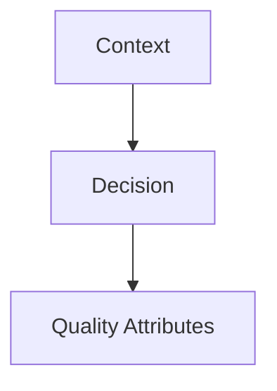

# {{Title}}

> **Intent:** one line, what problem this solves.
> 🎨 **Visual diagram:** Create Excalidraw drawing from template: `Cmd+P → Excalidraw: New from template → Architecture Diagram`

## 1. When to use
- Bullet 1: concrete trigger.
- Bullet 2: Spring Boot 3.5 / K8s angle.

**When NOT:** what breaks if misapplied.

## 2. Diagram


## 3. Example (Spring Boot 3.5 + K8s)

```java
// minimal, compilable sketch
```

## 4. Key Insight / Mental Model
[Why does this work? What's the invariant? What makes it different from alternatives?]

## 5. Pros / Cons
|| Pros | Cons ||
|---|---|---|
| | | |

## 6. Trade-offs / Decision Matrix
| Dimension | This Approach | Alternative A | Alternative B | Pick When |
|-----------|---------------|---------------|---------------|-----------|
| Complexity | | | | |
| Latency | | | | |
| Consistency | | | | |
| Operability | | | | |
| Cost | | | | |

## 7. vs
- **Vs X:** one-line differentiator with [[wikilink]].

## 8. Interview q&a (Senior Depth)
**Q1:** ...
A: ...

**Q2:** ...
A: ...

**Q3:** ...
A: ...

## 9. Pitfalls & Anti-patterns
- [Concrete mistake] → [Fix]
- [Concrete mistake] → [Fix]

## 10. Links
- [[Related-Note]] · [[02_ADRs|ADRs]]

---
*Category: Template · Part of [[README|Architect MOC]]*
