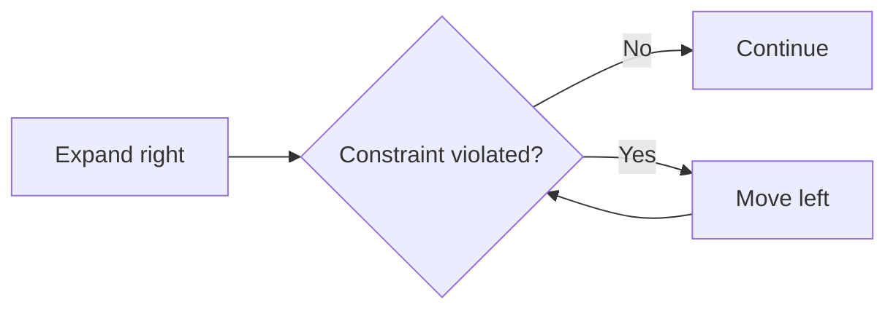

# Diagram Guide

Use diagrams only when they make the invariant easier to see.

- **Flowchart:** algorithm steps.
- **State diagram:** pointer/window/graph state transitions.
- **Excalidraw:** spatial algorithms, matrix movement, tree/graph traversal state, memory layout.
- Avoid decorative diagrams.

## Example

This explains the sliding-window control loop without mixing it with implementation details.
