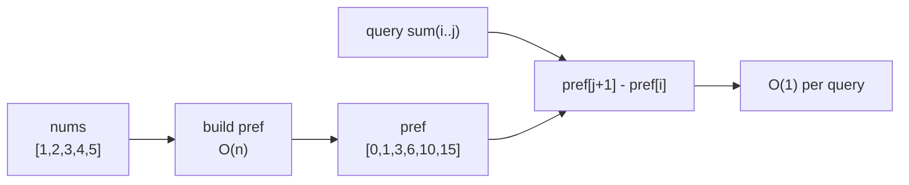

# Prefix Sum

> Part of [[README|20 DSA Patterns]] • `Coding Patterns/01_Array` • Pattern #1

## Intent
Answer many range-sum queries on an immutable array in O(1) each after O(n) preprocessing — the classic space-time tradeoff that turns repeated scans into a single subtraction.

## Why it Matters
- Core pattern for range queries, subarray sum problems, and frequency-based derivations (subarray sum = k via prefix-hashmap).
- The leading-zero `pref[0]=0` convention eliminates boundary checks: `sum(i..j) = pref[j+1] - pref[i]` works for `i=0` without an `if`.
- Senior signal: recognizing when a problem *is* a prefix sum in disguise (e.g., "count subarrays with sum k" → hashmap on prefix sums, not two pointers).

## Diagram



## Problems

### 560. Subarray Sum Equals K (Medium)
> [LeetCode 560](https://leetcode.com/problems/subarray-sum-equals-k/) • Tags: Array, Hash Table, Prefix Sum

**Problem Statement:**

Given an array of integers nums and an integer k, return the total number of subarrays whose sum equals to k. A subarray is a contiguous non-empty sequence of elements within an array. Example 1: Input: nums = [1,1,1], k = 2 Output: 2 Example 2: Input: nums = [1,2,3], k = 3 Output: 2 Constraints: 1 4 -1000 -107 7

**Examples:**

Example 1:
```
[1,1,1]
```

Example 2:
```
2
```

Example 3:
```
[1,2,3]
```

Example 4:
```
3
```
---

### 930. Binary Subarrays With Sum (Medium)
> [LeetCode 930](https://leetcode.com/problems/binary-subarrays-with-sum/) • Tags: Array, Hash Table, Sliding Window, Prefix Sum

**Problem Statement:**

Given a binary array nums and an integer goal, return the number of non-empty subarrays with a sum goal. A subarray is a contiguous part of the array. Example 1: Input: nums = [1,0,1,0,1], goal = 2 Output: 4 Explanation: The 4 subarrays are bolded and underlined below: [1,0,1,0,1] [1,0,1,0,1] [1,0,1,0,1] [1,0,1,0,1] Example 2: Input: nums = [0,0,0,0,0], goal = 0 Output: 15 Constraints: 1 4 nums[i] is either 0 or 1. 0

**Examples:**

Example 1:
```
[1,0,1,0,1]
```

Example 2:
```
2
```

Example 3:
```
[0,0,0,0,0]
```

Example 4:
```
0
```
---

### 525. Contiguous Array (Medium)
> [LeetCode 525](https://leetcode.com/problems/contiguous-array/) • Tags: Array, Hash Table, Prefix Sum

**Problem Statement:**

Given a binary array nums, return the maximum length of a contiguous subarray with an equal number of 0 and 1. Example 1: Input: nums = [0,1] Output: 2 Explanation: [0, 1] is the longest contiguous subarray with an equal number of 0 and 1. Example 2: Input: nums = [0,1,0] Output: 2 Explanation: [0, 1] (or [1, 0]) is a longest contiguous subarray with equal number of 0 and 1. Example 3: Input: nums = [0,1,1,1,1,1,0,0,0] Output: 6 Explanation: [1,1,1,0,0,0] is the longest contiguous subarray with equal number of 0 and 1. Constraints: 1 5 nums[i] is either 0 or 1.

**Examples:**

Example 1:
```
[0,1]
```

Example 2:
```
[0,1,0]
```

Example 3:
```
[0,1,1,1,1,1,0,0,0]
```
---


## Code / Example
```java
// Java 25: var, record, pattern matching
record PrefixSum(int[] pref) {
    static PrefixSum of(int[] nums) {
        int n = nums.length;
        int[] pref = new int[n + 1];
        for (int i = 0; i < n; i++) pref[i + 1] = pref[i] + nums[i];
        return new PrefixSum(pref);
    }
    int rangeSum(int i, int j) { // inclusive
        return pref[j + 1] - pref[i];
    }
}

// Count subarrays with sum k (LC 560) — hashmap on prefix sums
int subarraySum(int[] nums, int k) {
    var count = new java.util.HashMap<Integer, Integer>();
    count.put(0, 1);
    int sum = 0, ans = 0;
    for (var x : nums) {
        sum += x;
        ans += count.getOrDefault(sum - k, 0);
        count.put(sum, count.getOrDefault(sum, 0) + 1);
    }
    return ans;
}
```

## When to Use / When NOT
- **Use:** many range-sum queries on static array; subarray sum = k / count subarrays; "contiguous" + "sum" keywords; immutable data, repeated queries.
- **NOT:** array updates interleaved with queries (use Segment Tree / Fenwick); need min/max/gcd on range (use Sparse Table); single query (just loop).

## Trade-offs
| Dimension | Prefix Sum | Segment Tree | Sparse Table |
|-----------|------------|--------------|--------------|
| Build     | O(n)       | O(n)         | O(n log n)   |
| Query     | O(1) sum only | O(log n) any associative op | O(1) idempotent ops (min/max/gcd) |
| Update    | rebuild O(n) | O(log n) | rebuild O(n log n) |
| Space     | O(n)       | O(n)         | O(n log n)   |
| Pick when | immutable array, sum queries only | updates + queries interleaved | static array, min/max queries |

## Vs Table
| Aspect | Prefix Sum | Segment Tree | Sparse Table | Decision Rule |
|--------|------------|--------------|--------------|---------------|
| Query type | sum only | any associative | idempotent only | sum → prefix; min/max → sparse; updates → segment |
| Mutability | immutable | mutable | immutable | updates needed? → segment tree |
| Implementation | trivial | moderate | moderate | simplest that fits constraints |

## Pitfalls
- `pref` length is `n+1` with leading zero — off-by-one is the #1 bug.
- Large sums need `long[]` for `pref` (overflow on `int`).
- Subarray count hashmap **must** `count.put(0, 1)` before the loop (empty prefix).
- For 2D prefix sums, `pref[r+1][c+1] = pref[r][c+1] + pref[r+1][c] - pref[r][c] + grid[r][c]`.

## Interview Q&A (Senior Depth)

**Q: Walk me through counting subarrays with sum k. Why does the hashmap-on-prefix work?**
**A:** We want `sum(i..j) = k`. With prefix sums `pref[j+1] - pref[i] = k` → `pref[i] = pref[j+1] - k`. So as we scan `j`, we count how many earlier `pref[i]` equal `pref[j+1] - k`. The hashmap stores frequency of each prefix sum seen so far. `count[0]=1` handles subarrays starting at index 0. Time O(n), space O(n). Rejected alternative: two pointers — fails because array has negatives / not sorted.

**Q: When would you NOT use prefix sum for range queries?**
**A:** When the array mutates. Prefix sum rebuild is O(n) per update. If updates + queries are interleaved, use Fenwick Tree (BIT) or Segment Tree — both O(log n) update and query. Prefix sum wins only for static data.

**Q: 2D range sum query immutable (LC 304). How does the formula change?**
**A:** `pref[r+1][c+1] = pref[r][c+1] + pref[r+1][c] - pref[r][c] + grid[r][c]`. Query `(r1,c1)-(r2,c2)`: `pref[r2+1][c2+1] - pref[r1][c2+1] - pref[r2+1][c1] + pref[r1][c1]`. Same O(1) query after O(mn) build. Inclusion-exclusion principle.

**Q: Given streaming data, can you maintain prefix sums?**
**A:** No — prefix sum assumes static array. For streaming, you need a Fenwick Tree or Segment Tree that supports point updates. Or if it's append-only, you *can* append to `pref` in O(1) per element.


## Flashcards (Spaced Repetition)

#flashcard
**Q:** What is the trigger keyword for Prefix Sum? :: **A:** range sum queries, subarray sum equals k, immutable array repeated queries #flashcard

#flashcard
**Q:** Time/space complexity of Prefix Sum? :: **A:** Time: O(n) build + O(1) query, Space: O(n) #flashcard

#flashcard
**Q:** When do you NOT use Prefix Sum? :: **A:** array mutates (use Fenwick/Segment Tree), single query (just loop), need min/max on range (use Sparse Table) #flashcard

#flashcard
**Q:** Core Java 25 snippet for Prefix Sum? :: **A:** `int[] pref = new int[n+1]; for (int i=0;i<n;i++) pref[i+1]=pref[i]+a[i]; int sum(int l,int r){return pref[r+1]-pref[l];}` #flashcard


## Practice Tasks (Tasks Plugin)
- [ ] Restate the intent from memory 📅 {date:YYYY-MM-DD, +1}
- [ ] Code the snippet without looking 📅 {date:YYYY-MM-DD, +3}
- [ ] Answer all Interview Q&A aloud 📅 {date:YYYY-MM-DD, +7}
- [ ] Review flashcards (Spaced Repetition) 📅 {date:YYYY-MM-DD, +1}

```tasks
not done
path includes {file.folder}
sort by due
limit 10
```

## Related
- [[01_Array/03 - Sliding Window|Sliding Window]] (fixed-k sums use prefix internally)
- [[01_Array/04 - Frequency Counting|Frequency Counting]] (hashmap on prefix for subarray count)
- [[Java/07_DSA/Array]] · [[Java/07_DSA/HashMap]]
---
*Category: Coding Patterns/01_Array*
