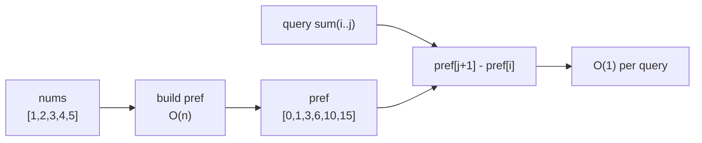

## Why it Matters

Build an array `pref` where `pref[0]=0` and `pref[i+1]=pref[i]+nums[i]`. Then any range sum is one subtraction: `sum(i..j)=pref[j+1]-pref[i]`. Example: `nums=[1,2,3,4,5]` gives `pref=[0,1,3,6,10,15]`, so `sum(1..3)=pref[4]-pref[1]=10-1=9` which is `2+3+4`.

Preprocess once O(n), answer each query O(1). You pay an extra array, you save repeated loops.

## Diagram


One preprocessing pass turns every later range query into a single subtraction.

## Code

```java
public class PrefixSum {
 private final int[] pref;

 public PrefixSum(int[] nums) {
 var n = nums.length;
 pref = new int[n + 1];
 for (var i = 0; i < n; i++) pref[i + 1] = pref[i] + nums[i];
 }

 int rangeSum(int i, int j) { // inclusive
 return pref[j + 1] - pref[i];
 }

 public static void main(String[] args) {
 var ps = new PrefixSum(new int[]{1, 2, 3, 4, 5});
 System.out.println(ps.rangeSum(1, 3)); // 9
 }
}

// Count subarrays that sum to k, hash map on prefix sums
int subarraySum(int[] nums, int k) {
 var count = new java.util.HashMap<Integer,Integer>();
 count.put(0, 1);
 int sum = 0, ans = 0;
 for (var x : nums) {
 sum += x;
 ans += count.getOrDefault(sum - k, 0);
 count.put(sum, count.getOrDefault(sum, 0) + 1);
 }
 return ans;
}
```
`pref[j+1]-pref[i]` handles the start-of-array case without an if. The map version works because `sum(j)-sum(i)=k` means the prefix at `j` minus an earlier prefix equals `k`.

## When to use / not

- Need many range sums on the same array
- Subarray sum equals k, or "count subarrays with sum X", combine prefix sum with a map of frequencies
- Look for keywords: "range sum", "subarray sum", "contiguous"

## Trade-offs

| operation | time | space |
|---|---|---|
| build | O(n) | O(n) |
| query | O(1) | n/a |

Hash-map variant for subarray count is also O(n) time, O(n) space.

## Vs

| | Prefix sum | Segment tree | Sparse table |
|---|---|---|---|
| build | O(n) | O(n) | O(n log n) |
| range query | O(1), sum only | O(log n), any associative op | O(1), idempotent ops (min/max/gcd) |
| point update | rebuild O(n) | O(log n) | rebuild O(n log n) |
| pick when | immutable array, sum queries only | updates interleaved with queries | static array, min/max queries |

Prefix sum is the narrowest tool of the three, it wins because it has nothing to maintain.

## Pitfalls

- `pref` is length `n+1` with leading zero. Off by one is the usual bug.
- For large sums use `long` for `pref`.
- Subarray count needs `count.put(0,1)` before the loop.

## Interview q&a

- [303. Range Sum Query Immutable](https://leetcode.com/problems/range-sum-query-immutable/)
- [525. Contiguous Array](https://leetcode.com/problems/contiguous-array/)
- [560. Subarray Sum Equals K](https://leetcode.com/problems/subarray-sum-equals-k/)

## Related

- [[Java/07_DSA/Array]]
- [[Java/07_DSA/HashMap]]

# Prefix sum

> Part of [[README|20 DSA Patterns]], Pattern #1
