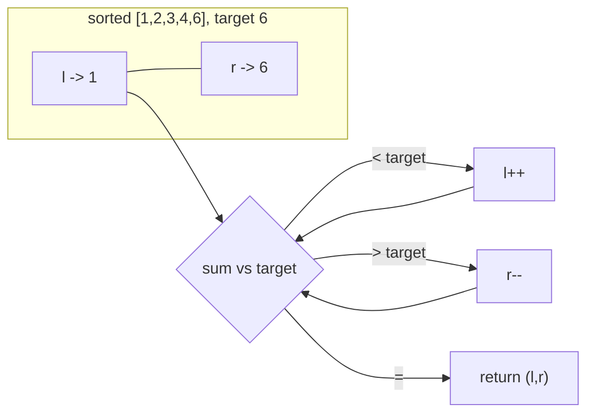

# Two Pointers

> Part of [[README|Coding Patterns]] • `Coding Patterns/01_Array` • Pattern #2

## Intent
Replace nested O(n²) scans on sorted arrays with a single O(n) pass using two indices moving toward each other or in lockstep — the pattern for pair search, partitioning, and palindrome checks.

## Why it Matters
- The "sorted" keyword is the primary trigger: sorted + pair/target → two pointers. Unsorted? Sort first (O(n log n)) and track original indices if needed.
- Two variants: opposite ends (`l=0, r=n-1`) for pair sum / container / palindrome; same direction (slow/fast) for cycle / middle / dedup.
- Senior signal: knowing when the pointer movement logic is *correct by invariant* — each step permanently discards elements that cannot participate in any valid solution.

## Diagram



## Problems

### 167. Two Sum II - Input Array Is Sorted (Medium)
> [LeetCode 167](https://leetcode.com/problems/two-sum-ii-input-array-is-sorted/) • Tags: Array, Two Pointers, Binary Search

**Problem Statement:**

You are given a 1-indexed array of integers numbers that is already sorted in non-decreasing order. Find two numbers such that they add up to a specific target number. Let these two numbers be numbers[index1] and numbers[index2] where 1 1 2 . Return the indices of the two numbers index1 and index2 as an integer array [index1, index2] of length 2. The tests are generated such that there is exactly one solution. You may not use the same element twice. Your solution must use only constant extra space. Example 1: Input: numbers = [2,7,11,15], target = 9 Output: [1,2] Explanation: The sum of 2 and 7 is 9. Therefore, index1 = 1, index2 = 2. We return [1, 2]. Example 2: Input: numbers = [2,3,4], target = 6 Output: [1,3] Explanation: The sum of 2 and 4 is 6. Therefore index1 = 1, index2 = 3. We return [1, 3]. Example 3: Input: numbers = [-1,0], target = -1 Output: [1,2] Explanation: The sum of -1 and 0 is -1. Therefore index1 = 1, index2 = 2. We return [1, 2]. Constraints: 2 4 -1000 numbers is sorted in non-decreasing order. -1000 The tests are generated such that there is exactly one solution.

**Examples:**

Example 1:
```
[2,7,11,15]
```

Example 2:
```
9
```

Example 3:
```
[2,3,4]
```

Example 4:
```
6
```

Example 5:
```
[-1,0]
```

Example 6:
```
-1
```
---

### 11. Container With Most Water (Medium)
> [LeetCode 11](https://leetcode.com/problems/container-with-most-water/) • Tags: Array, Two Pointers, Greedy

**Problem Statement:**

You are given an integer array height of length n. There are n vertical lines drawn such that the two endpoints of the ith line are (i, 0) and (i, height[i]). Find two lines that together with the x-axis form a container, such that the container contains the most water. Return the maximum amount of water a container can store. Notice that you may not slant the container. Example 1: Input: height = [1,8,6,2,5,4,8,3,7] Output: 49 Explanation: The above vertical lines are represented by array [1,8,6,2,5,4,8,3,7]. In this case, the max area of water (blue section) the container can contain is 49. Example 2: Input: height = [1,1] Output: 1 Constraints: n == height.length 2 5 0 4

**Examples:**

Example 1:
```
[1,8,6,2,5,4,8,3,7]
```

Example 2:
```
[1,1]
```
---

### 42. Trapping Rain Water (Hard)
> [LeetCode 42](https://leetcode.com/problems/trapping-rain-water/) • Tags: Array, Two Pointers, Dynamic Programming, Stack, Monotonic Stack

**Problem Statement:**

Given n non-negative integers representing an elevation map where the width of each bar is 1, compute how much water it can trap after raining. Example 1: Input: height = [0,1,0,2,1,0,1,3,2,1,2,1] Output: 6 Explanation: The above elevation map (black section) is represented by array [0,1,0,2,1,0,1,3,2,1,2,1]. In this case, 6 units of rain water (blue section) are being trapped. Example 2: Input: height = [4,2,0,3,2,5] Output: 9 Constraints: n == height.length 1 4 0 5

**Examples:**

Example 1:
```
[0,1,0,2,1,0,1,3,2,1,2,1]
```

Example 2:
```
[4,2,0,3,2,5]
```
---

### 75. Sort Colors (Medium)
> [LeetCode 75](https://leetcode.com/problems/sort-colors/) • Tags: Array, Two Pointers, Sorting, Quicksort, Bubble Sort

**Problem Statement:**

You are given an array nums with n objects colored red, white, or blue, sort them in-place so that objects of the same color are adjacent, with the colors in the order red, white, and blue. We will use the integers 0, 1, and 2 to represent the color red, white, and blue, respectively. You must solve this problem without using the library's sort function. Example 1: Input: nums = [2,0,2,1,1,0] Output: [0,0,1,1,2,2] Explanation: The array has two 0s, two 1s, and two 2s. Sorting them in-place places all 0s first, then all 1s, then all 2s. Example 2: Input: nums = [2,0,1] Output: [0,1,2] Explanation: The array has one each of 0, 1, and 2, arranged in-place in the order 0, 1, 2. Constraints: n == nums.length 1 nums[i] is either 0, 1, or 2. Follow up: Could you come up with a one-pass algorithm using only constant extra space?

**Examples:**

Example 1:
```
[2,0,2,1,1,0]
```

Example 2:
```
[2,0,1]
```
---


## Code / Example
```java
// Sorted Two Sum — LC 167
int[] twoSumSorted(int[] nums, int target) {
    int l = 0, r = nums.length - 1;
    while (l < r) {
        int sum = nums[l] + nums[r];
        if (sum == target) return new int[]{l + 1, r + 1}; // 1-indexed
        if (sum < target) l++;
        else r--;
    }
    return new int[]{-1, -1};
}

// Container With Most Water — LC 11
int maxArea(int[] h) {
    int l = 0, r = h.length - 1, best = 0;
    while (l < r) {
        int area = Math.min(h[l], h[r]) * (r - l);
        best = Math.max(best, area);
        if (h[l] < h[r]) l++; else r--;
    }
    return best;
}

// 3Sum — LC 15 (sort + two pointers per fixed element)
java.util.List<java.util.List<Integer>> threeSum(int[] nums) {
    java.util.Arrays.sort(nums);
    var res = new java.util.ArrayList<java.util.List<Integer>>();
    for (int i = 0; i < nums.length - 2; i++) {
        if (i > 0 && nums[i] == nums[i - 1]) continue; // skip dup fixed
        int l = i + 1, r = nums.length - 1;
        while (l < r) {
            int sum = nums[i] + nums[l] + nums[r];
            if (sum == 0) {
                res.add(java.util.List.of(nums[i], nums[l], nums[r]));
                while (l < r && nums[l] == nums[l + 1]) l++;
                while (l < r && nums[r] == nums[r - 1]) r--;
                l++; r--;
            } else if (sum < 0) l++;
            else r--;
        }
    }
    return res;
}
```

## When to Use / When NOT
- **Use:** sorted array + pair/triple target; palindrome check; remove duplicates in-place; merge two sorted arrays; partition (Dutch national flag).
- **NOT:** unsorted array without sorting (use HashMap for two sum); need original indices after sort (must pair value with index before sorting); non-contiguous subsequence (not a two-pointer problem).

## Trade-offs
| Case | Time | Space |
|------|------|-------|
| Sorted pair search | O(n) | O(1) |
| 3Sum (sort + 2ptr) | O(n²) | O(1) extra |
| Container with most water | O(n) | O(1) |

## Vs Table
| Aspect | Two Pointers | HashMap (Two Sum) | Sliding Window |
|--------|--------------|-------------------|----------------|
| Input requirement | sorted | unsorted OK | any sequence |
| Solves | pair, palindrome, sorted search | unsorted two sum (original indices) | contiguous subarray with condition |
| Space | O(1) | O(n) | O(1) fixed-k, O(k) variable |
| Pick when | sorted, pair or palindrome | unsorted two sum, need indices | contiguous subarray, max/min window |

## Pitfalls
- Input must be sorted for two-sum. If not, sort first and track original indices separately (pair value with index).
- For 3Sum, skip duplicates *after sorting* or you return the same triple many times.
- Move only **one** pointer per iteration — moving both can skip the answer.
- For palindrome, `l < r` not `l <= r` (middle char doesn't need comparison).

## Interview Q&A (Senior Depth)

**Q: Why does moving the shorter wall in Container With Most Water never miss the optimal answer?**
**A:** Area = `min(h[l], h[r]) * (r - l)`. The shorter wall caps the height. Moving the *taller* wall keeps the same cap but reduces width → area strictly decreases or stays same. Moving the *shorter* wall might find a taller wall that raises the cap. The invariant: at each step, all pairs involving the discarded shorter wall and any wall between `l` and `r` are provably suboptimal. Rejected alternative: check all pairs O(n²) — correct but fails time constraint.

**Q: Two Sum II (sorted) vs Two Sum I (unsorted). Why different approaches?**
**A:** Sorted → two pointers O(n) time, O(1) space. Unsorted → HashMap O(n) time, O(n) space. If you sort unsorted, you lose original indices (requirement in LC 1). Trade-off: HashMap uses extra space but preserves indices; two pointers uses O(1) space but needs sorted input.

**Q: 3Sum with duplicates — walk me through the skip logic.**
**A:** Three levels: (1) skip duplicate fixed element `i` with `i > 0 && nums[i] == nums[i-1]`. (2) After finding a valid triplet, skip duplicate `l` with `while(l<r && nums[l]==nums[l+1]) l++`. (3) Skip duplicate `r` similarly. Without all three, you emit duplicate triplets. The sort brings duplicates adjacent, making skip O(1) per duplicate.

**Q: Can two pointers work on a rotated sorted array for pair sum?**
**A:** No — rotated array isn't globally sorted. You'd need to find the pivot (min element) first, then treat as two sorted subarrays, or just use HashMap O(n). Two pointers requires monotonic ordering to know which direction to move.


## Flashcards (Spaced Repetition)

#flashcard
**Q:** What is the trigger keyword for Two Pointers? :: **A:** sorted array, pair/triplet sum, remove duplicates, palindrome check, container with most water #flashcard

#flashcard
**Q:** Time/space complexity of Two Pointers? :: **A:** Time: O(n) after sort O(n log n), Space: O(1) #flashcard

#flashcard
**Q:** When do you NOT use Two Pointers? :: **A:** unsorted array (sort first or use hashmap), need all pairs (O(n²) output) #flashcard

#flashcard
**Q:** Core Java 25 snippet for Two Pointers? :: **A:** `int l=0,r=n-1; while(l<r){ int s=a[l]+a[r]; if(s==t) return new int[]{l,r}; else if(s<t) l++; else r--; }` #flashcard


## Practice Tasks (Tasks Plugin)
- [ ] Restate the intent from memory 📅 {date:YYYY-MM-DD, +1}
- [ ] Code the snippet without looking 📅 {date:YYYY-MM-DD, +3}
- [ ] Answer all Interview Q&A aloud 📅 {date:YYYY-MM-DD, +7}
- [ ] Review flashcards (Spaced Repetition) 📅 {date:YYYY-MM-DD, +1}

```tasks
not done
path includes {file.folder}
sort by due
limit 10
```

## Related
- [[01_Array/03 - Sliding Window|Sliding Window]] (variable window also uses two pointers but both advance forward)
- [[02_LinkedList/01 - Fast and Slow Pointers|Fast & Slow Pointers]] (same direction, different speeds)
- [[Java/07_DSA/Array]]
---
*Category: Coding Patterns/01_Array*
- [[Architect/10_System-Design-Interviews/DB-05-Sharding.md|DB-05-Sharding]] — Two-pointer for range queries across shards
