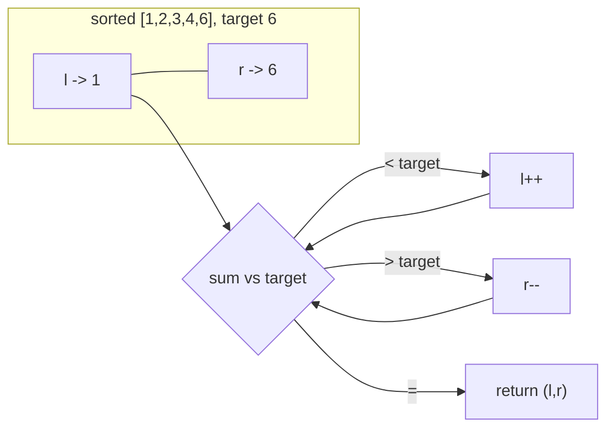

## Why it Matters

Two indices walk through the same array at different speeds or from different ends. On a sorted array they find pairs without trying every combination. Example: `nums=[1,2,3,4,6]`, target `6` → left at `1`, right at `6`, sum `7` is too high so move right inward; `1+4=5` too low so move left outward; `2+4=6` done in two steps.

Replaces nested loops O(n²) with a single scan O(n).

## Diagram


Two pointers replace a nested loop: each step permanently rules one element out of consideration.

## Code

```java
// Sorted two sum, LC 167
int[] twoSumSorted(int[] nums, int target) {
 var l = 0;
 var r = nums.length - 1;
 while (l < r) {
 int sum = nums[l] + nums[r];
 if (sum == target) return new int[]{l, r};
 if (sum < target) l++;
 else r--;
 }
 return null;
}

// Container with most water, LC 11
int maxArea(int[] h) {
 var l = 0; var r = h.length - 1; int best = 0;
 while (l < r) {
 int area = Math.min(h[l], h[r]) * (r - l);
 best = Math.max(best, area);
 if (h[l] < h[r]) l++;
 else r--;
 }
 return best;
}
```
Left moves when you need a bigger sum, right moves when you need a smaller one. For container, move the shorter wall. The taller one cannot improve the area by staying.

## When to use / not

- Array is sorted and you look for a pair, triple, or container
- Need to remove duplicates in place, or merge two sorted arrays
- Keywords: "sorted", "pair", "two sum", "container", "remove duplicates"

## Trade-offs

| case | time | space |
|---|---|---|
| sorted pair search | O(n) | O(1) |
| 3sum | O(n²) | O(1) apart from output |

## Vs

| | Two pointers | Hash map (two sum) | Sliding window |
|---|---|---|---|
| needs sorted input | yes | no | no |
| solves pair/target | O(n) | O(n) | no (contiguous ranges) |
| space | O(1) | O(n) | O(1), or O(k) with a map |
| pick when | sorted, pair or palindrome | unsorted two sum, need original indices | contiguous subarray with a condition |

## Pitfalls

- Input must be sorted for two-sum. If not, sort first and track original indices separately.
- For 3sum, skip duplicates after sorting or you return the same triple many times.
- Move only one pointer per iteration.

## Interview q&a

- [167. Two Sum II Input Array Is Sorted](https://leetcode.com/problems/two-sum-ii-input-array-is-sorted/)
- [15. 3Sum](https://leetcode.com/problems/3sum/)
- [11. Container With Most Water](https://leetcode.com/problems/container-with-most-water/)

## Related

- [[Java/07_DSA/Array]]

# Two Pointers

> Part of [[README|20 DSA Patterns]], Pattern #2
