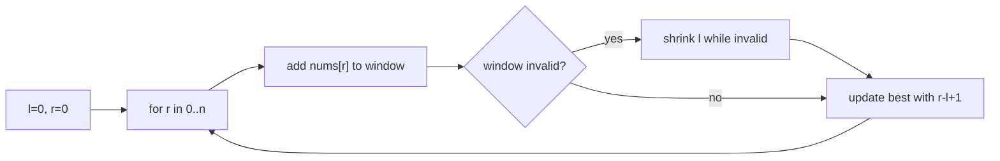

# Sliding Window

> Part of [[README|20 DSA Patterns]] • `Coding Patterns/01_Array` • Pattern #3

## Intent
Maintain a mutable window `[l, r]` over a sequence where both ends advance forward — O(n) for contiguous subarray/substring problems with max/min/longest/shortest constraints by expanding `r` and shrinking `l` only when the window violates the condition.

## Why it Matters
- Two flavors: **fixed-k** (window size constant, e.g., max sum of k elements) and **variable** (window grows/shrinks based on condition, e.g., longest substring without repeats, minimum window substring).
- The "contiguous" + "subarray/substring" + "max/min/longest/shortest" keyword cluster is the trigger.
- Senior signal: knowing the invariant — after the inner `while` shrinks, the window is *valid* and *minimal* for the current `r`. Update answer *after* shrinking, not before.

## Diagram



## Problems

### 643. Maximum Average Subarray I (Easy)
> [LeetCode 643](https://leetcode.com/problems/maximum-average-subarray-i/) • Tags: Array, Sliding Window

**Problem Statement:**

You are given an integer array nums consisting of n elements, and an integer k.

Find a contiguous subarray whose length is equal to k that has the maximum average value and return this value. Any answer with a calculation error less than 10^-5^ will be accepted.

**Examples:**

Example 1:

Input: nums = [1,12,-5,-6,50,3], k = 4
Output: 12.75000
Explanation: Maximum average is (12 - 5 - 6 + 50) / 4 = 51 / 4 = 12.75

Example 2:

Input: nums = [5], k = 1
Output: 5.00000

---

### 3. Longest Substring Without Repeating Characters (Medium)
> [LeetCode 3](https://leetcode.com/problems/longest-substring-without-repeating-characters/) • Tags: Hash Table, String, Sliding Window

**Problem Statement:**

Given a string s, find the length of the longest substring without duplicate characters.

**Examples:**

Example 1:

Input: s = "abcabcbb"
Output: 3
Explanation: The answer is "abc", with the length of 3. Note that "bca" and "cab" are also correct answers.

Example 2:

Input: s = "bbbbb"
Output: 1
Explanation: The answer is "b", with the length of 1.

Example 3:

Input: s = "pwwkew"
Output: 3
Explanation: The answer is "wke", with the length of 3.
Notice that the answer must be a substring, "pwke" is a subsequence and not a substring.

---

### 76. Minimum Window Substring (Hard)
> [LeetCode 76](https://leetcode.com/problems/minimum-window-substring/) • Tags: Hash Table, String, Sliding Window

**Problem Statement:**

Given two strings s and t of lengths m and n respectively, return the minimum window substring of s such that every character in t (including duplicates) is included in the window. If there is no such substring, return the empty string "".

The testcases will be generated such that the answer is unique.

**Examples:**

Example 1:

Input: s = "ADOBECODEBANC", t = "ABC"
Output: "BANC"
Explanation: The minimum window substring "BANC" includes 'A', 'B', and 'C' from string t.

Example 2:

Input: s = "a", t = "a"
Output: "a"
Explanation: The entire string s is the minimum window.

Example 3:

Input: s = "a", t = "aa"
Output: ""
Explanation: Both 'a's from t must be included in the window.
Since the largest window of s only has one 'a', return empty string.

---


## Code / Example
```java
// Fixed-k: max sum of k consecutive — LC 643
int maxSumK(int[] nums, int k) {
    int sum = 0;
    for (int i = 0; i < k; i++) sum += nums[i];
    int best = sum;
    for (int i = k; i < nums.length; i++) {
        sum += nums[i] - nums[i - k];
        best = Math.max(best, sum);
    }
    return best;
}

// Variable: longest substring without repeating chars — LC 3
int lengthOfLongestSubstring(String s) {
    var cnt = new java.util.HashMap<Character, Integer>();
    int l = 0, ans = 0;
    for (int r = 0; r < s.length(); r++) {
        char c = s.charAt(r);
        cnt.put(c, cnt.getOrDefault(c, 0) + 1);
        while (cnt.get(c) > 1) { // shrink until valid
            char cl = s.charAt(l);
            cnt.put(cl, cnt.get(cl) - 1);
            l++;
        }
        ans = Math.max(ans, r - l + 1); // update AFTER shrink
    }
    return ans;
}

// Variable: minimum window substring — LC 76
String minWindow(String s, String t) {
    var need = new java.util.HashMap<Character, Integer>();
    for (char c : t.toCharArray()) need.put(c, need.getOrDefault(c, 0) + 1);
    int required = need.size();
    var have = new java.util.HashMap<Character, Integer>();
    int l = 0, formed = 0, bestLen = Integer.MAX_VALUE, bestL = 0;
    for (int r = 0; r < s.length(); r++) {
        char c = s.charAt(r);
        have.put(c, have.getOrDefault(c, 0) + 1);
        if (need.containsKey(c) && have.get(c).equals(need.get(c))) formed++;
        while (formed == required) {
            if (r - l + 1 < bestLen) { bestLen = r - l + 1; bestL = l; }
            char cl = s.charAt(l);
            if (need.containsKey(cl) && have.get(cl).equals(need.get(cl))) formed--;
            have.put(cl, have.get(cl) - 1);
            l++;
        }
    }
    return bestLen == Integer.MAX_VALUE ? "" : s.substring(bestL, bestL + bestLen);
}
```

## When to Use / When NOT
- **Use:** contiguous subarray/substring with max/min/longest/shortest condition; fixed-k sums/averages; "window" / "substring" / "subarray" keywords.
- **NOT:** non-contiguous subsequence (use DP/backtracking); need original order but not contiguous; sorted pair search (use two pointers).

## Trade-offs
| Type | Time | Space |
|------|------|-------|
| Fixed-k | O(n) | O(1) |
| Variable + HashMap | O(n) | O(k) for frequency map (k = distinct chars in window) |
| Variable + HashSet | O(n) | O(min(n, alphabet)) |

## Vs Table
| Aspect | Sliding Window | Two Pointers | Prefix Sum |
|--------|----------------|--------------|------------|
| Window | contiguous, both ends advance forward | two ends walking inward | no window, precomputed |
| Solves | longest/shortest substring, fixed-k sums | pair, palindrome, sorted search | static range sums |
| Needs order | any sequence | sorted for two-sum | immutable array |
| Space | O(1) fixed-k, O(k) variable | O(1) | O(n) |
| Pick when | contiguous + condition | sorted + pair | repeated static range queries |

## Pitfalls
- Fixed-k: initialize with first `k` elements *before* sliding loop.
- Variable: update answer **after** shrinking (`while`), not before — the window is only guaranteed valid after the shrink loop.
- Use `HashSet` when only existence matters; `HashMap` when counts matter (e.g., min window substring).
- For min window substring, track `formed` (distinct chars meeting required count) vs `required` — don't recompute.

## Interview Q&A (Senior Depth)

**Q: Longest substring without repeating — why update answer *after* the `while` shrink loop?**
**A:** The `while` loop guarantees the window `[l, r]` has all unique characters. Before the `while`, the window is invalid (has a duplicate). Updating before shrink would record an invalid window. The invariant: at the top of the `for` loop, `[l, r-1]` is valid; we add `r`, possibly invalid; `while` restores validity; *then* `[l, r]` is the maximal valid window ending at `r`.

**Q: Minimum window substring (LC 76) — why `formed == required` and not just "all chars present"?**
**A:** `t` can have duplicates (e.g., `t="AAB"` needs 2 A's, 1 B). `required` = distinct chars in `t` (2). `formed` increments only when a char's count *exactly matches* its required count. This handles duplicates correctly — we don't overcount when we have 3 A's but only need 2.

**Q: When does fixed-k sliding window beat prefix sum for max sum of k?**
**A:** Both O(n). Sliding window O(1) space, prefix sum O(n) space. Sliding window is simpler for fixed-k — no extra array. Prefix sum wins when you have *many different k queries* on the same array (preprocess once, answer any k in O(1)). For single k, sliding window is preferred.

**Q: Can sliding window handle negative numbers for "longest subarray with sum <= k"?**
**A:** No — with negatives, shrinking `l` can *increase* the sum (removing a negative), breaking the monotonicity that makes the `while` shrink correct. For negatives + sum constraint, use prefix sum + ordered map (TreeMap) or monotonic deque (LC 862).

## Related
- [[01_Array/01 - Prefix Sum|Prefix Sum]] (fixed-k sums, alternative for static arrays)
- [[01_Array/04 - Frequency Counting|Frequency Counting]] (hashmap on window for variable windows)
- [[01_Array/02 - Two Pointers|Two Pointers]] (two pointers move inward; window moves forward)
- [[Java/07_DSA/Array]] · [[Java/07_DSA/HashMap]]

---
*Category: Coding Patterns/01_Array*
