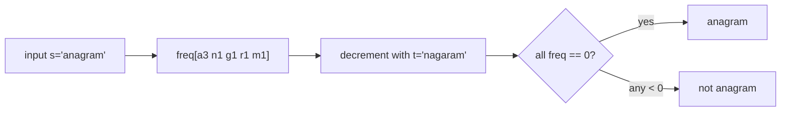

## Why it Matters

Count how many times each value appears, then answer the question from the counts. Trade space for time: O(n²) lookup becomes O(n) with a hash map. If the alphabet is small (26 letters), use an array instead.

Example: `s="anagram"`, `t="nagaram"` → build `freq` from `s` giving `a:3, n:1, g:1, r:1, m:1`, then decrement with each char of `t`. All zero at the end means anagram.

## Diagram


Counting reduces a comparison problem to a table lookup; the space cost is the size of the value domain.

## Code

```java
// General case with hash map
var freq = new java.util.HashMap<Integer,Integer>();
for (var x : nums) freq.put(x, freq.getOrDefault(x, 0) + 1);

// Bounded alphabet, valid anagram LC 242
boolean isAnagram(String s, String t) {
 if (s.length() != t.length()) return false;
 var freq = new int[26];
 for (var c : s.toCharArray()) freq[c - 'a']++;
 for (var c : t.toCharArray()) if (--freq[c - 'a'] < 0) return false;
 return true;
}

// Walkthrough: s="anagram", t="nagaram"
// s builds [a3 n1 g1 r1 m1], t decrements to all zero → true
```
Array is faster than map when the range is known. Check length first for anagram. It is the quickest filter.

## When to use / not

- Anagram, duplicate, or grouping questions
- "How many elements appear k times"
- Keywords: "count occurrences", "frequency", "anagram", "duplicate"

## Trade-offs

| case | time | space |
|---|---|---|
| hash map | O(n) | O(n) |
| fixed alphabet (26) | O(n) | O(1) |

## Vs

| | Frequency map | Sorting | Prefix sum |
|---|---|---|---|
| anagram / duplicate | O(n) | O(n log n) | not applicable |
| space | O(domain) | O(1) extra | O(n) |
| bounded alphabet | int[26], effectively O(1) | no benefit | n/a |
| pick when | counts matter, values are the question | only order matters | range sums |

For a 26-letter alphabet the map collapses to an array; the map is the general case of the same idea.

## Pitfalls

- Use `getOrDefault` to avoid NPE on missing keys.
- For anagram, decrement and check `<0` immediately instead of a second pass.
- Group anagrams builds a map from sorted string or frequency key to list.

## Interview q&a

- [242. Valid Anagram](https://leetcode.com/problems/valid-anagram/)
- [49. Group Anagrams](https://leetcode.com/problems/group-anagrams/)
- [347. Top K Frequent Elements](https://leetcode.com/problems/top-k-frequent-elements/)

## Related

- [[Java/07_DSA/Array]]
- [[Java/07_DSA/HashMap]]

# Frequency Counting

> Part of [[README|20 DSA Patterns]], Pattern #6
