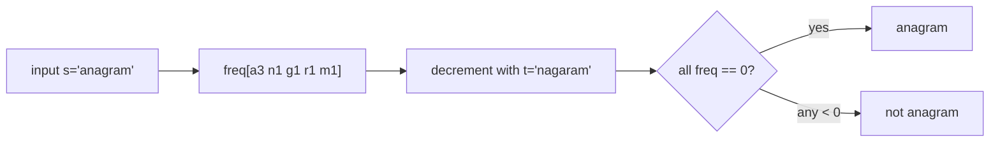

# Frequency Counting

> Part of [[README|Coding Patterns]] • `Coding Patterns/01_Array` • Pattern #4

## Intent
Count occurrences of each value in O(n) time using a HashMap (or array for bounded alphabet), then answer questions from the counts — the fundamental space-for-time tradeoff that turns O(n²) pairwise comparisons into O(n) table lookups.

## Why it Matters
- Core pattern for anagram, duplicate, grouping, and top-k frequency problems.
- Bounded alphabet (a-z, ASCII) → `int[26]` or `int[128]` is faster than HashMap (no hashing, cache-friendly).
- Senior signal: recognizing when a problem *reduces to counting* — "are these anagrams?" → count both, compare; "group anagrams" → count per word, use sorted string or frequency array as map key.

## Diagram



## Problems

### 242. Valid Anagram (Easy)
> [LeetCode 242](https://leetcode.com/problems/valid-anagram/) • Tags: Hash Table, String, Sorting

**Problem Statement:**

Given two strings s and t, return true if t is an anagram of s, and false otherwise. Example 1: Input: s = "anagram", t = "nagaram" Output: true Example 2: Input: s = "rat", t = "car" Output: false Constraints: 1 4 s and t consist of lowercase English letters. Follow up: What if the inputs contain Unicode characters? How would you adapt your solution to such a case?

**Examples:**

Example 1:
```
"anagram"
```

Example 2:
```
"nagaram"
```

Example 3:
```
"rat"
```

Example 4:
```
"car"
```
---

### 49. Group Anagrams (Medium)
> [LeetCode 49](https://leetcode.com/problems/group-anagrams/) • Tags: Array, Hash Table, String, Sorting

**Problem Statement:**

Given an array of strings strs, group the anagrams together. You can return the answer in any order. Example 1: Input: strs = ["eat","tea","tan","ate","nat","bat"] Output: [["bat"],["nat","tan"],["ate","eat","tea"]] Explanation: There is no string in strs that can be rearranged to form "bat". The strings "nat" and "tan" are anagrams as they can be rearranged to form each other. The strings "ate", "eat", and "tea" are anagrams as they can be rearranged to form each other. Example 2: Input: strs = [""] Output: [[""]] Example 3: Input: strs = ["a"] Output: [["a"]] Constraints: 1 4 0 strs[i] consists of lowercase English letters.

**Examples:**

Example 1:
```
["eat","tea","tan","ate","nat","bat"]
```

Example 2:
```
[""]
```

Example 3:
```
["a"]
```
---


## Code / Example
```java
// General case with HashMap
var freq = new java.util.HashMap<Integer, Integer>();
for (var x : nums) freq.put(x, freq.getOrDefault(x, 0) + 1);

// Valid Anagram — LC 242 (bounded alphabet: int[26])
boolean isAnagram(String s, String t) {
    if (s.length() != t.length()) return false;
    int[] freq = new int[26];
    for (char c : s.toCharArray()) freq[c - 'a']++;
    for (char c : t.toCharArray()) if (--freq[c - 'a'] < 0) return false;
    return true;
}

// Group Anagrams — LC 49 (frequency array as key)
java.util.List<java.util.List<String>> groupAnagrams(String[] strs) {
    var map = new java.util.HashMap<String, java.util.List<String>>();
    for (var s : strs) {
        int[] freq = new int[26];
        for (char c : s.toCharArray()) freq[c - 'a']++;
        String key = java.util.Arrays.toString(freq); // e.g., "[3,0,1,...]"
        map.computeIfAbsent(key, k -> new java.util.ArrayList<>()).add(s);
    }
    return new java.util.ArrayList<>(map.values());
}

// Top K Frequent Elements — LC 347 (frequency + heap)
int[] topKFrequent(int[] nums, int k) {
    var freq = new java.util.HashMap<Integer, Integer>();
    for (var x : nums) freq.put(x, freq.getOrDefault(x, 0) + 1);
    var heap = new java.util.PriorityQueue<Integer>((a, b) -> freq.get(a) - freq.get(b));
    for (var key : freq.keySet()) {
        heap.offer(key);
        if (heap.size() > k) heap.poll();
    }
    int[] res = new int[k];
    for (int i = 0; i < k; i++) res[i] = heap.poll();
    return res;
}
```

## When to Use / When NOT
- **Use:** anagram, duplicate detection, grouping by frequency, "how many appear k times", top-k frequent.
- **NOT:** only order matters (use sort); range sum queries (use prefix sum); streaming with bounded memory (use Count-Min Sketch / reservoir sampling).

## Trade-offs
| Case | Time | Space |
|------|------|-------|
| HashMap (general) | O(n) | O(n) distinct values |
| Fixed alphabet (26/128) | O(n) | O(1) — array is constant size |

## Vs Table
| Aspect | Frequency Map | Sorting | Prefix Sum |
|--------|---------------|---------|------------|
| Anagram / duplicate | O(n) | O(n log n) | N/A |
| Space | O(domain) | O(1) extra | O(n) |
| Bounded alphabet | `int[26]`, effectively O(1) | no benefit | N/A |
| Pick when | counts matter, values are the question | only order matters | range sums |

## Pitfalls
- Use `getOrDefault(key, 0)` to avoid NPE on missing keys.
- For anagram, decrement and check `< 0` immediately — early exit, no second pass needed.
- Group anagrams: key can be sorted string (`Arrays.sort(chars)`) or frequency array (`Arrays.toString(freq)`). Frequency array is O(L) vs O(L log L) for sort.
- For top-k frequent, bucket sort O(n) is possible when max frequency ≤ n (array of lists indexed by frequency).

## Interview Q&A (Senior Depth)

**Q: Valid Anagram — why `int[26]` over HashMap? What's the actual performance difference?**
**A:** `int[26]` avoids hashing overhead, has better cache locality, no object allocation per entry. For short strings the difference is negligible; for millions of short strings (e.g., dictionary processing), array is measurably faster. HashMap is the general case — use it when alphabet is large or unknown (Unicode). Both O(n) time, but constant factors differ.

**Q: Group Anagrams — frequency array key vs sorted string key. Which do you pick and why?**
**A:** Frequency array `int[26]` → `Arrays.toString(freq)` is O(L) to build + O(26) to convert to string. Sorted string is O(L log L) to sort. For long strings, frequency array wins asymptotically. For short strings (L < 10), sort overhead is tiny and sorted string is more readable. In interviews, mention both and the tradeoff.

**Q: Top K Frequent — heap vs bucket sort. When does bucket sort win?**
**A:** Bucket sort: `List<Integer>[] buckets = new List[n+1]`, bucket[freq].add(num). Iterate buckets from n down to 1, collect until k. Time O(n), space O(n). Heap is O(n log k). Bucket sort wins when k is large (close to n) or when you need *all* frequencies sorted. Heap wins when k << n and you only need top k. Interview answer: "Heap for k << n, bucket sort when k is large or you need full ordering."

**Q: Frequency counting with negative numbers or large range — what changes?**
**A:** `int[]` array no longer works (negative index, huge range). Must use HashMap. Time stays O(n), space becomes O(distinct values). No asymptotic change, just constant factors.


## Flashcards (Spaced Repetition)

#flashcard
**Q:** What is the trigger keyword for Frequency Counting? :: **A:** anagrams, character counts, frequency of elements, top K frequent, find duplicate #flashcard

#flashcard
**Q:** Time/space complexity of Frequency Counting? :: **A:** Time: O(n) build + O(1) lookup, Space: O(Σ) alphabet or O(n) distinct #flashcard

#flashcard
**Q:** When do you NOT use Frequency Counting? :: **A:** need order information (use array/list), range frequency queries (use Mo's algorithm) #flashcard

#flashcard
**Q:** Core Java 25 snippet for Frequency Counting? :: **A:** `int[] cnt = new int[26]; for(char c:s.toCharArray()) cnt[c-'a']++; // or Map<Integer,Integer> for general` #flashcard


## Practice Tasks (Tasks Plugin)
- [ ] Restate the intent from memory 📅 {date:YYYY-MM-DD, +1}
- [ ] Code the snippet without looking 📅 {date:YYYY-MM-DD, +3}
- [ ] Answer all Interview Q&A aloud 📅 {date:YYYY-MM-DD, +7}
- [ ] Review flashcards (Spaced Repetition) 📅 {date:YYYY-MM-DD, +1}

```tasks
not done
path includes {file.folder}
sort by due
limit 10
```

## Related
- [[01_Array/01 - Prefix Sum|Prefix Sum]] (hashmap on prefix sums for subarray sum = k)
- [[01_Array/03 - Sliding Window|Sliding Window]] (frequency map inside variable window)
- [[03_Stack_Heap/02 - Top K Elements|Top K Elements]] (frequency + heap)
- [[Java/07_DSA/Array]] · [[Java/07_DSA/HashMap]]
---
*Category: Coding Patterns/01_Array*
