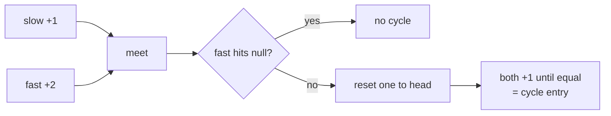

## Why it Matters

Two pointers move at different speeds. Slow moves 1 step, fast moves 2. If there is a cycle they meet; if fast hits null there is none. Example: `head=[3,2,0,-4] pos=1` → slow and fast both start at 3, after a few steps they meet at node 2, proving a cycle.

Also finds the middle: when fast reaches the end, slow sits at the middle. Reset one to head after meeting and move both 1 step to find the cycle entry.

## Diagram


The meeting proves a cycle exists; it does not locate it. The second phase, reset to head, advance both at speed 1, does.

## Code

```java
record Node(int val, Node next) {}

// Cycle detection, LC 141
boolean hasCycle(Node head) {
 var slow = head; var fast = head;
 while (fast != null && fast.next() != null) {
 slow = slow.next();
 fast = fast.next().next();
 if (slow == fast) return true;
 }
 return false;
}

// Find middle, when fast ends, slow is middle
Node middle(Node head) {
 var slow = head; var fast = head;
 while (fast != null && fast.next() != null) {
 slow = slow.next();
 fast = fast.next().next();
 }
 return slow;
}

// Entry of cycle, reset one to head after meeting
Node detectCycle(Node head) {
 var slow = head; var fast = head;
 while (fast != null && fast.next() != null) {
 slow = slow.next();
 fast = fast.next().next();
 if (slow == fast) {
 var p = head;
 while (p != slow) { p = p.next(); slow = slow.next(); }
 return p;
 }
 }
 return null;
}
```
Pattern matching in Java 25 can replace null checks: `if (cur instanceof Node(var v, var nxt))` but the classic null check reads clearer for interviews.

## When to use / not

- Linked list cycle, middle of list, happy number, duplicate number
- Keywords: "cycle", "loop", "middle", "circular"

## Trade-offs

| time | space |
|---|---|
| O(n) | O(1) |

## Vs

| | Floyd fast/slow | Hash set of visited | Brent's algorithm |
|---|---|---|---|
| space | O(1) | O(n) | O(1) |
| cycle detect | O(n) | O(n) | O(n), fewer traversals on average |
| find cycle length | extra pass from the meeting point | trivial | direct |
| pick when | O(1) space is required | debugging, or every visited node must be reported | competitive tuning only |

## Pitfalls

- Check `fast != null && fast.next() != null` every loop. Checking only `fast != null` misses the next pointer.
- Meeting point is not the cycle start. You still need the second phase.

## Interview q&a

- [141. Linked List Cycle](https://leetcode.com/problems/linked-list-cycle/)
- [202. Happy Number](https://leetcode.com/problems/happy-number/)
- [287. Find the Duplicate Number](https://leetcode.com/problems/find-the-duplicate-number/)

## Related

- [[Java/07_DSA/Singly Linked List]]
- [[Java/07_DSA/Linked List]]

# Fast and Slow Pointers

> Part of [[README|20 DSA Patterns]], Pattern #4
