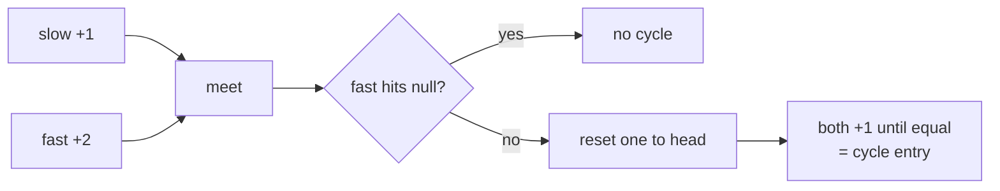

# Fast and Slow Pointers

> Part of [[README|Coding Patterns]] • `Coding Patterns/02_LinkedList` • Pattern #5

## Intent
Two pointers traversing a sequence at different speeds (slow +1, fast +2) to detect cycles, find middles, or locate cycle entry — O(1) space alternative to HashSet for linked list and sequence problems.

## Why it Matters
- **Cycle detection (Floyd's algorithm):** If a cycle exists, fast and slow *must* meet. Proof: relative speed is 1 step per iteration; in a cycle of length C, they meet within C steps.
- **Cycle entry:** After meeting, reset one pointer to head, advance both at speed 1 — they meet at cycle entry. Distance from head to entry = distance from meeting point to entry (mod C).
- **Middle of list:** When fast reaches end, slow is at middle (even length → first middle).
- Senior signal: knowing the *proof* of cycle entry — not just the code. The second phase works because `distance(head→entry) = distance(meeting→entry)` when both move at speed 1.

## Diagram



## Problems

### 141. Linked List Cycle (Easy)
> [LeetCode 141](https://leetcode.com/problems/linked-list-cycle/) • Tags: Hash Table, Linked List, Two Pointers, Floyd's Cycle Finding Algorithm

**Problem Statement:**

Given head, the head of a linked list, determine if the linked list has a cycle in it. There is a cycle in a linked list if there is some node in the list that can be reached again by continuously following the next pointer. Internally, pos is used to denote the index of the node that tail's next pointer is connected to. Note that pos is not passed as a parameter. Return true if there is a cycle in the linked list. Otherwise, return false. Example 1: Input: head = [3,2,0,-4], pos = 1 Output: true Explanation: There is a cycle in the linked list, where the tail connects to the 1st node (0-indexed). Example 2: Input: head = [1,2], pos = 0 Output: true Explanation: There is a cycle in the linked list, where the tail connects to the 0th node. Example 3: Input: head = [1], pos = -1 Output: false Explanation: There is no cycle in the linked list. Constraints: The number of the nodes in the list is in the range [0, 104]. -105 5 pos is -1 or a valid index in the linked-list. Follow up: Can you solve it using O(1) (i.e. constant) memory?

**Examples:**

Example 1:
```
[3,2,0,-4]
```

Example 2:
```
1
```

Example 3:
```
[1,2]
```

Example 4:
```
0
```

Example 5:
```
[1]
```

Example 6:
```
-1
```
---

### 876. Middle of the Linked List (Easy)
> [LeetCode 876](https://leetcode.com/problems/middle-of-the-linked-list/) • Tags: Linked List, Two Pointers

**Problem Statement:**

Given the head of a singly linked list, return the middle node of the linked list. If there are two middle nodes, return the second middle node. Example 1: Input: head = [1,2,3,4,5] Output: [3,4,5] Explanation: The middle node of the list is node 3. Example 2: Input: head = [1,2,3,4,5,6] Output: [4,5,6] Explanation: Since the list has two middle nodes with values 3 and 4, we return the second one. Constraints: The number of nodes in the list is in the range [1, 100]. 1

**Examples:**

Example 1:
```
[1,2,3,4,5]
```

Example 2:
```
[1,2,3,4,5,6]
```
---

### 287. Find the Duplicate Number (Medium)
> [LeetCode 287](https://leetcode.com/problems/find-the-duplicate-number/) • Tags: Array, Two Pointers, Binary Search, Bit Manipulation, Pigeonhole Principle, Floyd's Cycle Finding Algorithm

**Problem Statement:**

Given an array of integers nums containing n + 1 integers where each integer is in the range [1, n] inclusive. There is only one repeated number in nums, return this repeated number. You must solve the problem without modifying the array nums and using only constant extra space. Example 1: Input: nums = [1,3,4,2,2] Output: 2 Example 2: Input: nums = [3,1,3,4,2] Output: 3 Example 3: Input: nums = [3,3,3,3,3] Output: 3 Constraints: 1 5 nums.length == n + 1 1 All the integers in nums appear only once except for precisely one integer which appears two or more times. Follow up: How can we prove that at least one duplicate number must exist in nums? Can you solve the problem in linear runtime complexity?

**Examples:**

Example 1:
```
[1,3,4,2,2]
```

Example 2:
```
[3,1,3,4,2]
```

Example 3:
```
[3,3,3,3,3]
```
---


## Code / Example
```java
record Node(int val, Node next) {}

// Cycle detection — LC 141
boolean hasCycle(Node head) {
    var slow = head; var fast = head;
    while (fast != null && fast.next() != null) {
        slow = slow.next();
        fast = fast.next().next();
        if (slow == fast) return true;
    }
    return false;
}

// Find middle — when fast ends, slow is middle
Node middle(Node head) {
    var slow = head; var fast = head;
    while (fast != null && fast.next() != null) {
        slow = slow.next();
        fast = fast.next().next();
    }
    return slow;
}

// Cycle entry — LC 142
Node detectCycle(Node head) {
    var slow = head; var fast = head;
    while (fast != null && fast.next() != null) {
        slow = slow.next();
        fast = fast.next().next();
        if (slow == fast) {
            var p = head;
            while (p != slow) { p = p.next(); slow = slow.next(); }
            return p;
        }
    }
    return null;
}

// Happy Number — LC 202 (sequence cycle)
boolean isHappy(int n) {
    int slow = n, fast = next(n);
    while (fast != 1 && slow != fast) {
        slow = next(slow);
        fast = next(next(fast));
    }
    return fast == 1;
}
int next(int n) {
    int sum = 0;
    while (n > 0) { int d = n % 10; sum += d * d; n /= 10; }
    return sum;
}

// Find Duplicate — LC 287 (array as linked list via values as pointers)
int findDuplicate(int[] nums) {
    int slow = nums[0], fast = nums[0];
    do { slow = nums[slow]; fast = nums[nums[fast]]; } while (slow != fast);
    slow = nums[0];
    while (slow != fast) { slow = nums[slow]; fast = nums[fast]; }
    return slow;
}
```

## When to Use / When NOT
- **Use:** linked list cycle detection; middle of list; happy number; find duplicate (array values as pointers); any sequence where next(x) is O(1).
- **NOT:** need to visit every node (just traverse); need all nodes in cycle (need extra pass); array where values aren't valid indices.

## Trade-offs
| Approach | Time | Space |
|----------|------|-------|
| Floyd (fast/slow) | O(n) | O(1) |
| HashSet visited | O(n) | O(n) |
| Brent's algorithm | O(n) | O(1) — fewer traversals on average |

## Vs Table
| Aspect | Floyd Fast/Slow | HashSet Visited | Brent's Algorithm |
|--------|-----------------|-----------------|-------------------|
| Space | O(1) | O(n) | O(1) |
| Cycle detect | O(n) | O(n) | O(n), fewer traversals avg |
| Find cycle length | extra pass from meeting | trivial | direct |
| Pick when | O(1) space required | debugging, or must report every visited | competitive tuning only |

## Pitfalls
- Check `fast != null && fast.next() != null` **every loop**. Checking only `fast != null` misses `fast.next` and causes NPE.
- Meeting point is **not** the cycle start. You *must* do the second phase (reset one to head, both +1).
- For array-as-linked-list (LC 287), values must be valid indices `[1, n-1]` for 1..n array with n+1 elements.

## Interview Q&A (Senior Depth)

**Q: Prove why resetting one pointer to head and advancing both at speed 1 finds the cycle entry.**
**A:** Let `L1` = distance head→entry, `L2` = distance entry→meeting, `C` = cycle length. Slow travels `L1 + L2`. Fast travels `L1 + L2 + kC` (k loops). Fast = 2×Slow → `L1 + L2 + kC = 2(L1 + L2)` → `L1 = kC - L2`. So distance from head to entry equals distance from meeting to entry (mod C). Moving both at speed 1, they meet at entry.

**Q: Happy Number — why does this work on a number sequence?**
**A:** The transformation `n → sum of squares of digits` defines a deterministic next-state function on a finite domain (max sum for 32-bit int is 9²×10=810). Any finite-state deterministic sequence must eventually cycle. If it reaches 1, it stays at 1 (cycle of length 1). If not, it enters a cycle not containing 1. Fast/slow detects which case.

**Q: Find Duplicate (LC 287) — why can we treat the array as a linked list?**
**A:** Array has n+1 elements with values in [1,n]. Treat `i → nums[i]` as a pointer. Since there are n+1 nodes and only n possible values, by pigeonhole principle there's a cycle. The duplicate value is the *entry point* of the cycle (two indices point to it). Floyd's algorithm finds the entry in O(1) space without modifying the array.

**Q: What if the linked list is very long and you're worried about stack overflow?**
**A:** Floyd's algorithm is iterative — no recursion, no stack overflow risk. The O(1) space guarantee holds regardless of list length. This is exactly why it's preferred over recursive or HashSet approaches in production.


## Flashcards (Spaced Repetition)

#flashcard
**Q:** What is the trigger keyword for Fast and Slow Pointers? :: **A:** linked list cycle, find middle, happy number, find duplicate (LC 287), palindrome linked list #flashcard

#flashcard
**Q:** Time/space complexity of Fast and Slow Pointers? :: **A:** Time: O(n) cycle detect / O(n) find entry, Space: O(1) #flashcard

#flashcard
**Q:** When do you NOT use Fast and Slow Pointers? :: **A:** need to visit all nodes (just traverse), need cycle length only (extra pass needed) #flashcard

#flashcard
**Q:** Core Java 25 snippet for Fast and Slow Pointers? :: **A:** `ListNode slow=head, fast=head; while(fast!=null && fast.next!=null){ slow=slow.next; fast=fast.next.next; if(slow==fast) break; }` #flashcard


## Practice Tasks (Tasks Plugin)
- [ ] Restate the intent from memory 📅 {date:YYYY-MM-DD, +1}
- [ ] Code the snippet without looking 📅 {date:YYYY-MM-DD, +3}
- [ ] Answer all Interview Q&A aloud 📅 {date:YYYY-MM-DD, +7}
- [ ] Review flashcards (Spaced Repetition) 📅 {date:YYYY-MM-DD, +1}

```tasks
not done
path includes {file.folder}
sort by due
limit 10
```

## Related
- [[02_LinkedList/02 - LinkedList In-place Reversal|LinkedList In-place Reversal]]
- [[05_Trees_Graphs/02 - DFS|DFS]] (graph cycle detection uses visited set, not fast/slow)
- [[Java/07_DSA/Singly Linked List]] · [[Java/07_DSA/Linked List]]
---
*Category: Coding Patterns/02_LinkedList*
