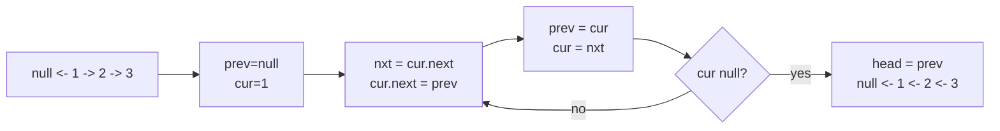

# LinkedList In-place Reversal

> Part of [[README|20 DSA Patterns]] • `Coding Patterns/02_LinkedList` • Pattern #5

## Intent
Reverse a linked list (or sublist) in O(n) time and O(1) space by flipping `next` pointers with three variables — the canonical pattern for any in-place list restructuring.

## Why it Matters
- Core loop: `prev = null; cur = head; while (cur != null) { nxt = cur.next; cur.next = prev; prev = cur; cur = nxt; }` — every reversal variant is this loop with different bookkeeping at the boundaries.
- **Sublist [m,n]:** anchor `prev` before `m`, then head-insert each next node into the sublist front for `n-m` steps.
- **K-groups:** reverse each group of k, link groups together.
- **Palindrome check:** find middle, reverse second half, compare, restore.
- Senior signal: using a dummy head to handle `m=1` uniformly — avoids special-casing the head.

## Diagram



## Problems

### 206. Reverse Linked List (Easy)
> [LeetCode 206](https://leetcode.com/problems/reverse-linked-list/) • Tags: Linked List, Recursion

**Problem Statement:**

Given the head of a singly linked list, reverse the list, and return the reversed list.

**Examples:**

Example 1:

Input: head = [1,2,3,4,5]
Output: [5,4,3,2,1]

Example 2:

Input: head = [1,2]
Output: [2,1]

Example 3:

Input: head = []
Output: []

---

### 92. Reverse Linked List II (Medium)
> [LeetCode 92](https://leetcode.com/problems/reverse-linked-list-ii/) • Tags: Linked List

**Problem Statement:**

Given the head of a singly linked list and two integers left and right where left <= right, reverse the nodes of the list from position left to position right, and return the reversed list.

**Examples:**

Example 1:

Input: head = [1,2,3,4,5], left = 2, right = 4
Output: [1,4,3,2,5]

Example 2:

Input: head = [5], left = 1, right = 1
Output: [5]

---

### 24. Swap Nodes in Pairs (Medium)
> [LeetCode 24](https://leetcode.com/problems/swap-nodes-in-pairs/) • Tags: Linked List, Recursion

**Problem Statement:**

Given a linked list, swap every two adjacent nodes and return its head. You must solve the problem without modifying the values in the list's nodes (i.e., only nodes themselves may be changed.)

**Examples:**

Example 1:

Input: head = [1,2,3,4]

Output: [2,1,4,3]

Explanation:

Example 2:

Input: head = []

Output: []

Example 3:

Input: head = [1]

Output: [1]

---


## Code / Example
```java
// Mutable node for interviews (Java record is immutable)
class Node { int val; Node next; Node(int v){ val=v; } }

// Reverse entire list — LC 206
Node reverseList(Node head) {
    Node prev = null; var cur = head;
    while (cur != null) {
        var nxt = cur.next;
        cur.next = prev;
        prev = cur;
        cur = nxt;
    }
    return prev;
}

// Reverse between m and n — LC 92 (1-indexed)
Node reverseBetween(Node head, int m, int n) {
    Node dummy = new Node(0); dummy.next = head;
    Node prev = dummy;
    for (int i = 1; i < m; i++) prev = prev.next; // node before m
    Node cur = prev.next; // m-th node
    for (int i = 0; i < n - m; i++) {
        Node nxt = cur.next;
        cur.next = nxt.next;
        nxt.next = prev.next;
        prev.next = nxt; // head-insert nxt at front of sublist
    }
    return dummy.next;
}

// Reverse in k-groups — LC 25
Node reverseKGroup(Node head, int k) {
    Node dummy = new Node(0); dummy.next = head;
    Node groupPrev = dummy;
    while (true) {
        Node kth = groupPrev;
        for (int i = 0; i < k; i++) { kth = kth.next; if (kth == null) return dummy.next; }
        Node groupNext = kth.next;
        // reverse group
        Node prev = groupNext, cur = groupPrev.next;
        while (cur != groupNext) {
            var nxt = cur.next; cur.next = prev; prev = cur; cur = nxt;
        }
        Node tmp = groupPrev.next; groupPrev.next = kth; groupPrev = tmp;
    }
}
```

## When to Use / When NOT
- **Use:** reverse whole list; reverse sublist [m,n]; reverse in k-groups; palindrome check (reverse second half); reorder list.
- **NOT:** when O(n) space is acceptable and recursive clarity wins (small n); immutable list (must rebuild).

## Trade-offs
| Approach | Time | Space | Stack Overflow Risk |
|----------|------|-------|---------------------|
| Iterative in-place | O(n) | O(1) | None |
| Recursive | O(n) | O(n) call stack | Deep lists |
| Copy to array, reverse, rebuild | O(n) | O(n) | None |

## Vs Table
| Aspect | In-place Reversal | Recursive Reversal | Array Copy + Rebuild |
|--------|-------------------|--------------------|----------------------|
| Time | O(n) | O(n) | O(n) |
| Space | O(1) | O(n) call stack | O(n) |
| Stack overflow | None | Deep lists | None |
| Pick when | O(1) space required | Shortest code, small n | Never in interview |

## Pitfalls
- Save `next` **before** overwriting `cur.next` — classic bug.
- For sublist, use dummy head to handle `m=1` without special cases.
- Palindrome: reverse second half, compare, then **restore** the list (interviewers check this).
- Java 25 `record` is immutable — in interviews, explicitly declare a mutable `class Node` for pointer manipulation.

## Interview Q&A (Senior Depth)

**Q: Reverse Between (LC 92) — why does the head-insertion loop run `n-m` times, not `n-m+1`?**
**A:** The sublist has `n-m+1` nodes. The first node (at position m) becomes the *last* node of the reversed sublist — it's already in place as the tail. Each iteration moves the *next* node to the front. After `n-m` moves, all remaining `n-m` nodes are at the front, and the original m-th node is at the end. Total nodes in reversed section: `1 + (n-m) = n-m+1`. Correct.

**Q: Reverse K-Group — how do you handle the last group if it has fewer than k nodes?**
**A:** Before reversing, advance a pointer `k` steps from `groupPrev`. If it hits `null`, the remaining nodes < k — return immediately without reversing. The check `for (int i = 0; i < k; i++) { kth = kth.next; if (kth == null) return dummy.next; }` handles this.

**Q: Can you reverse a list using only two pointers?**
**A:** No — you need three: `prev`, `cur`, `nxt`. The `nxt` saves the rest of the list before you sever `cur.next`. With only two pointers, you lose the reference to the unprocessed portion. Some languages allow `cur.next, prev, cur = prev, cur, cur.next` (tuple assignment) which *looks* like two variables but semantically still has three values.

**Q: Palindrome check with O(1) space — walk me through the full algorithm.**
**A:** (1) Find middle with fast/slow. (2) Reverse second half starting from `slow` (or `slow.next` for odd). (3) Compare first half and reversed second half node by node. (4) **Restore** by reversing the second half again and reattaching. (5) Return comparison result. Restoration is required for production code; some interviewers skip it but seniors include it.

## Related
- [[02_LinkedList/01 - Fast and Slow Pointers|Fast & Slow Pointers]] (find middle for palindrome)
- [[07_Backtracking_DP/01 - Backtracking|Backtracking]] (recursive reversal is backtracking)
- [[Java/07_DSA/Singly Linked List]] · [[Java/07_DSA/Linked List]]

---
*Category: Coding Patterns/02_LinkedList*
