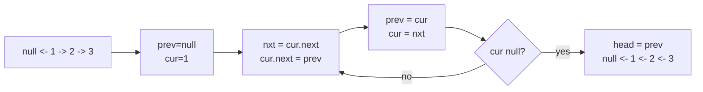

## Why it Matters

Flip `next` pointers with three variables: `prev`, `curr`, `next`. One pass, O(1) space. Example: `1→2→3→null` → iterate: `prev=null,curr=1` → `next=2, curr.next=prev, prev=1,curr=2` → repeat → result `3→2→1→null`.

For sublist `[m,n]` anchor `prev` before `m`, then move each next node to front of the sublist. For k-groups, reverse each group and link.

## Diagram


Three pointers, one pass, zero allocation. Every reversal variant is this loop with different bookkeeping at the ends.

## Code

```java
record ListNode(int val, ListNode next) {}

// Reverse entire list, LC 206
ListNode reverseList(ListNode head) {
 ListNode prev = null; var curr = head;
 while (curr != null) {
 var nxt = curr.next();
 // need mutable version for interview: curr.next = prev
 // with record, rebuild: curr = new ListNode(curr.val(), prev)
 // below uses classic mutable node for clarity
 curr.next = prev;
 prev = curr;
 curr = nxt;
 }
 return prev;
}

// Mutable node version commonly used in interviews:
class Node { int val; Node next; Node(int v){val=v;} }

Node reverse(Node head) {
 Node prev = null; var cur = head;
 while (cur != null) {
 var nxt = cur.next;
 cur.next = prev;
 prev = cur;
 cur = nxt;
 }
 return prev;
}

// LC 92 reverse between m and n: find node before m, then head-insertion for n-m steps
```
Java 25 `record` is immutable, so real interview code keeps a mutable `Node` class. Mention `record` as value holder if asked about Java 25.

## When to use / not

- Reverse whole list, reverse between m and n, reverse in k-groups, palindrome check, reorder list
- Question says "in O(1) extra space"

## Trade-offs

| time | space |
|---|---|
| O(n) | O(1) |

## Vs

| | In-place reversal | Recursive reversal | Copy to array, reverse, rebuild |
|---|---|---|---|
| time | O(n) | O(n) | O(n) |
| space | O(1) | O(n) call stack | O(n) |
| stack overflow risk | none | deep lists | none |
| pick when | O(1) space asked | shortest code, small n | never in an interview |

Recursion is the same algorithm with an implicit stack; the iterative version is what O(1) space actually means.

## Pitfalls

- Save `next` before overwriting `curr.next`.
- For sublist, keep a dummy head to handle `m==1`.
- Palindrome check: reverse second half, compare, then restore.

## Interview q&a

- [206. Reverse Linked List](https://leetcode.com/problems/reverse-linked-list/)
- [92. Reverse Linked List II](https://leetcode.com/problems/reverse-linked-list-ii/)
- [24. Swap Nodes in Pairs](https://leetcode.com/problems/swap-nodes-in-pairs/)

## Related

- [[Java/07_DSA/Singly Linked List]]
- [[Java/07_DSA/Linked List]]

# Linked List in Place Reversal

> Part of [[README|20 DSA Patterns]], Pattern #5
