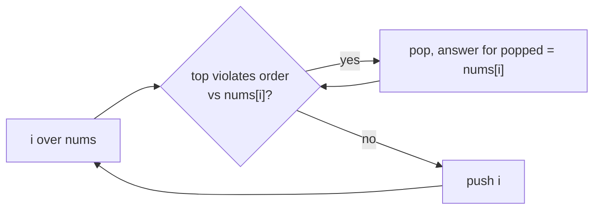

## Why it Matters

A stack that stays sorted. Increasing stack keeps the smallest on top, decreasing keeps the largest. Iterate the array, pop while the top violates the order with the current element, then the top (if any) is the answer for current. Push current.

Example next greater: `nums=[2,1,2,4,3]` → stack holds indices of decreasing values. At `4`, pop `2` and `1` because `4` is greater, their next greater is `4`.

## Diagram


Each index is pushed once and popped at most once, so the inner `while` loop runs O(n) times total, not O(n²).

## Code

```java
// Next greater element
int[] nextGreater(int[] nums) {
 int n = nums.length;
 var res = new int[n];
 java.util.Arrays.fill(res, -1);
 var st = new java.util.ArrayDeque<Integer>(); // stores indices
 for (var i = 0; i < n; i++) {
 while (!st.isEmpty() && nums[st.getFirst()] < nums[i]) {
 res[st.pop()] = nums[i];
 }
 st.push(i);
 }
 return res;
}

// Daily temperatures, LC 739: same logic, answer is i - popped index
int[] dailyTemperatures(int[] temps) {
 int n = temps.length;
 var ans = new int[n];
 var st = new java.util.ArrayDeque<Integer>();
 for (var i = 0; i < n; i++) {
 while (!st.isEmpty() && temps[st.peek()] < temps[i]) {
 var j = st.pop();
 ans[j] = i - j;
 }
 st.push(i);
 }
 return ans;
}
```
`ArrayDeque` is the Java 25 choice over `Stack`. `getFirst` and `peek` both work; interviews accept either.

## When to use / not

- Next greater or smaller element, daily temperatures, histogram, trapping rain water
- Need to keep elements in order while scanning once

## Trade-offs

| time | space |
|---|---|
| O(n), each element pushed and popped at most once | O(n) |

## Vs

| | Monotonic stack | Brute force next greater | Sorting |
|---|---|---|---|
| next greater element | O(n) | O(n²) | does not solve it |
| space | O(n) | O(1) | O(n) |
| solves range queries | no | no | no |
| pick when | nearest greater/smaller, histogram, span | n tiny | order is the whole question |

## Pitfalls

- Store indices, not values, so you can write answers by position.
- For histogram, add a sentinel `0` at the end to flush the stack.
- Decide increasing vs decreasing before coding.

## Interview q&a

- [496. Next Greater Element I](https://leetcode.com/problems/next-greater-element-i/)
- [739. Daily Temperatures](https://leetcode.com/problems/daily-temperatures/)
- [84. Largest Rectangle in Histogram](https://leetcode.com/problems/largest-rectangle-in-histogram/)

## Related

- [[Java/07_DSA/Stack]]

# Monotonic Stack

> Part of [[README|20 DSA Patterns]], Pattern #7
