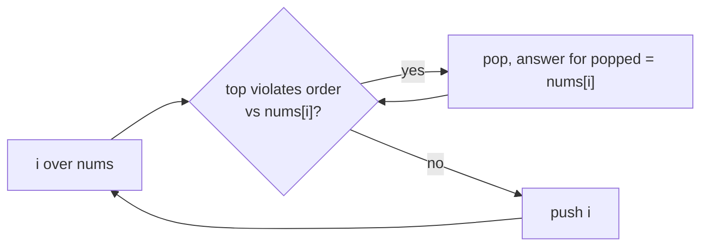

# Monotonic Stack

> Part of [[README|Coding Patterns]] • `Coding Patterns/03_Stack_Heap` • Pattern #7

## Intent
Maintain a stack that stays sorted (increasing or decreasing) while scanning once — each element is pushed once and popped at most once, giving O(n) total time for "next greater/smaller", "daily temperatures", histogram, and trapping rain water.

## Why it Matters
- **Increasing stack** (smallest on top): finds next *smaller* element. **Decreasing stack** (largest on top): finds next *greater* element.
- The inner `while` loop runs O(n) total — not O(n²) — because each index is pushed once and popped at most once.
- **Store indices, not values** — you need positions to write answers and compute distances (e.g., daily temperatures = `i - poppedIndex`).
- Senior signal: the sentinel pattern — append a `0` (or `-∞`) at the end to flush the stack for histogram/largest rectangle.

## Diagram



## Problems

### 739. Daily Temperatures (Medium)
> [LeetCode 739](https://leetcode.com/problems/daily-temperatures/) • Tags: Array, Stack, Monotonic Stack

**Problem Statement:**

Given an array of integers temperatures represents the daily temperatures, return an array answer such that answer[i] is the number of days you have to wait after the ith day to get a warmer temperature. If there is no future day for which this is possible, keep answer[i] == 0 instead. Example 1: Input: temperatures = [73,74,75,71,69,72,76,73] Output: [1,1,4,2,1,1,0,0] Example 2: Input: temperatures = [30,40,50,60] Output: [1,1,1,0] Example 3: Input: temperatures = [30,60,90] Output: [1,1,0] Constraints: 1 5 30

**Examples:**

Example 1:
```
[73,74,75,71,69,72,76,73]
```

Example 2:
```
[30,40,50,60]
```

Example 3:
```
[30,60,90]
```
---

### 901. Online Stock Span (Medium)
> [LeetCode 901](https://leetcode.com/problems/online-stock-span/) • Tags: Stack, Design, Monotonic Stack, Data Stream

**Problem Statement:**

Design an algorithm that collects daily price quotes for some stock and returns the span of that stock's price for the current day. The span of the stock's price in one day is the maximum number of consecutive days (starting from that day and going backward) for which the stock price was less than or equal to the price of that day. For example, if the prices of the stock in the last four days are [7,2,1,2] and the price of the stock today is 2, then the span of today is 3 because starting from today, the price of the stock was less than or equal to 2 for 3 consecutive days. Also, if the prices of the stock in the last four days is [7,34,1,2] and the price of the stock today is 8, then the span of today is 3 because starting from today, the price of the stock was less than or equal 8 for 3 consecutive days. Implement the StockSpanner class: StockSpanner() Initializes the object of the class. int next(int price) Returns the span of the stock's price given that today's price is price. Example 1: Input ["StockSpanner", "next", "next", "next", "next", "next", "next", "next"] [[], [100], [80], [60], [70], [60], [75], [85]] Output [null, 1, 1, 1, 2, 1, 4, 6] Explanation StockSpanner stockSpanner = new StockSpanner(); stockSpanner.next(100); // return 1 stockSpanner.next(80); // return 1 stockSpanner.next(60); // return 1 stockSpanner.next(70); // return 2 stockSpanner.next(60); // return 1 stockSpanner.next(75); // return 4, because the last 4 prices (including today's price of 75) were less than or equal to today's price. stockSpanner.next(85); // return 6 Constraints: 1 5 At most 104 calls will be made to next.

**Examples:**

Example 1:
```
["StockSpanner","next","next","next","next","next","next","next"]
```

Example 2:
```
[[],[100],[80],[60],[70],[60],[75],[85]]
```
---

### 84. Largest Rectangle in Histogram (Hard)
> [LeetCode 84](https://leetcode.com/problems/largest-rectangle-in-histogram/) • Tags: Array, Stack, Monotonic Stack, Range Minimum/Maximum Query

**Problem Statement:**

Given an array of integers heights representing the histogram's bar height where the width of each bar is 1, return the area of the largest rectangle in the histogram. Example 1: Input: heights = [2,1,5,6,2,3] Output: 10 Explanation: The above is a histogram where width of each bar is 1. The largest rectangle is shown in the red area, which has an area = 10 units. Example 2: Input: heights = [2,4] Output: 4 Constraints: 1 5 0 4

**Examples:**

Example 1:
```
[2,1,5,6,2,3]
```

Example 2:
```
[2,4]
```
---

### 496. Next Greater Element I (Easy)
> [LeetCode 496](https://leetcode.com/problems/next-greater-element-i/) • Tags: Array, Hash Table, Stack, Monotonic Stack

**Problem Statement:**

The next greater element of some element x in an array is the first greater element that is to the right of x in the same array. You are given two distinct 0-indexed integer arrays nums1 and nums2, where nums1 is a subset of nums2. For each 0 , find the index j such that nums1[i] == nums2[j] and determine the next greater element of nums2[j] in nums2. If there is no next greater element, then the answer for this query is -1. Return an array ans of length nums1.length such that ans[i] is the next greater element as described above. Example 1: Input: nums1 = [4,1,2], nums2 = [1,3,4,2] Output: [-1,3,-1] Explanation: The next greater element for each value of nums1 is as follows: - 4 is underlined in nums2 = [1,3,4,2]. There is no next greater element, so the answer is -1. - 1 is underlined in nums2 = [1,3,4,2]. The next greater element is 3. - 2 is underlined in nums2 = [1,3,4,2]. There is no next greater element, so the answer is -1. Example 2: Input: nums1 = [2,4], nums2 = [1,2,3,4] Output: [3,-1] Explanation: The next greater element for each value of nums1 is as follows: - 2 is underlined in nums2 = [1,2,3,4]. The next greater element is 3. - 4 is underlined in nums2 = [1,2,3,4]. There is no next greater element, so the answer is -1. Constraints: 1 0 4 All integers in nums1 and nums2 are unique. All the integers of nums1 also appear in nums2. Follow up: Could you find an O(nums1.length + nums2.length) solution?

**Examples:**

Example 1:
```
[4,1,2]
```

Example 2:
```
[1,3,4,2]
```

Example 3:
```
[2,4]
```

Example 4:
```
[1,2,3,4]
```
---


## Code / Example
```java
// Next Greater Element — LC 496
int[] nextGreater(int[] nums) {
    int n = nums.length;
    var res = new int[n];
    java.util.Arrays.fill(res, -1);
    var st = new java.util.ArrayDeque<Integer>(); // stores indices
    for (int i = 0; i < n; i++) {
        while (!st.isEmpty() && nums[st.peek()] < nums[i]) {
            res[st.pop()] = nums[i];
        }
        st.push(i);
    }
    return res;
}

// Daily Temperatures — LC 739 (answer is distance, not value)
int[] dailyTemperatures(int[] temps) {
    int n = temps.length;
    var ans = new int[n];
    var st = new java.util.ArrayDeque<Integer>();
    for (int i = 0; i < n; i++) {
        while (!st.isEmpty() && temps[st.peek()] < temps[i]) {
            int j = st.pop();
            ans[j] = i - j; // days until warmer
        }
        st.push(i);
    }
    return ans;
}

// Largest Rectangle in Histogram — LC 84 (sentinel flush)
int largestRectangleArea(int[] heights) {
    int n = heights.length;
    var st = new java.util.ArrayDeque<Integer>();
    int maxArea = 0;
    for (int i = 0; i <= n; i++) {
        int h = (i == n) ? 0 : heights[i]; // sentinel 0 flushes stack
        while (!st.isEmpty() && heights[st.peek()] > h) {
            int height = heights[st.pop()];
            int width = st.isEmpty() ? i : i - st.peek() - 1;
            maxArea = Math.max(maxArea, height * width);
        }
        st.push(i);
    }
    return maxArea;
}
```

## When to Use / When NOT
- **Use:** next greater/smaller element; daily temperatures/span; histogram (largest rectangle); trapping rain water; stock span; sliding window maximum (monotonic deque variant).
- **NOT:** arbitrary range queries (use segment tree / sparse table); need all historical values (stack discards dominated elements).

## Trade-offs
| Metric | Value |
|--------|-------|
| Time | O(n) — each element pushed/popped at most once |
| Space | O(n) worst case (monotonic input) |

## Vs Table
| Aspect | Monotonic Stack | Brute Force Next Greater | Sorting |
|--------|-----------------|--------------------------|---------|
| Next greater element | O(n) | O(n²) | N/A (doesn't solve) |
| Space | O(n) | O(1) | O(n) |
| Solves range queries | No | No | No |
| Pick when | nearest greater/smaller, histogram, span | n tiny | order is the whole question |

## Pitfalls
- **Store indices, not values** — you need positions to write answers by index and compute distances.
- For histogram, add sentinel `0` at end to flush stack — otherwise remaining bars never get processed.
- Decide increasing vs decreasing *before* coding: decreasing stack (top is largest) → next greater; increasing stack (top is smallest) → next smaller.
- `ArrayDeque` is the Java 25 choice over legacy `Stack`. `peek()` and `pop()` work as expected.

## Interview Q&A (Senior Depth)

**Q: Why is the inner `while` loop O(n) total, not O(n²)?**
**A:** Each index is pushed onto the stack exactly once and popped at most once. The total number of `pop` operations across the entire algorithm ≤ n. The `while` condition is checked O(n) times for successful pops + O(n) times for failed checks (when loop exits). Total operations = O(2n) = O(n).

**Q: Daily Temperatures — why does storing indices let us compute the answer?**
**A:** When `temps[i] > temps[stack.top()]`, we found the next warmer day for the popped index `j`. The answer is `i - j` (days between them). If we stored values, we'd know *that* a warmer day exists but not *when*. Indices preserve position information.

**Q: Largest Rectangle in Histogram — explain the width calculation when stack becomes empty after pop.**
**A:** When stack is empty after popping index `j`, the popped bar `heights[j]` is the smallest seen so far (extending to index 0). Width = `i` (current index, which is the first bar to the right that's lower). If stack not empty, new top `k` is the first bar to the left that's lower than `heights[j]`, so width = `i - k - 1`. The sentinel `0` at `i=n` ensures all bars get popped.

**Q: Trapping Rain Water (LC 42) — how does monotonic stack apply?**
**A:** Decreasing stack of indices. When `heights[i] > heights[stack.top()]`, we pop the bottom `bottom = stack.pop()`. If stack now empty, no left wall → continue. Else left wall = `stack.top()`. Trapped water over `bottom` = `(min(heights[left], heights[i]) - heights[bottom]) * (i - left - 1)`. Each bar is the "bottom" of a trapped pocket exactly once.

**Q: Monotonic Stack vs Monotonic Deque (Sliding Window Maximum).**
**A:** Stack = LIFO, discards dominated elements permanently (for next greater). Deque = double-ended, maintains window of candidates for sliding window max. For sliding window max, you need to remove elements that leave the window (from front) AND elements dominated by new arrival (from back). Deque supports both; stack only supports back removal.


## Flashcards (Spaced Repetition)

#flashcard
**Q:** What is the trigger keyword for Monotonic Stack? :: **A:** next greater/smaller element, largest rectangle in histogram, trapping rain water, stock span #flashcard

#flashcard
**Q:** Time/space complexity of Monotonic Stack? :: **A:** Time: O(n) each element pushed/popped once, Space: O(n) #flashcard

#flashcard
**Q:** When do you NOT use Monotonic Stack? :: **A:** need all pairs (O(n²)), offline queries (use segment tree) #flashcard

#flashcard
**Q:** Core Java 25 snippet for Monotonic Stack? :: **A:** `Deque<Integer> st=new ArrayDeque<>(); for(int i=0;i<n;i++){ while(!st.isEmpty() && a[st.peek()]<a[i]) ans[st.pop()]=i; st.push(i); }` #flashcard


## Practice Tasks (Tasks Plugin)
- [ ] Restate the intent from memory 📅 {date:YYYY-MM-DD, +1}
- [ ] Code the snippet without looking 📅 {date:YYYY-MM-DD, +3}
- [ ] Answer all Interview Q&A aloud 📅 {date:YYYY-MM-DD, +7}
- [ ] Review flashcards (Spaced Repetition) 📅 {date:YYYY-MM-DD, +1}

```tasks
not done
path includes {file.folder}
sort by due
limit 10
```

## Related
- [[01_Array/03 - Sliding Window|Sliding Window]] (monotonic deque for sliding window max)
- [[03_Stack_Heap/02 - Top K Elements|Top K Elements]] (heap for top-k, different use case)
- [[Java/07_DSA/Stack]]
---
*Category: Coding Patterns/03_Stack_Heap*
