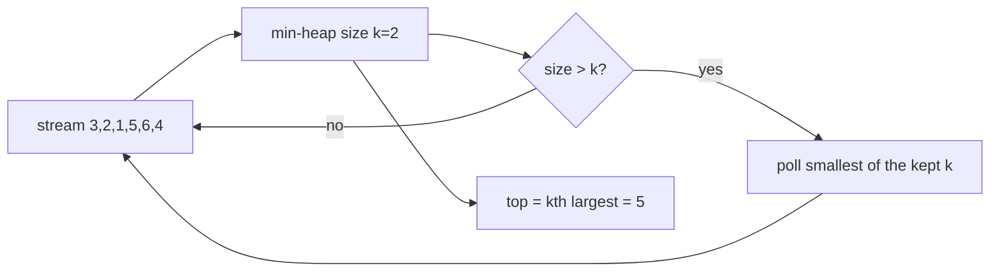

# Top K Elements

> Part of [[README|Coding Patterns]] • `Coding Patterns/03_Stack_Heap` • Pattern #8

## Intent
Find k largest/smallest/most frequent elements in O(n log k) time and O(k) space using a heap of size k — the streaming-friendly alternative to full sort when k << n.

## Why it Matters
- **Min-heap for k largest:** root = k-th largest (smallest among the chosen k). When heap size > k, evict root — keeps the k largest survivors.
- **Max-heap for k smallest:** symmetric.
- **Top k frequent:** hashmap for frequencies + min-heap on frequency.
- **Bucket sort alternative:** O(n) time when max frequency ≤ n — array of lists indexed by frequency.
- Senior signal: knowing *why* min-heap for k largest (evicting smallest of chosen k keeps the largest k) and when bucket sort beats heap (k large or full frequency ordering needed).

## Diagram



## Problems

### 215. Kth Largest Element in an Array (Medium)
> [LeetCode 215](https://leetcode.com/problems/kth-largest-element-in-an-array/) • Tags: Array, Divide and Conquer, Sorting, Heap (Priority Queue), Quickselect

**Problem Statement:**

Given an integer array nums and an integer k, return the kth largest element in the array. Note that it is the kth largest element in the sorted order, not the kth distinct element. Can you solve it without sorting? Example 1: Input: nums = [3,2,1,5,6,4], k = 2 Output: 5 Example 2: Input: nums = [3,2,3,1,2,4,5,5,6], k = 4 Output: 4 Constraints: 1 5 -104 4

**Examples:**

Example 1:
```
[3,2,1,5,6,4]
```

Example 2:
```
2
```

Example 3:
```
[3,2,3,1,2,4,5,5,6]
```

Example 4:
```
4
```
---

### 347. Top K Frequent Elements (Medium)
> [LeetCode 347](https://leetcode.com/problems/top-k-frequent-elements/) • Tags: Array, Hash Table, Divide and Conquer, Sorting, Heap (Priority Queue), Bucket Sort, Counting, Quickselect

**Problem Statement:**

Given an integer array nums and an integer k, return the k most frequent elements. You may return the answer in any order. Example 1: Input: nums = [1,1,1,2,2,3], k = 2 Output: [1,2] Example 2: Input: nums = [1], k = 1 Output: [1] Example 3: Input: nums = [1,2,1,2,1,2,3,1,3,2], k = 2 Output: [1,2] Constraints: 1 5 -104 4 k is in the range [1, the number of unique elements in the array]. It is guaranteed that the answer is unique. Follow up: Your algorithm's time complexity must be better than O(n log n), where n is the array's size.

**Examples:**

Example 1:
```
[1,1,1,2,2,3]
```

Example 2:
```
2
```

Example 3:
```
[1]
```

Example 4:
```
1
```

Example 5:
```
[1,2,1,2,1,2,3,1,3,2]
```

Example 6:
```
2
```
---

### 378. Kth Smallest Element in a Sorted Matrix (Medium)
> [LeetCode 378](https://leetcode.com/problems/kth-smallest-element-in-a-sorted-matrix/) • Tags: Array, Binary Search, Sorting, Heap (Priority Queue), Matrix

**Problem Statement:**

Given an n x n matrix where each of the rows and columns is sorted in ascending order, return the kth smallest element in the matrix. Note that it is the kth smallest element in the sorted order, not the kth distinct element. You must find a solution with a memory complexity better than O(n2). Example 1: Input: matrix = [[1,5,9],[10,11,13],[12,13,15]], k = 8 Output: 13 Explanation: The elements in the matrix are [1,5,9,10,11,12,13,13,15], and the 8th smallest number is 13 Example 2: Input: matrix = [[-5]], k = 1 Output: -5 Constraints: n == matrix.length == matrix[i].length 1 -109 9 All the rows and columns of matrix are guaranteed to be sorted in non-decreasing order. 1 2 Follow up: Could you solve the problem with a constant memory (i.e., O(1) memory complexity)? Could you solve the problem in O(n) time complexity? The solution may be too advanced for an interview but you may find reading this paper fun.

**Examples:**

Example 1:
```
[[1,5,9],[10,11,13],[12,13,15]]
```

Example 2:
```
8
```

Example 3:
```
[[-5]]
```

Example 4:
```
1
```
---

### 973. K Closest Points to Origin (Medium)
> [LeetCode 973](https://leetcode.com/problems/k-closest-points-to-origin/) • Tags: Array, Math, Divide and Conquer, Geometry, Sorting, Heap (Priority Queue), Quickselect, K-D Tree

**Problem Statement:**

Given an array of points where points[i] = [xi, yi] represents a point on the X-Y plane and an integer k, return the k closest points to the origin (0, 0). The distance between two points on the X-Y plane is the Euclidean distance (i.e., √(x1 - x2)2 + (y1 - y2)2). You may return the answer in any order. The answer is guaranteed to be unique (except for the order that it is in). Example 1: Input: points = [[1,3],[-2,2]], k = 1 Output: [[-2,2]] Explanation: The distance between (1, 3) and the origin is sqrt(10). The distance between (-2, 2) and the origin is sqrt(8). Since sqrt(8) Example 2: Input: points = [[3,3],[5,-1],[-2,4]], k = 2 Output: [[3,3],[-2,4]] Explanation: The answer [[-2,4],[3,3]] would also be accepted. Constraints: 1 4 -104 i, yi 4

**Examples:**

Example 1:
```
[[1,3],[-2,2]]
```

Example 2:
```
1
```

Example 3:
```
[[3,3],[5,-1],[-2,4]]
```

Example 4:
```
2
```
---


## Code / Example
```java
// Kth Largest Element — LC 215
int findKthLargest(int[] nums, int k) {
    var minHeap = new java.util.PriorityQueue<Integer>();
    for (int x : nums) {
        minHeap.offer(x);
        if (minHeap.size() > k) minHeap.poll();
    }
    return minHeap.peek();
}

// Top K Frequent — LC 347
int[] topKFrequent(int[] nums, int k) {
    var freq = new java.util.HashMap<Integer, Integer>();
    for (int x : nums) freq.put(x, freq.getOrDefault(x, 0) + 1);
    var heap = new java.util.PriorityQueue<Integer>((a, b) -> freq.get(a) - freq.get(b));
    for (int key : freq.keySet()) {
        heap.offer(key);
        if (heap.size() > k) heap.poll();
    }
    int[] res = new int[k];
    for (int i = 0; i < k; i++) res[i] = heap.poll();
    return res;
}

// K Closest Points to Origin — LC 973
int[][] kClosest(int[][] points, int k) {
    var maxHeap = new java.util.PriorityQueue<int[]>((a, b) -> 
        Integer.compare(b[0]*b[0] + b[1]*b[1], a[0]*a[0] + a[1]*a[1]));
    for (int[] p : points) {
        maxHeap.offer(p);
        if (maxHeap.size() > k) maxHeap.poll();
    }
    int[][] res = new int[k][2];
    for (int i = 0; i < k; i++) res[i] = maxHeap.poll();
    return res;
}

// Bucket sort O(n) for top-k frequent (when k large or full ordering needed)
int[] topKFrequentBucket(int[] nums, int k) {
    var freq = new java.util.HashMap<Integer, Integer>();
    for (int x : nums) freq.put(x, freq.getOrDefault(x, 0) + 1);
    var buckets = new java.util.ArrayList<java.util.List<Integer>>(nums.length + 1);
    for (int i = 0; i <= nums.length; i++) buckets.add(new java.util.ArrayList<>());
    for (var e : freq.entrySet()) buckets.get(e.getValue()).add(e.getKey());
    int[] res = new int[k];
    int idx = 0;
    for (int f = nums.length; f >= 0 && idx < k; f--)
        for (int x : buckets.get(f)) if (idx < k) res[idx++] = x;
    return res;
}
```

## When to Use / When NOT
- **Use:** k largest/smallest/most frequent/closest; stream of data where k << n; online algorithms (heap processes elements one at a time).
- **NOT:** k ≈ n (just sort O(n log n)); need all elements sorted; static array with single query (quickselect O(n) average).

## Trade-offs
| Approach | Time | Space | When |
|----------|------|-------|------|
| Min-heap size k | O(n log k) | O(k) | k << n, streaming |
| Quickselect | O(n) avg, O(n²) worst | O(1) | single k-th query, mutable array |
| Bucket sort | O(n) | O(n) | top-k frequent, bounded frequencies |
| Full sort | O(n log n) | O(1) extra | k ≈ n, or need full ordering |

## Vs Table
| Aspect | Heap size k | Full Sort | Quickselect | Bucket Sort |
|--------|-------------|-----------|-------------|-------------|
| Time | O(n log k) | O(n log n) | O(n) avg | O(n) |
| Space | O(k) | O(1) extra | O(1) extra | O(n) |
| Streaming | Yes | No | No | No |
| Pick when | k << n, or data streams | k ≈ n | O(n) wanted, array indexable | top-k frequent, domain bounded |

## Pitfalls
- **Min-heap for k largest is counterintuitive** — get it straight before coding. Root = smallest of the kept k = k-th largest.
- For kth largest you can also use quickselect O(n) average if asked to optimize — but heap is more robust (no worst-case O(n²)).
- Heap of `int` vs heap of entries (record with value + frequency) — pick the right one for comparator.
- Bucket sort only works when max frequency is bounded (e.g., ≤ n for array length n). For unbounded frequencies, use heap.

## Interview Q&A (Senior Depth)

**Q: Why min-heap for k largest? Explain the eviction logic.**
**A:** We want to keep the k largest elements. A min-heap puts the *smallest* of the kept elements at the root. When a new element arrives, if it's larger than the root, it belongs in the top k — we push it and pop the root (the smallest of the previous k). If it's smaller than the root, it's not in the top k — discard. The heap always contains the k largest seen so far, with the k-th largest at the root.

**Q: Quickselect vs Heap for kth largest — when do you choose which?**
**A:** Quickselect: O(n) average, O(1) space, but O(n²) worst case (bad pivot), and modifies the array. Heap: O(n log k) guaranteed, O(k) space, non-destructive, streaming-friendly. In interviews: "Quickselect for single k-th query on mutable array when average case is acceptable; heap for streaming, multiple queries, or when worst-case matters."

**Q: Top K Frequent — heap vs bucket sort. Decision rule?**
**A:** Bucket sort O(n) time, O(n) space — wins when k is large (close to n) or you need the full frequency ordering. Heap O(n log k) — wins when k << n and you only need top k. If k = n/2, bucket sort is faster. If k = 3, heap uses less space and is simpler.

**Q: K Closest Points — why max-heap instead of min-heap?**
**A:** We want k *smallest* distances. Max-heap root = largest distance among kept k. When new point has smaller distance than root, it belongs in top k — push and pop root. Min-heap would need to keep all n points and pop k times (O(n + k log n)). Max-heap of size k is O(n log k).


## Flashcards (Spaced Repetition)

#flashcard
**Q:** What is the trigger keyword for Top K Elements? :: **A:** K largest/smallest, K closest, merge K sorted lists, top K frequent elements #flashcard

#flashcard
**Q:** Time/space complexity of Top K Elements? :: **A:** Time: O(n log k) heap / O(n) quickselect avg, Space: O(k) heap / O(1) quickselect #flashcard

#flashcard
**Q:** When do you NOT use Top K Elements? :: **A:** K ≈ n (just sort), need all sorted (use sort O(n log n)) #flashcard

#flashcard
**Q:** Core Java 25 snippet for Top K Elements? :: **A:** `PriorityQueue<Integer> minHeap=new PriorityQueue<>(); for(int x:nums){ minHeap.offer(x); if(minHeap.size()>k) minHeap.poll(); }` #flashcard


## Practice Tasks (Tasks Plugin)
- [ ] Restate the intent from memory 📅 {date:YYYY-MM-DD, +1}
- [ ] Code the snippet without looking 📅 {date:YYYY-MM-DD, +3}
- [ ] Answer all Interview Q&A aloud 📅 {date:YYYY-MM-DD, +7}
- [ ] Review flashcards (Spaced Repetition) 📅 {date:YYYY-MM-DD, +1}

```tasks
not done
path includes {file.folder}
sort by due
limit 10
```

## Related
- [[03_Stack_Heap/01 - Monotonic Stack|Monotonic Stack]] (different stack/heap pattern)
- [[07_Backtracking_DP/02 - Dynamic Programming|Dynamic Programming]] (knapsack variants use different DP)
- [[Java/07_DSA/Heap]] · [[Java/07_DSA/HashMap]]
---
*Category: Coding Patterns/03_Stack_Heap*
- [[Architect/10_System-Design-Interviews/NET-01-Load-Balancer.md|NET-01-Load-Balancer]] — Least connections = min heap
- [[Architect/10_System-Design-Interviews/INT-02-Twitter-Timeline.md|INT-02-Twitter-Timeline]] — Merge k sorted lists = heap
