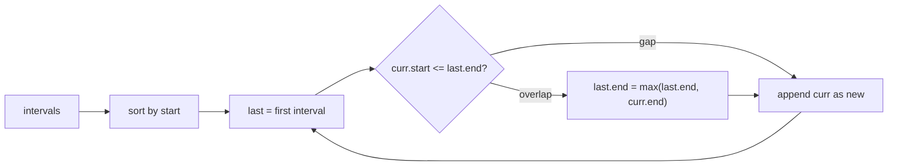

## Why it Matters

Sort by start time, then walk once and merge. Overlap if `current.start <= last.end`. If overlap, extend `last.end = max(last.end, current.end)`; otherwise add current as new interval. Example: `[[1,3],[2,6],[8,10],[15,18]]` → sorted `[1,3]` and `[2,6]` overlap so merge to `[1,6]`, then `[8,10]` and `[15,18]` do not, result `[[1,6],[8,10],[15,18]]`.

## Diagram


Sorting first is the whole trick: after it, every interval that can overlap the current group is already adjacent.

## Code

```java
int[][] merge(int[][] intervals) {
 java.util.Arrays.sort(intervals, (a,b) -> Integer.compare(a[0], b[0]));
 var merged = new java.util.ArrayList<int[]>();
 for (var in : intervals) {
 if (merged.isEmpty() || in[0] > merged.get(merged.size()-1)[1]) {
 merged.add(in);
 } else {
 merged.get(merged.size()-1)[1] = Math.max(merged.get(merged.size()-1)[1], in[1]);
 }
 }
 return merged.toArray(new int[merged.size()][]);
}

// Insert interval, same merge after adding newInterval, or linear scan to place it
```
Use `record Interval(int start, int end)` in Java 25 if you want a typed version instead of `int[]`.

## When to use / not

- Merge, insert, remove intervals, meeting scheduling, minimum removals for non-overlapping
- Input is intervals with start and end

## Trade-offs

| time | space |
|---|---|
| O(n log n) for sort + O(n) scan | O(n) for result |

## Vs

| | Merge intervals | Activity selection (greedy) | Interval tree |
|---|---|---|---|
| solves | union of all overlaps | max set of mutually non-overlapping | which intervals contain a point |
| sort by | start | end | none, tree structure |
| time | O(n log n) | O(n log n) | O(n log n) build, O(log n + k) query |
| pick when | merge, insert, meeting rooms | non-overlapping count, minimum removals | dynamic point-stabbing queries |

Both sort then scan; the sort key differs because the question differs.

## Pitfalls

- Sort by start, not end, for merge. End matters for activity selection.
- Edge condition is `<=` not `<`, decide if touching intervals `[1,3],[3,5]` count as overlapping.
- Return type `int[][]` needs `toArray` with correct size.

## Interview q&a

- [56. Merge Intervals](https://leetcode.com/problems/merge-intervals/)
- [57. Insert Interval](https://leetcode.com/problems/insert-interval/)
- [435. Non-overlapping Intervals](https://leetcode.com/problems/non-overlapping-intervals/)

## Related

- [[Java/07_DSA/Array]]

# Overlapping Intervals

> Part of [[README|20 DSA Patterns]], Pattern #10
