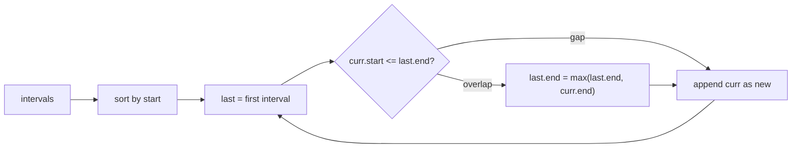

# Overlapping Intervals

> Part of [[README|20 DSA Patterns]] • `Coding Patterns/04_Intervals_Search` • Pattern #10

## Intent
Merge, insert, or remove intervals by sorting on start time and scanning once — the sort-by-start greedy pattern that turns interval union into a linear scan.

## Why it Matters
- **Sort by start** is the key insight: after sorting, any interval that can overlap the current group is already adjacent. No backtracking needed.
- **Merge condition:** `current.start <= last.end` → overlap, extend `last.end = max(last.end, current.end)`. Else: new group, append.
- Three classic variants: merge all (LC 56), insert one (LC 57), remove minimum for non-overlapping (LC 435).
- Senior signal: knowing the sort key difference — merge/insert sort by *start*; activity selection / non-overlapping count sort by *end*.

## Diagram



## Problems

### 56. Merge Intervals (Medium)
> [LeetCode 56](https://leetcode.com/problems/merge-intervals/) • Tags: Array, Sorting, Quicksort

**Problem Statement:**

Given an array of intervals where intervals[i] = [start_i_, end_i_], merge all overlapping intervals, and return an array of the non-overlapping intervals that cover all the intervals in the input.

**Examples:**

Example 1:

Input: intervals = [[1,3],[2,6],[8,10],[15,18]]
Output: [[1,6],[8,10],[15,18]]
Explanation: Since intervals [1,3] and [2,6] overlap, merge them into [1,6].

Example 2:

Input: intervals = [[1,4],[4,5]]
Output: [[1,5]]
Explanation: Intervals [1,4] and [4,5] are considered overlapping.

Example 3:

Input: intervals = [[4,7],[1,4]]
Output: [[1,7]]
Explanation: Intervals [1,4] and [4,7] are considered overlapping.

---

### 57. Insert Interval (Medium)
> [LeetCode 57](https://leetcode.com/problems/insert-interval/) • Tags: Array

**Problem Statement:**

You are given an array of non-overlapping intervals intervals where intervals[i] = [start_i_, end_i_] represent the start and the end of the i^th^ interval and intervals is sorted in ascending order by start_i_. You are also given an interval newInterval = [start, end] that represents the start and end of another interval.

Two intervals are considered overlapping if they share at least one point.

Insert newInterval into intervals such that intervals is still sorted in ascending order by start_i_ and intervals still does not have any overlapping intervals (merge overlapping intervals if necessary).

Return intervals after the insertion.

Note that you don't need to modify intervals in-place. You can make a new array and return it.

**Examples:**

Example 1:

Input: intervals = [[1,3],[6,9]], newInterval = [2,5]
Output: [[1,5],[6,9]]

Example 2:

Input: intervals = [[1,2],[3,5],[6,7],[8,10],[12,16]], newInterval = [4,8]
Output: [[1,2],[3,10],[12,16]]
Explanation: Because the new interval [4,8] overlaps with [3,5],[6,7],[8,10].

---

### 435. Non-overlapping Intervals (Medium)
> [LeetCode 435](https://leetcode.com/problems/non-overlapping-intervals/) • Tags: Array, Dynamic Programming, Greedy, Sorting

**Problem Statement:**

Given an array of intervals intervals where intervals[i] = [start_i_, end_i_], return the minimum number of intervals you need to remove to make the rest of the intervals non-overlapping.

Note that intervals which only touch at a point are non-overlapping. For example, [1, 2] and [2, 3] are non-overlapping.

**Examples:**

Example 1:

Input: intervals = [[1,2],[2,3],[3,4],[1,3]]
Output: 1
Explanation: [1,3] can be removed and the rest of the intervals are non-overlapping.

Example 2:

Input: intervals = [[1,2],[1,2],[1,2]]
Output: 2
Explanation: You need to remove two [1,2] to make the rest of the intervals non-overlapping.

Example 3:

Input: intervals = [[1,2],[2,3]]
Output: 0
Explanation: You don't need to remove any of the intervals since they're already non-overlapping.

---


## Code / Example
```java
// Merge Intervals — LC 56
int[][] merge(int[][] intervals) {
    java.util.Arrays.sort(intervals, (a, b) -> Integer.compare(a[0], b[0]));
    var merged = new java.util.ArrayList<int[]>();
    for (int[] in : intervals) {
        if (merged.isEmpty() || in[0] > merged.get(merged.size() - 1)[1]) {
            merged.add(in);
        } else {
            merged.get(merged.size() - 1)[1] = Math.max(merged.get(merged.size() - 1)[1], in[1]);
        }
    }
    return merged.toArray(new int[merged.size()][]);
}

// Insert Interval — LC 57 (same merge after adding newInterval)
int[][] insert(int[][] intervals, int[] newInterval) {
    var res = new java.util.ArrayList<int[]>();
    int i = 0, n = intervals.length;
    // add all before newInterval
    while (i < n && intervals[i][1] < newInterval[0]) res.add(intervals[i++]);
    // merge overlapping with newInterval
    while (i < n && intervals[i][0] <= newInterval[1]) {
        newInterval[0] = Math.min(newInterval[0], intervals[i][0]);
        newInterval[1] = Math.max(newInterval[1], intervals[i][1]);
        i++;
    }
    res.add(newInterval);
    // add remaining
    while (i < n) res.add(intervals[i++]);
    return res.toArray(new int[res.size()][]);
}

// Non-overlapping Intervals (min removals) — LC 435
// Sort by END, greedy keep earliest finishing
int eraseOverlapIntervals(int[][] intervals) {
    java.util.Arrays.sort(intervals, (a, b) -> Integer.compare(a[1], b[1]));
    int end = Integer.MIN_VALUE, removed = 0;
    for (int[] in : intervals) {
        if (in[0] >= end) end = in[1];
        else removed++;
    }
    return removed;
}
```

## When to Use / When NOT
- **Use:** merge intervals; insert interval; min removals for non-overlapping; meeting scheduling; "overlap" / "interval" keywords.
- **NOT:** point stabbing queries (which intervals contain a point — use interval tree); dynamic insert/delete with queries (use balanced BST or segment tree).

## Trade-offs
| Operation | Time | Space |
|-----------|------|-------|
| Sort + scan | O(n log n) | O(n) for result |

## Vs Table
| Aspect | Merge Intervals | Activity Selection (Greedy) | Interval Tree |
|--------|-----------------|----------------------------|---------------|
| Solves | union of all overlaps | max set of mutually non-overlapping | which intervals contain a point |
| Sort by | start | end | N/A (tree structure) |
| Time | O(n log n) | O(n log n) | O(n log n) build, O(log n + k) query |
| Pick when | merge, insert, meeting rooms | non-overlapping count, min removals | dynamic point-stabbing queries |

## Pitfalls
- **Sort by start for merge**, not end. End matters for activity selection.
- Edge condition: `<=` vs `<` — decide if touching intervals `[1,3],[3,5]` count as overlapping (usually yes for merge, no for activity selection).
- Return type `int[][]` needs `toArray(new int[size][])` with correct size.
- For insert interval, the three-phase approach (before, merge, after) is cleaner than binary search + insert + merge.

## Interview Q&A (Senior Depth)

**Q: Merge Intervals vs Non-overlapping Intervals — why different sort keys?**
**A:** Merge wants to *combine* overlapping intervals. Sorting by start brings overlapping intervals together so they can be merged in one pass. Activity selection wants to *pick* a max subset of non-overlapping intervals. Sorting by end picks the interval that finishes earliest, leaving maximum room for the rest — the classic greedy proof.

**Q: Insert Interval (LC 57) — why is the three-phase approach better than binary search?**
**A:** Binary search finds insert position, but you still need to scan left and right for overlaps. The three-phase linear scan (add before, merge overlap, add after) is O(n) total, simpler, and handles all edge cases (new interval before all, after all, spanning multiple). Same asymptotic, less code.

**Q: What if intervals are [1,3], [3,5] — do they overlap?**
**A:** Depends on problem definition. Merge Intervals (LC 56): typically `current.start <= last.end` → overlap, so `[1,3]` and `[3,5]` merge to `[1,5]`. Activity Selection: typically `current.start >= last.end` → non-overlapping, so they *don't* overlap and both can be picked. Always clarify or state your assumption.

**Q: Meeting Rooms II (LC 253) — how does it relate?**
**A:** Min rooms = max concurrent meetings. Sweep line: split each interval into (start, +1) and (end, -1) events, sort by time (end before start at same time), scan and track running sum. Max sum = min rooms. Alternative: min-heap of end times, O(n log n). Both are interval patterns but use sweep line / heap, not merge.

## Related
- [[04_Intervals_Search/02 - Modified Binary Search|Modified Binary Search]] (search in intervals)
- [[07_Backtracking_DP/03 - Greedy|Greedy]] (activity selection is greedy)
- [[Java/07_DSA/Array]]

---
*Category: Coding Patterns/04_Intervals_Search*
