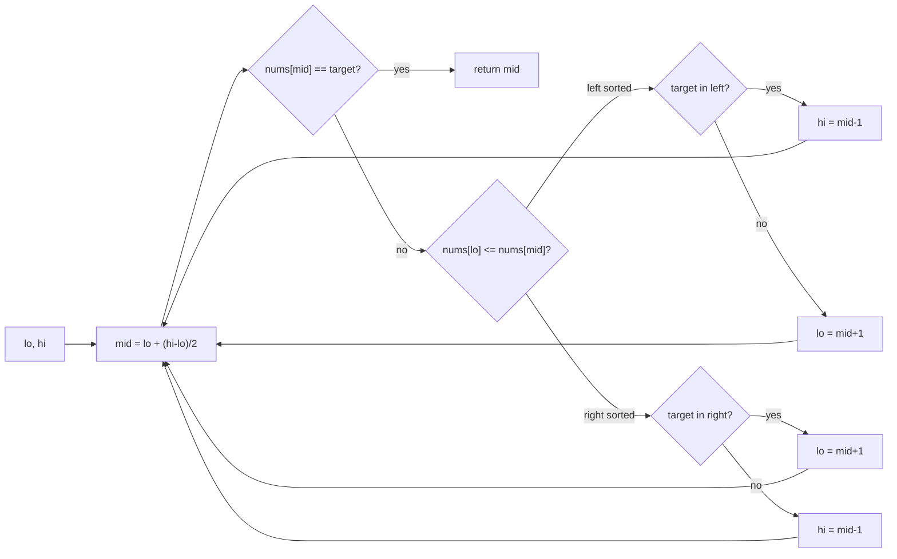

## Why it Matters

Classic binary search plus extra logic. For rotated sorted arrays one half is always sorted, so check which half is sorted and decide where the target can live. Example: `[4,5,6,7,0,1,2]`, target `0` → mid is `7`, left half `[4..7]` sorted, target not in left, so search right → finds `0` at index 4.

Same idea applies to 2D matrix, peak finding, first and last position.

## Diagram


In a rotated array one half is always properly sorted; identify which half, then test the target against that half's known bounds.

## Code

```java
// Search in rotated sorted array, LC 33
int search(int[] nums, int target) {
 int lo = 0, hi = nums.length - 1;
 while (lo <= hi) {
 var mid = lo + (hi - lo) / 2; // no overflow
 if (nums[mid] == target) return mid;
 if (nums[lo] <= nums[mid]) { // left half sorted
 if (nums[lo] <= target && target < nums[mid]) hi = mid - 1;
 else lo = mid + 1;
 } else { // right half sorted
 if (nums[mid] < target && target <= nums[hi]) lo = mid + 1;
 else hi = mid - 1;
 }
 }
 return -1;
}

// First and last position, run binary search twice, once for left bound, once for right
```
Mid formula `lo + (hi-lo)/2` avoids overflow. Java 25 `var` keeps it short.

## When to use / not

- Sorted or rotated sorted array, search in 2D matrix, find peak, find first or last occurrence
- Keywords: "sorted", "rotated", "search", "peak", "matrix"

## Trade-offs

| time | space |
|---|---|
| O(log n) | O(1) |

## Vs

| | Plain binary search | Modified (rotated) | Binary search on answer |
|---|---|---|---|
| input | fully sorted | rotated or bitonic | monotonic predicate over a range |
| invariant | target range halves | one sorted half identified first | feasible(v) monotonically flips |
| time | O(log n) | O(log n) | O(log range) |
| pick when | plain sorted array | rotated, peak, 2D matrix | "minimum capacity", "split largest sum" |

## Pitfalls

- Use `<=` correctly when checking which half is sorted. Off-by-one on boundaries is common.
- Duplicates (LC 81) break the "one half sorted" guarantee, need extra handling.
- For 2D matrix, treat it as flattened 1D with `mid/n` and `mid%n`, or two-stage search.

## Interview q&a

- [33. Search in Rotated Sorted Array](https://leetcode.com/problems/search-in-rotated-sorted-array/)
- [153. Find Minimum in Rotated Sorted Array](https://leetcode.com/problems/find-minimum-in-rotated-sorted-array/)
- [74. Search a 2D Matrix](https://leetcode.com/problems/search-a-2d-matrix/)

## Related

- [[Java/07_DSA/Array]]

# Modified Binary Search

> Part of [[README|20 DSA Patterns]], Pattern #11
