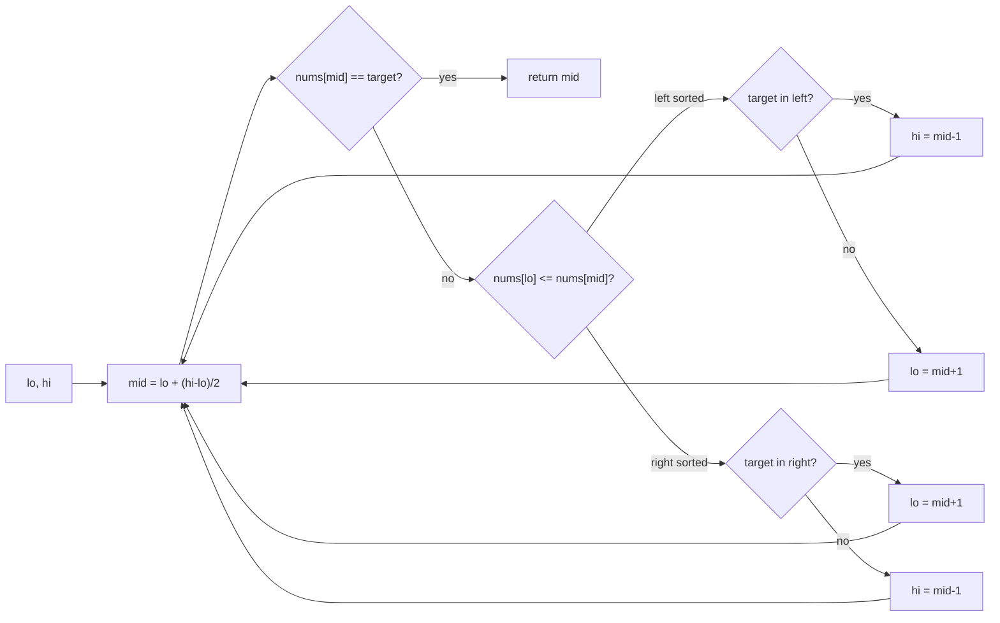

# Modified Binary Search

> Part of [[README|20 DSA Patterns]] • `Coding Patterns/04_Intervals_Search` • Pattern #11

## Intent
Binary search on rotated/bitonic arrays, 2D matrices, or monotonic predicates — identify which half is sorted (or which side satisfies the predicate) and discard the other half in O(log n).

## Why it Matters
- **Rotated sorted array:** one half is always properly sorted. Check `nums[lo] <= nums[mid]` → left sorted; else right sorted. Then test if target lies in the sorted half.
- **Search in 2D matrix (LC 74):** treat as flattened 1D with `row = mid / n`, `col = mid % n` — same binary search.
- **Binary search on answer (capacity, split largest sum):** predicate `feasible(capacity)` is monotonic — binary search the answer space, not the array.
- Senior signal: the `mid = lo + (hi - lo) / 2` overflow-safe formula, and the `<=` vs `<` boundary discipline that prevents infinite loops.

## Diagram



## Problems

### 33. Search in Rotated Sorted Array (Medium)
> [LeetCode 33](https://leetcode.com/problems/search-in-rotated-sorted-array/) • Tags: Array, Binary Search

**Problem Statement:**

There is an integer array nums sorted in ascending order (with distinct values).

Prior to being passed to your function, nums is possibly left rotated at an unknown index k (1 <= k < nums.length) such that the resulting array is [nums[k], nums[k+1], ..., nums[n-1], nums[0], nums[1], ..., nums[k-1]] (0-indexed). For example, [0,1,2,4,5,6,7] might be left rotated by 3 indices and become [4,5,6,7,0,1,2].

Given the array nums after the possible rotation and an integer target, return the index of target if it is in nums, or -1 if it is not in nums.

You must write an algorithm with O(log n) runtime complexity.

**Examples:**

Example 1:
Input: nums = [4,5,6,7,0,1,2], target = 0
Output: 4

Example 2:
Input: nums = [4,5,6,7,0,1,2], target = 3
Output: -1

Example 3:
Input: nums = [1], target = 0
Output: -1

---

### 153. Find Minimum in Rotated Sorted Array (Medium)
> [LeetCode 153](https://leetcode.com/problems/find-minimum-in-rotated-sorted-array/) • Tags: Array, Binary Search

**Problem Statement:**

Suppose an array of length n sorted in ascending order is rotated between 1 and n times. For example, the array nums = [0,1,2,4,5,6,7] might become:

	[4,5,6,7,0,1,2] if it was rotated 4 times.
	[0,1,2,4,5,6,7] if it was rotated 7 times.

Notice that rotating an array [a[0], a[1], a[2], ..., a[n-1]] 1 time results in the array [a[n-1], a[0], a[1], a[2], ..., a[n-2]].

Given the sorted rotated array nums of unique elements, return the minimum element of this array.

You must write an algorithm that runs in O(log n) time.

**Examples:**

Example 1:

Input: nums = [3,4,5,1,2]
Output: 1
Explanation: The original array was [1,2,3,4,5] rotated 3 times.

Example 2:

Input: nums = [4,5,6,7,0,1,2]
Output: 0
Explanation: The original array was [0,1,2,4,5,6,7] and it was rotated 4 times.

Example 3:

Input: nums = [11,13,15,17]
Output: 11
Explanation: The original array was [11,13,15,17] and it was rotated 4 times.

---

### 74. Search a 2D Matrix (Medium)
> [LeetCode 74](https://leetcode.com/problems/search-a-2d-matrix/) • Tags: Array, Binary Search, Matrix

**Problem Statement:**

You are given an m x n integer matrix matrix with the following two properties:

	Each row is sorted in non-decreasing order.
	The first integer of each row is greater than the last integer of the previous row.

Given an integer target, return true if target is in matrix or false otherwise.

You must write a solution in O(log(m * n)) time complexity.

**Examples:**

Example 1:

Input: matrix = [[1,3,5,7],[10,11,16,20],[23,30,34,60]], target = 3
Output: true

Example 2:

Input: matrix = [[1,3,5,7],[10,11,16,20],[23,30,34,60]], target = 13
Output: false

---


## Code / Example
```java
// Search in Rotated Sorted Array — LC 33
int search(int[] nums, int target) {
    int lo = 0, hi = nums.length - 1;
    while (lo <= hi) {
        int mid = lo + (hi - lo) / 2; // no overflow
        if (nums[mid] == target) return mid;
        if (nums[lo] <= nums[mid]) { // left half sorted
            if (nums[lo] <= target && target < nums[mid]) hi = mid - 1;
            else lo = mid + 1;
        } else { // right half sorted
            if (nums[mid] < target && target <= nums[hi]) lo = mid + 1;
            else hi = mid - 1;
        }
    }
    return -1;
}

// Find Minimum in Rotated Sorted Array — LC 153
int findMin(int[] nums) {
    int lo = 0, hi = nums.length - 1;
    while (lo < hi) {
        int mid = lo + (hi - lo) / 2;
        if (nums[mid] > nums[hi]) lo = mid + 1; // min in right
        else hi = mid; // min in left (including mid)
    }
    return nums[lo];
}

// Search a 2D Matrix — LC 74 (flattened 1D)
boolean searchMatrix(int[][] matrix, int target) {
    int m = matrix.length, n = matrix[0].length;
    int lo = 0, hi = m * n - 1;
    while (lo <= hi) {
        int mid = lo + (hi - lo) / 2;
        int val = matrix[mid / n][mid % n];
        if (val == target) return true;
        if (val < target) lo = mid + 1;
        else hi = mid - 1;
    }
    return false;
}

// Binary Search on Answer — Split Array Largest Sum (LC 410)
int splitArray(int[] nums, int k) {
    int lo = 0, hi = 0;
    for (int x : nums) { lo = Math.max(lo, x); hi += x; }
    while (lo < hi) {
        int mid = lo + (hi - lo) / 2;
        if (canSplit(nums, k, mid)) hi = mid;
        else lo = mid + 1;
    }
    return lo;
}
boolean canSplit(int[] nums, int k, int maxSum) {
    int sum = 0, parts = 1;
    for (int x : nums) {
        if (sum + x > maxSum) { parts++; sum = x; }
        else sum += x;
    }
    return parts <= k;
}
```

## When to Use / When NOT
- **Use:** rotated sorted array search; find min in rotated; search 2D matrix; find peak; first/last position; "minimum capacity", "split largest sum", "koko eating bananas" (binary search on answer).
- **NOT:** unsorted array (sort first or use hashmap); need all occurrences (linear scan).

## Trade-offs
| Variant | Time | Space |
|---------|------|-------|
| Classic / Rotated / 2D matrix | O(log n) | O(1) |
| Binary search on answer | O(log(range) * n) | O(1) |

## Vs Table
| Aspect | Plain Binary Search | Modified (Rotated) | Binary Search on Answer |
|--------|---------------------|--------------------|-------------------------|
| Input | fully sorted | rotated or bitonic | monotonic predicate over range |
| Invariant | target range halves | one sorted half identified first | feasible(v) monotonically flips |
| Time | O(log n) | O(log n) | O(log range * check) |
| Pick when | plain sorted array | rotated, peak, 2D matrix | "minimum capacity", "split largest sum" |

## Pitfalls
- Use `<=` correctly when checking which half is sorted (`nums[lo] <= nums[mid]`). Off-by-one on boundaries is the #1 bug.
- Duplicates (LC 81) break "one half sorted" guarantee — need extra handling (`nums[lo] == nums[mid] == nums[hi]` → shrink both ends).
- For 2D matrix, `mid/n` and `mid%n` mapping assumes row-major order with sorted rows and first element of each row > last of previous.
- Binary search on answer: `lo < hi` vs `lo <= hi` depends on whether you want lower bound (first true) or upper bound (last true). `lo < hi` with `hi = mid` / `lo = mid + 1` finds first true.

## Interview Q&A (Senior Depth)

**Q: Search in Rotated Sorted Array — why `nums[lo] <= nums[mid]` and not `<`?**
**A:** When `lo == mid` (two elements), `nums[lo] <= nums[mid]` is true, correctly identifying left half (single element) as sorted. With `<`, it would be false and you'd check the right half incorrectly. The `<=` handles the base case where the sorted half has length 1.

**Q: Find Min in Rotated (LC 153) — why `lo < hi` not `lo <= hi`?**
**A:** We're finding the minimum *value*, not an index match. The loop invariant: min is in `[lo, hi]`. When `lo == hi`, the range has size 1 → that element is the min. `lo < hi` terminates when range size = 1. Using `lo <= hi` would require an extra iteration and careful mid handling.

**Q: Binary Search on Answer — how do you know the predicate is monotonic?**
**A:** For "split array largest sum": if you can split with max sum = X, you can definitely split with max sum = X+1 (just use the same splits). The predicate `feasible(maxSum)` is monotonic: false...false, true...true. This is the *exchange argument* for monotonicity — prove that increasing the capacity never makes a feasible split infeasible.

**Q: Search in Rotated with Duplicates (LC 81) — what breaks?**
**A:** When `nums[lo] == nums[mid] == nums[hi]`, you can't tell which half is sorted. Example: `[2,2,2,0,2]` — `lo=0, mid=2, hi=4` all 2. The fix: `lo++` and `hi--` to shrink the ambiguous region. Worst case degrades to O(n) (all elements equal), which is unavoidable.

**Q: 2D Matrix Search — why does treating as 1D work?**
**A:** The matrix is sorted such that `matrix[i][j] < matrix[i][j+1]` and `matrix[i][n-1] < matrix[i+1][0]`. This is exactly row-major order of a sorted 1D array. The mapping `row = mid / n, col = mid % n` is the inverse of `index = row * n + col`. Binary search on the virtual 1D array is isomorphic.

## Related
- [[04_Intervals_Search/01 - Overlapping Intervals|Overlapping Intervals]]
- [[07_Backtracking_DP/02 - Dynamic Programming|Dynamic Programming]] (binary search on answer often pairs with DP feasibility check)
- [[Java/07_DSA/Array]]

---
*Category: Coding Patterns/04_Intervals_Search*
