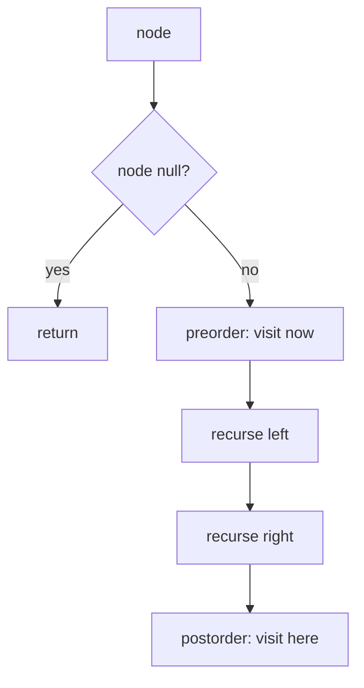

# Binary Tree Traversal

> Part of [[README|Coding Patterns]] • `Coding Patterns/05_Trees_Graphs` • Pattern #11

## Intent
Visit every node in a fixed order (preorder/inorder/postorder) — the three recursive patterns that differ only in *when* you process the node relative to its children.

## Why it Matters
- **Preorder (root, left, right):** copy tree, serialize, prefix expression.
- **Inorder (left, root, right):** BST gives sorted order.
- **Postorder (left, right, root):** delete tree, postfix expression, evaluate expression tree.
- **Iterative inorder with stack** is the canonical non-recursive pattern — inner `while` pushes all left children before popping.
- Senior signal: Morris traversal (O(1) space) by threading the tree — only for inorder, modifies tree temporarily, restores on exit.

## Diagram



## Problems

### 94. Binary Tree Inorder Traversal (Easy)
> [LeetCode 94](https://leetcode.com/problems/binary-tree-inorder-traversal/) • Tags: Stack, Tree, Depth-First Search, Binary Tree

**Problem Statement:**

Given the root of a binary tree, return the inorder traversal of its nodes' values. Example 1: Input: root = [1,null,2,3] Output: [1,3,2] Explanation: Example 2: Input: root = [1,2,3,4,5,null,8,null,null,6,7,9] Output: [4,2,6,5,7,1,3,9,8] Explanation: Example 3: Input: root = [] Output: [] Example 4: Input: root = [1] Output: [1] Constraints: The number of nodes in the tree is in the range [0, 100]. -100 Follow up: Recursive solution is trivial, could you do it iteratively?

**Examples:**

Example 1:
```
[1,null,2,3]
```

Example 2:
```
[1,2,3,4,5,null,8,null,null,6,7,9]
```

Example 3:
```
[]
```

Example 4:
```
[1]
```
---

### 102. Binary Tree Level Order Traversal (Medium)
> [LeetCode 102](https://leetcode.com/problems/binary-tree-level-order-traversal/) • Tags: Tree, Breadth-First Search, Binary Tree

**Problem Statement:**

Given the root of a binary tree, return the level order traversal of its nodes' values. (i.e., from left to right, level by level). Example 1: Input: root = [3,9,20,null,null,15,7] Output: [[3],[9,20],[15,7]] Example 2: Input: root = [1] Output: [[1]] Example 3: Input: root = [] Output: [] Constraints: The number of nodes in the tree is in the range [0, 2000]. -1000

**Examples:**

Example 1:
```
[3,9,20,null,null,15,7]
```

Example 2:
```
[1]
```

Example 3:
```
[]
```
---

### 103. Binary Tree Zigzag Level Order Traversal (Medium)
> [LeetCode 103](https://leetcode.com/problems/binary-tree-zigzag-level-order-traversal/) • Tags: Tree, Breadth-First Search, Binary Tree

**Problem Statement:**

Given the root of a binary tree, return the zigzag level order traversal of its nodes' values. (i.e., from left to right, then right to left for the next level and alternate between). Example 1: Input: root = [3,9,20,null,null,15,7] Output: [[3],[20,9],[15,7]] Example 2: Input: root = [1] Output: [[1]] Example 3: Input: root = [] Output: [] Constraints: The number of nodes in the tree is in the range [0, 2000]. -100

**Examples:**

Example 1:
```
[3,9,20,null,null,15,7]
```

Example 2:
```
[1]
```

Example 3:
```
[]
```
---

### 104. Maximum Depth of Binary Tree (Easy)
> [LeetCode 104](https://leetcode.com/problems/maximum-depth-of-binary-tree/) • Tags: Tree, Depth-First Search, Breadth-First Search, Binary Tree

**Problem Statement:**

Given the root of a binary tree, return its maximum depth. A binary tree's maximum depth is the number of nodes along the longest path from the root node down to the farthest leaf node. Example 1: Input: root = [3,9,20,null,null,15,7] Output: 3 Example 2: Input: root = [1,null,2] Output: 2 Constraints: The number of nodes in the tree is in the range [0, 104]. -100

**Examples:**

Example 1:
```
[3,9,20,null,null,15,7]
```

Example 2:
```
[1,null,2]
```
---


## Code / Example
```java
record TreeNode(int val, TreeNode left, TreeNode right) {}

void preorder(TreeNode r, java.util.List<Integer> out) {
    if (r == null) return;
    out.add(r.val());
    preorder(r.left(), out);
    preorder(r.right(), out);
}

void inorder(TreeNode r, java.util.List<Integer> out) {
    if (r == null) return;
    inorder(r.left(), out);
    out.add(r.val());
    inorder(r.right(), out);
}

void postorder(TreeNode r, java.util.List<Integer> out) {
    if (r == null) return;
    postorder(r.left(), out);
    postorder(r.right(), out);
    out.add(r.val());
}

// Iterative inorder with stack
java.util.List<Integer> inorderIter(TreeNode root) {
    var res = new java.util.ArrayList<Integer>();
    var st = new java.util.ArrayDeque<TreeNode>();
    var cur = root;
    while (cur != null || !st.isEmpty()) {
        while (cur != null) { st.push(cur); cur = cur.left(); }
        cur = st.pop();
        res.add(cur.val());
        cur = cur.right();
    }
    return res;
}

// Morris Inorder — O(1) space (modifies tree temporarily)
java.util.List<Integer> morrisInorder(TreeNode root) {
    var res = new java.util.ArrayList<Integer>();
    TreeNode cur = root;
    while (cur != null) {
        if (cur.left() == null) {
            res.add(cur.val());
            cur = cur.right();
        } else {
            TreeNode pre = cur.left();
            while (pre.right() != null && pre.right() != cur) pre = pre.right();
            if (pre.right() == null) {
                // Thread to cur
                // Note: record is immutable, use mutable class for Morris
                cur = cur.left();
            } else {
                // Thread exists, restore
                pre.right = null;
                res.add(cur.val());
                cur = cur.right();
            }
        }
    }
    return res;
}
```

## When to Use / When NOT
- **Use:** visit every node in fixed order; serialize tree; operate on BST (inorder = sorted); delete tree (postorder).
- **NOT:** level-order (use BFS); path existence / shortest path (use BFS/DFS); Morris only for inorder.

## Trade-offs
| Approach | Time | Space | Orders |
|----------|------|-------|--------|
| Recursive | O(n) | O(h) call stack (O(n) worst) | pre/in/post |
| Iterative stack | O(n) | O(h) explicit | pre/in/post (post awkward) |
| Morris | O(n) | O(1) | inorder only (mutates tree temporarily) |

## Vs Table
| Aspect | DFS Recursion | Iterative Stack | Morris Traversal | BFS Level Order |
|--------|---------------|-----------------|------------------|-----------------|
| Space | O(h) call stack | O(h) explicit | O(1) | O(w) queue (max width) |
| Orders | pre/in/post | pre/in/post (post tricky) | inorder only | breadth |
| Mutates tree | No | No | Temporarily, restored | No |
| Pick when | clarity, balanced tree | deep tree, stack overflow risk | O(1) space required | level-by-level processing |

## Pitfalls
- Null check **first** in every recursive call.
- Iterative inorder: inner `while` pushes all left nodes *before* popping — missing this is the #1 bug.
- Postorder iterative is trickiest — easiest is two stacks or reversed modified preorder (root, right, left) then reverse.
- Morris traversal requires mutable nodes (Java `record` is immutable — use `class TreeNode` with `left`/`right` fields).

## Interview Q&A (Senior Depth)

**Q: Why does iterative inorder need the inner `while (cur != null)` loop?**
**A:** It simulates the recursive call stack. Recursion goes left as deep as possible before returning. The inner `while` pushes the entire left spine onto the stack, then we pop, visit, and go right. Without the inner loop, you'd only push one left child per iteration, breaking the depth-first order.

**Q: Morris traversal — how does it achieve O(1) space?**
**A:** It uses the tree's own null right pointers as "threads" to remember where to return after visiting the left subtree. When we go left, we find the rightmost node of the left subtree (predecessor) and thread its right pointer to the current node. After visiting the left subtree, we follow the thread back, remove it, and go right. No stack needed — the tree *is* the stack.

**Q: Postorder iterative — why is it harder than preorder/inorder?**
**A:** In preorder/inorder, the node is processed *before* or *between* children, so the stack naturally holds the parent while we process children. In postorder, the node is processed *after* both children, but the stack only gives us the parent *after* children are done. The two-stack trick: push root to stack1, pop to stack2, push left then right to stack1 — stack2 ends up with postorder (reverse of root-right-left).

**Q: BST validation — why is inorder traversal the right approach?**
**A:** BST property: left < root < right. Inorder visits left, then root, then right → produces strictly increasing sequence for valid BST. Check `prev < curr` during inorder traversal. O(n) time, O(h) space. Alternative: pass min/max bounds recursively (also O(n), O(h)).


## Flashcards (Spaced Repetition)

#flashcard
**Q:** What is the trigger keyword for Binary Tree Traversal? :: **A:** preorder/inorder/postorder/level-order, tree serialization, path sum, BST validation #flashcard

#flashcard
**Q:** Time/space complexity of Binary Tree Traversal? :: **A:** Time: O(n) visit each node once, Space: O(h) recursion / O(w) queue #flashcard

#flashcard
**Q:** When do you NOT use Binary Tree Traversal? :: **A:** only need height/count (single pass no traversal order needed) #flashcard

#flashcard
**Q:** Core Java 25 snippet for Binary Tree Traversal? :: **A:** `void dfs(TreeNode n){ if(n==null) return; process(n.val); dfs(n.left); dfs(n.right); } // iterative: stack.push(root);` #flashcard


## Practice Tasks (Tasks Plugin)
- [ ] Restate the intent from memory 📅 {date:YYYY-MM-DD, +1}
- [ ] Code the snippet without looking 📅 {date:YYYY-MM-DD, +3}
- [ ] Answer all Interview Q&A aloud 📅 {date:YYYY-MM-DD, +7}
- [ ] Review flashcards (Spaced Repetition) 📅 {date:YYYY-MM-DD, +1}

```tasks
not done
path includes {file.folder}
sort by due
limit 10
```

## Related
- [[05_Trees_Graphs/02 - DFS|DFS]] (generalizes to graphs)
- [[05_Trees_Graphs/03 - BFS|BFS]] (level order)
- [[Java/07_DSA/Trees]]
---
*Category: Coding Patterns/05_Trees_Graphs*
