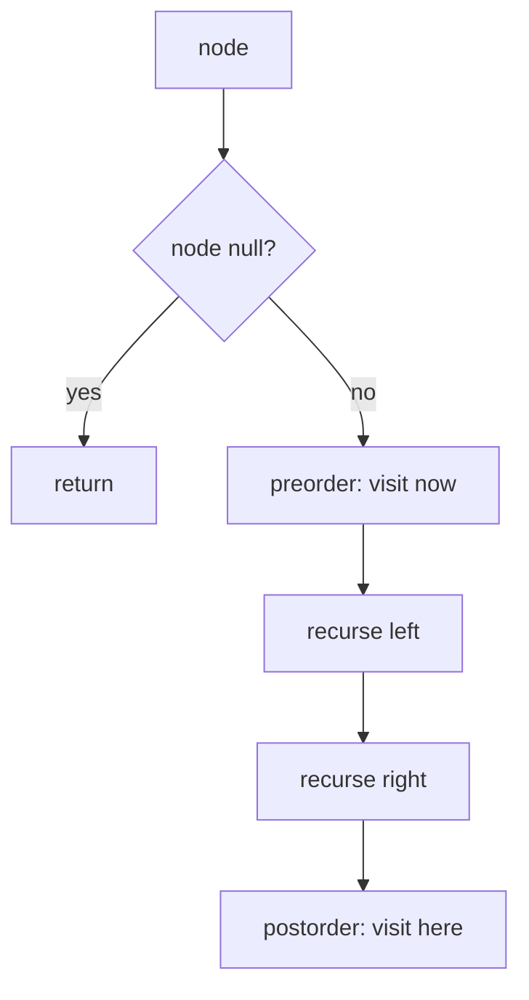

## Why it Matters

Three orders, same recursion, different position of the visit:

- preorder: root, left, right, copy a tree or produce prefix order
- inorder: left, root, right, BST gives sorted order
- postorder: left, right, root, delete a tree or produce postfix order

Example: tree `[1,null,2,3]` → preorder `[1,2,3]`, inorder `[1,3,2]`, postorder `[3,2,1]`.

## Diagram


The recursion shape is identical for all three orders; only the position of the `visit` line changes.

## Code

```java
record TreeNode(int val, TreeNode left, TreeNode right) {}

void preorder(TreeNode r, java.util.List<Integer> out) {
 if (r == null) return;
 out.add(r.val());
 preorder(r.left(), out);
 preorder(r.right(), out);
}

void inorder(TreeNode r, java.util.List<Integer> out) {
 if (r == null) return;
 inorder(r.left(), out);
 out.add(r.val());
 inorder(r.right(), out);
}

void postorder(TreeNode r, java.util.List<Integer> out) {
 if (r == null) return;
 postorder(r.left(), out);
 postorder(r.right(), out);
 out.add(r.val());
}

// Iterative inorder with stack
java.util.List<Integer> inorderIter(TreeNode root) {
 var res = new java.util.ArrayList<Integer>();
 var st = new java.util.ArrayDeque<TreeNode>();
 var cur = root;
 while (cur != null || !st.isEmpty()) {
 while (cur != null) { st.push(cur); cur = cur.left(); }
 cur = st.pop();
 res.add(cur.val());
 cur = cur.right();
 }
 return res;
}
```
Java 25 record makes `TreeNode` concise. Classic mutable class works too if you need `node.left = ...` assignment.

## When to use / not

- Visit every node in a fixed order, serialize, or operate on BSTs
- Morris traversal if asked for O(1) space

## Trade-offs

| time | space |
|---|---|
| O(n) | O(h) recursion stack, O(n) worst case |

## Vs

| | DFS recursion | Iterative stack | Morris traversal | BFS level order |
|---|---|---|---|---|
| space | O(h) call stack | O(h) explicit | O(1) | O(w) queue, w = max width |
| orders | pre/in/post | pre/in/post, post is awkward | inorder only | breadth |
| mutates tree | no | no | temporarily, restored | no |
| pick when | clarity, balanced tree | deep tree, stack overflow risk | O(1) space required | level-by-level processing |

## Pitfalls

- Null check first in every recursive call.
- Inorder iterative needs inner while to push all left nodes before popping.
- Postorder iterative is trickiest, easiest is two stacks or reversed modified preorder.

## Interview q&a

- [144. Binary Tree Preorder Traversal](https://leetcode.com/problems/binary-tree-preorder-traversal/)
- [94. Binary Tree Inorder Traversal](https://leetcode.com/problems/binary-tree-inorder-traversal/)
- [145. Binary Tree Postorder Traversal](https://leetcode.com/problems/binary-tree-postorder-traversal/)

## Related

- [[Java/07_DSA/Trees]]

# Binary Tree Traversal

> Part of [[README|20 DSA Patterns]], Pattern #12
