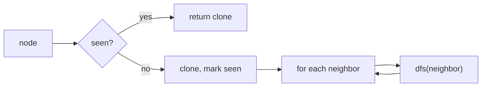

# DFS

> Part of [[README|Coding Patterns]] • `Coding Patterns/05_Trees_Graphs` • Pattern #12

## Intent
Explore as deep as possible before backtracking — the exhaustive search pattern for trees and graphs. Use recursion (implicit stack) or explicit stack + visited set. For trees, no visited set needed; for graphs, it prevents cycles.

## Why it Matters
- **Trees:** natural fit for all root-to-leaf paths, path sum, tree serialization.
- **Graphs:** `visited` set (or map for cloning) is mandatory — without it, cycles cause infinite recursion.
- **Clone Graph (LC 133):** DFS + hashmap `original → copy` is the canonical pattern. Hashmap serves as both visited check and copy cache.
- **Backtracking:** DFS with state restoration (choose → explore → unchoose) is the same recursion shape — see Backtracking pattern.
- Senior signal: knowing when to mark visited — *on entry* (pre-order) vs *on exit* (post-order). For graphs, mark on entry to prevent re-queueing.

## Diagram



## Problems

### 104. Maximum Depth of Binary Tree (Easy)
> [LeetCode 104](https://leetcode.com/problems/maximum-depth-of-binary-tree/) • Tags: Tree, Depth-First Search, Breadth-First Search, Binary Tree

**Problem Statement:**

Given the root of a binary tree, return its maximum depth. A binary tree's maximum depth is the number of nodes along the longest path from the root node down to the farthest leaf node. Example 1: Input: root = [3,9,20,null,null,15,7] Output: 3 Example 2: Input: root = [1,null,2] Output: 2 Constraints: The number of nodes in the tree is in the range [0, 104]. -100

**Examples:**

Example 1:
```
[3,9,20,null,null,15,7]
```

Example 2:
```
[1,null,2]
```
---

### 110. Balanced Binary Tree (Easy)
> [LeetCode 110](https://leetcode.com/problems/balanced-binary-tree/) • Tags: Tree, Depth-First Search, Binary Tree

**Problem Statement:**

Given a binary tree, determine if it is height-balanced. Example 1: Input: root = [3,9,20,null,null,15,7] Output: true Example 2: Input: root = [1,2,2,3,3,null,null,4,4] Output: false Example 3: Input: root = [] Output: true Constraints: The number of nodes in the tree is in the range [0, 5000]. -104 4

**Examples:**

Example 1:
```
[3,9,20,null,null,15,7]
```

Example 2:
```
[1,2,2,3,3,null,null,4,4]
```

Example 3:
```
[]
```
---

### 112. Path Sum (Easy)
> [LeetCode 112](https://leetcode.com/problems/path-sum/) • Tags: Tree, Depth-First Search, Breadth-First Search, Binary Tree

**Problem Statement:**

Given the root of a binary tree and an integer targetSum, return true if the tree has a root-to-leaf path such that adding up all the values along the path equals targetSum. A leaf is a node with no children. Example 1: Input: root = [5,4,8,11,null,13,4,7,2,null,null,null,1], targetSum = 22 Output: true Explanation: The root-to-leaf path with the target sum is shown. Example 2: Input: root = [1,2,3], targetSum = 5 Output: false Explanation: There are two root-to-leaf paths in the tree: (1 --> 2): The sum is 3. (1 --> 3): The sum is 4. There is no root-to-leaf path with sum = 5. Example 3: Input: root = [], targetSum = 0 Output: false Explanation: Since the tree is empty, there are no root-to-leaf paths. Constraints: The number of nodes in the tree is in the range [0, 5000]. -1000 -1000

**Examples:**

Example 1:
```
[5,4,8,11,null,13,4,7,2,null,null,null,1]
```

Example 2:
```
22
```

Example 3:
```
[1,2,3]
```

Example 4:
```
5
```

Example 5:
```
[]
```

Example 6:
```
0
```
---

### 129. Sum Root to Leaf Numbers (Medium)
> [LeetCode 129](https://leetcode.com/problems/sum-root-to-leaf-numbers/) • Tags: Tree, Depth-First Search, Binary Tree

**Problem Statement:**

You are given the root of a binary tree containing digits from 0 to 9 only. Each root-to-leaf path in the tree represents a number. For example, the root-to-leaf path 1 -> 2 -> 3 represents the number 123. Return the total sum of all root-to-leaf numbers. Test cases are generated so that the answer will fit in a 32-bit integer. A leaf node is a node with no children. Example 1: Input: root = [1,2,3] Output: 25 Explanation: The root-to-leaf path 1->2 represents the number 12. The root-to-leaf path 1->3 represents the number 13. Therefore, sum = 12 + 13 = 25. Example 2: Input: root = [4,9,0,5,1] Output: 1026 Explanation: The root-to-leaf path 4->9->5 represents the number 495. The root-to-leaf path 4->9->1 represents the number 491. The root-to-leaf path 4->0 represents the number 40. Therefore, sum = 495 + 491 + 40 = 1026. Constraints: The number of nodes in the tree is in the range [1, 1000]. 0 The depth of the tree will not exceed 10.

**Examples:**

Example 1:
```
[1,2,3]
```

Example 2:
```
[4,9,0,5,1]
```
---


## Code / Example
```java
record TreeNode(int val, TreeNode left, TreeNode right) {}

// Binary tree: all root-to-leaf paths
void dfs(TreeNode node, String path, java.util.List<String> res) {
    if (node == null) return;
    path += node.val();
    if (node.left() == null && node.right() == null) res.add(path);
    else {
        dfs(node.left(), path + "->", res);
        dfs(node.right(), path + "->", res);
    }
}

// Graph: Clone Graph — LC 133
class Node { int val; java.util.List<Node> neighbors; Node(int v){ val=v; neighbors=new java.util.ArrayList<>(); } }

java.util.Map<Node, Node> seen = new java.util.HashMap<>();
Node cloneGraph(Node node) {
    if (node == null) return null;
    if (seen.containsKey(node)) return seen.get(node);
    var copy = new Node(node.val);
    seen.put(node, copy);
    for (var nb : node.neighbors) copy.neighbors.add(cloneGraph(nb));
    return copy;
}

// Grid DFS: Number of Islands — LC 200
int numIslands(char[][] grid) {
    if (grid.length == 0) return 0;
    int m = grid.length, n = grid[0].length, count = 0;
    for (int i = 0; i < m; i++)
        for (int j = 0; j < n; j++)
            if (grid[i][j] == '1') { dfsGrid(grid, i, j); count++; }
    return count;
}
void dfsGrid(char[][] g, int r, int c) {
    if (r < 0 || r >= g.length || c < 0 || c >= g[0].length || g[r][c] != '1') return;
    g[r][c] = '0'; // mark visited by sinking
    dfsGrid(g, r+1, c);
    dfsGrid(g, r-1, c);
    dfsGrid(g, r, c+1);
    dfsGrid(g, r, c-1);
}
```

## When to Use / When NOT
- **Use:** explore all paths; count connected components; topological sort; clone graph; path existence; "all solutions" problems.
- **NOT:** shortest path in unweighted graph (use BFS); level-order traversal (use BFS); very deep graphs (stack overflow — use iterative stack).

## Trade-offs
| Scenario | Time | Space |
|----------|------|-------|
| Tree | O(n) | O(h) recursion stack |
| Graph | O(V+E) | O(V) visited + recursion stack |

## Vs Table
| Aspect | DFS | BFS | Union Find |
|--------|-----|-----|------------|
| Finds | any path, all paths, components, topo order | shortest in hops, level order | connectivity queries only |
| Space | O(h) tree, O(V) graph | O(w) frontier | O(V) arrays |
| Cycles | needs visited set | needs visited set | detects undirected cycles via union |
| Pick when | exhaustive exploration, backtracking | shortest unweighted path, levels | many connectivity queries on growing graph |

## Pitfalls
- **Graph DFS without visited loops forever on cycles.** Mark visited *before* recursing (pre-order).
- Path string: copy or use `StringBuilder` + backtrack length. Forgetting to revert is a classic bug.
- Grid DFS: mark visited by writing to grid (`'1' → '0'`) or use `visited[][]` array. Don't allocate new objects per cell.
- For very deep trees (skewed), recursion hits stack overflow. Use iterative stack: `push(root); while(!stack.isEmpty()) { pop; push children; }`.

## Interview Q&A (Senior Depth)

**Q: Number of Islands (LC 200) — why modify the grid instead of a `visited` array?**
**A:** Modifying `grid[r][c] = '0'` marks visited in O(1) space (no extra `visited[][]`). It's destructive but acceptable for the problem. In production, you'd use a separate visited structure if the grid must be preserved. The space savings (O(1) extra vs O(mn)) is significant for large grids.

**Q: Clone Graph — why does the hashmap serve dual purpose (visited + cache)?**
**A:** When we see a node, we create its copy *immediately* and put it in the map. If we encounter the same node again (cycle or shared neighbor), the map returns the already-created copy. This handles both cycle prevention and identity preservation in one structure. Without the map, you'd need separate `visited` set + `original→copy` map.

**Q: Topological Sort via DFS — how does it work?**
**A:** DFS on DAG. When a node finishes (all neighbors processed), push to stack. Reverse stack = topological order. Proof: for edge u→v, v finishes before u (v is deeper), so v appears earlier in reversed order. Cycle detection: if you encounter a gray (in-progress) node, cycle exists.

**Q: Path Sum II (LC 113) — why copy path when adding to result?**
**A:** The `path` list is mutated during recursion (add before recurse, remove after). If you add the *reference* to results, all entries point to the same mutating list. `res.add(new ArrayList<>(path))` creates a snapshot. This is the "copy on success" pattern — same in all backtracking/DFS path collection.


## Flashcards (Spaced Repetition)

#flashcard
**Q:** What is the trigger keyword for DFS? :: **A:** connected components, cycle detection, topological sort, path existence, backtracking prerequisite #flashcard

#flashcard
**Q:** Time/space complexity of DFS? :: **A:** Time: O(V+E) adjacency list, Space: O(V) visited + O(h) recursion #flashcard

#flashcard
**Q:** When do you NOT use DFS? :: **A:** shortest path unweighted (use BFS), very deep graphs (stack overflow — use iterative) #flashcard

#flashcard
**Q:** Core Java 25 snippet for DFS? :: **A:** `boolean[] vis=new boolean[n]; void dfs(int u){ vis[u]=true; for(int v:adj[u]) if(!vis[v]) dfs(v); }` #flashcard


## Practice Tasks (Tasks Plugin)
- [ ] Restate the intent from memory 📅 {date:YYYY-MM-DD, +1}
- [ ] Code the snippet without looking 📅 {date:YYYY-MM-DD, +3}
- [ ] Answer all Interview Q&A aloud 📅 {date:YYYY-MM-DD, +7}
- [ ] Review flashcards (Spaced Repetition) 📅 {date:YYYY-MM-DD, +1}

```tasks
not done
path includes {file.folder}
sort by due
limit 10
```

## Related
- [[05_Trees_Graphs/01 - Binary Tree Traversal|Binary Tree Traversal]] (tree DFS)
- [[05_Trees_Graphs/03 - BFS|BFS]] (shortest unweighted)
- [[05_Trees_Graphs/06 - Union Find|Union Find]] (connectivity queries)
- [[07_Backtracking_DP/01 - Backtracking|Backtracking]] (DFS with state restoration)
- [[Java/07_DSA/Trees]] · [[Java/07_DSA/Graph]]
---
*Category: Coding Patterns/05_Trees_Graphs*
- [[Architect/10_System-Design-Interviews/INT-03-Web-Crawler.md|INT-03-Web-Crawler]] — DFS for deep crawling
