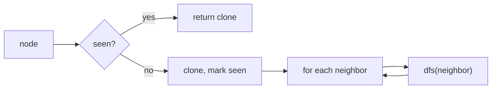

# DFS

> Part of [[README|20 DSA Patterns]] • `Coding Patterns/05_Trees_Graphs` • Pattern #13

## Intent
Explore as deep as possible before backtracking — the exhaustive search pattern for trees and graphs. Use recursion (implicit stack) or explicit stack + visited set. For trees, no visited set needed; for graphs, it prevents cycles.

## Why it Matters
- **Trees:** natural fit for all root-to-leaf paths, path sum, tree serialization.
- **Graphs:** `visited` set (or map for cloning) is mandatory — without it, cycles cause infinite recursion.
- **Clone Graph (LC 133):** DFS + hashmap `original → copy` is the canonical pattern. Hashmap serves as both visited check and copy cache.
- **Backtracking:** DFS with state restoration (choose → explore → unchoose) is the same recursion shape — see Backtracking pattern.
- Senior signal: knowing when to mark visited — *on entry* (pre-order) vs *on exit* (post-order). For graphs, mark on entry to prevent re-queueing.

## Diagram



## Problems

### 200. Number of Islands (Medium)
> [LeetCode 200](https://leetcode.com/problems/number-of-islands/) • Tags: Array, Depth-First Search, Breadth-First Search, Union-Find, Matrix

**Problem Statement:**

Given an m x n 2D binary grid grid which represents a map of '1's (land) and '0's (water), return the number of islands.

An island is surrounded by water and is formed by connecting adjacent lands horizontally or vertically. You may assume all four edges of the grid are all surrounded by water.

**Examples:**

Example 1:

Input: grid = [
  ["1","1","1","1","0"],
  ["1","1","0","1","0"],
  ["1","1","0","0","0"],
  ["0","0","0","0","0"]
]
Output: 1

Example 2:

Input: grid = [
  ["1","1","0","0","0"],
  ["1","1","0","0","0"],
  ["0","0","1","0","0"],
  ["0","0","0","1","1"]
]
Output: 3

---

### 133. Clone Graph (Medium)
> [LeetCode 133](https://leetcode.com/problems/clone-graph/) • Tags: Hash Table, Depth-First Search, Breadth-First Search, Graph Theory

**Problem Statement:**

Given a reference of a node in a connected undirected graph.

Return a deep copy (clone) of the graph.

Each node in the graph contains a value (int) and a list (List[Node]) of its neighbors.

class Node {
    public int val;
    public List<Node> neighbors;
}

 

Test case format:

For simplicity, each node's value is the same as the node's index (1-indexed). For example, the first node with val == 1, the second node with val == 2, and so on. The graph is represented in the test case using an adjacency list.

An adjacency list is a collection of unordered lists used to represent a finite graph. Each list describes the set of neighbors of a node in the graph.

The given node will always be the first node with val = 1. You must return the copy of the given node as a reference to the cloned graph.

**Examples:**

Example 1:

Input: adjList = [[2,4],[1,3],[2,4],[1,3]]
Output: [[2,4],[1,3],[2,4],[1,3]]
Explanation: There are 4 nodes in the graph.
1st node (val = 1)'s neighbors are 2nd node (val = 2) and 4th node (val = 4).
2nd node (val = 2)'s neighbors are 1st node (val = 1) and 3rd node (val = 3).
3rd node (val = 3)'s neighbors are 2nd node (val = 2) and 4th node (val = 4).
4th node (val = 4)'s neighbors are 1st node (val = 1) and 3rd node (val = 3).

Example 2:

Input: adjList = [[]]
Output: [[]]
Explanation: Note that the input contains one empty list. The graph consists of only one node with val = 1 and it does not have any neighbors.

Example 3:

Input: adjList = []
Output: []
Explanation: This an empty graph, it does not have any nodes.

---

### 113. Path Sum II (Medium)
> [LeetCode 113](https://leetcode.com/problems/path-sum-ii/) • Tags: Backtracking, Tree, Depth-First Search, Binary Tree

**Problem Statement:**

Given the root of a binary tree and an integer targetSum, return all root-to-leaf paths where the sum of the node values in the path equals targetSum. Each path should be returned as a list of the node values, not node references.

A root-to-leaf path is a path starting from the root and ending at any leaf node. A leaf is a node with no children.

**Examples:**

Example 1:

Input: root = [5,4,8,11,null,13,4,7,2,null,null,5,1], targetSum = 22
Output: [[5,4,11,2],[5,8,4,5]]
Explanation: There are two paths whose sum equals targetSum:
5 + 4 + 11 + 2 = 22
5 + 8 + 4 + 5 = 22

Example 2:

Input: root = [1,2,3], targetSum = 5
Output: []

Example 3:

Input: root = [1,2], targetSum = 0
Output: []

---


## Code / Example
```java
record TreeNode(int val, TreeNode left, TreeNode right) {}

// Binary tree: all root-to-leaf paths
void dfs(TreeNode node, String path, java.util.List<String> res) {
    if (node == null) return;
    path += node.val();
    if (node.left() == null && node.right() == null) res.add(path);
    else {
        dfs(node.left(), path + "->", res);
        dfs(node.right(), path + "->", res);
    }
}

// Graph: Clone Graph — LC 133
class Node { int val; java.util.List<Node> neighbors; Node(int v){ val=v; neighbors=new java.util.ArrayList<>(); } }

java.util.Map<Node, Node> seen = new java.util.HashMap<>();
Node cloneGraph(Node node) {
    if (node == null) return null;
    if (seen.containsKey(node)) return seen.get(node);
    var copy = new Node(node.val);
    seen.put(node, copy);
    for (var nb : node.neighbors) copy.neighbors.add(cloneGraph(nb));
    return copy;
}

// Grid DFS: Number of Islands — LC 200
int numIslands(char[][] grid) {
    if (grid.length == 0) return 0;
    int m = grid.length, n = grid[0].length, count = 0;
    for (int i = 0; i < m; i++)
        for (int j = 0; j < n; j++)
            if (grid[i][j] == '1') { dfsGrid(grid, i, j); count++; }
    return count;
}
void dfsGrid(char[][] g, int r, int c) {
    if (r < 0 || r >= g.length || c < 0 || c >= g[0].length || g[r][c] != '1') return;
    g[r][c] = '0'; // mark visited by sinking
    dfsGrid(g, r+1, c);
    dfsGrid(g, r-1, c);
    dfsGrid(g, r, c+1);
    dfsGrid(g, r, c-1);
}
```

## When to Use / When NOT
- **Use:** explore all paths; count connected components; topological sort; clone graph; path existence; "all solutions" problems.
- **NOT:** shortest path in unweighted graph (use BFS); level-order traversal (use BFS); very deep graphs (stack overflow — use iterative stack).

## Trade-offs
| Scenario | Time | Space |
|----------|------|-------|
| Tree | O(n) | O(h) recursion stack |
| Graph | O(V+E) | O(V) visited + recursion stack |

## Vs Table
| Aspect | DFS | BFS | Union Find |
|--------|-----|-----|------------|
| Finds | any path, all paths, components, topo order | shortest in hops, level order | connectivity queries only |
| Space | O(h) tree, O(V) graph | O(w) frontier | O(V) arrays |
| Cycles | needs visited set | needs visited set | detects undirected cycles via union |
| Pick when | exhaustive exploration, backtracking | shortest unweighted path, levels | many connectivity queries on growing graph |

## Pitfalls
- **Graph DFS without visited loops forever on cycles.** Mark visited *before* recursing (pre-order).
- Path string: copy or use `StringBuilder` + backtrack length. Forgetting to revert is a classic bug.
- Grid DFS: mark visited by writing to grid (`'1' → '0'`) or use `visited[][]` array. Don't allocate new objects per cell.
- For very deep trees (skewed), recursion hits stack overflow. Use iterative stack: `push(root); while(!stack.isEmpty()) { pop; push children; }`.

## Interview Q&A (Senior Depth)

**Q: Number of Islands (LC 200) — why modify the grid instead of a `visited` array?**
**A:** Modifying `grid[r][c] = '0'` marks visited in O(1) space (no extra `visited[][]`). It's destructive but acceptable for the problem. In production, you'd use a separate visited structure if the grid must be preserved. The space savings (O(1) extra vs O(mn)) is significant for large grids.

**Q: Clone Graph — why does the hashmap serve dual purpose (visited + cache)?**
**A:** When we see a node, we create its copy *immediately* and put it in the map. If we encounter the same node again (cycle or shared neighbor), the map returns the already-created copy. This handles both cycle prevention and identity preservation in one structure. Without the map, you'd need separate `visited` set + `original→copy` map.

**Q: Topological Sort via DFS — how does it work?**
**A:** DFS on DAG. When a node finishes (all neighbors processed), push to stack. Reverse stack = topological order. Proof: for edge u→v, v finishes before u (v is deeper), so v appears earlier in reversed order. Cycle detection: if you encounter a gray (in-progress) node, cycle exists.

**Q: Path Sum II (LC 113) — why copy path when adding to result?**
**A:** The `path` list is mutated during recursion (add before recurse, remove after). If you add the *reference* to results, all entries point to the same mutating list. `res.add(new ArrayList<>(path))` creates a snapshot. This is the "copy on success" pattern — same in all backtracking/DFS path collection.

## Related
- [[05_Trees_Graphs/01 - Binary Tree Traversal|Binary Tree Traversal]] (tree DFS)
- [[05_Trees_Graphs/03 - BFS|BFS]] (shortest unweighted)
- [[05_Trees_Graphs/06 - Union Find|Union Find]] (connectivity queries)
- [[07_Backtracking_DP/01 - Backtracking|Backtracking]] (DFS with state restoration)
- [[Java/07_DSA/Trees]] · [[Java/07_DSA/Graph]]

---
*Category: Coding Patterns/05_Trees_Graphs*
