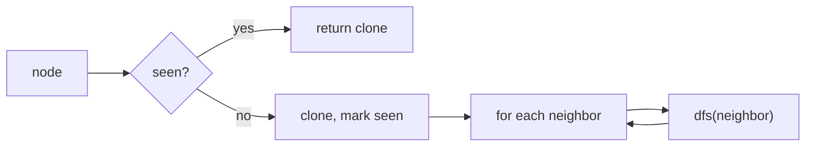

## Why it Matters

Go deep before backtracking. Use recursion (implicit stack) or an explicit stack plus a visited set. For trees no visited set is needed; for graphs it prevents cycles.

Example: root-to-leaf paths for `[1,2,3,null,5]` → DFS builds `"1->2->5"` then backtracks and builds `"1->3"`.

## Diagram


Recursion backtracks automatically when the call frame returns; the `seen` set is what stops a graph DFS from looping forever.

## Code

```java
record TreeNode(int val, TreeNode left, TreeNode right) {}

// Binary tree, all root-to-leaf paths
void dfs(TreeNode node, String path, java.util.List<String> res) {
 if (node == null) return;
 path += node.val();
 if (node.left() == null && node.right() == null) res.add(path);
 else {
 dfs(node.left(), path + "->", res);
 dfs(node.right(), path + "->", res);
 }
}

// Graph, clone graph LC 133
java.util.Map<Node,Node> seen = new java.util.HashMap<>();
Node clone(Node node) {
 if (node == null) return null;
 if (seen.containsKey(node)) return seen.get(node);
 var copy = new Node(node.val);
 seen.put(node, copy);
 for (var nb : node.neighbors) copy.neighbors.add(clone(nb));
 return copy;
}
```
DFS is natural with recursion. For very deep trees consider iterative stack to avoid stack overflow.

## When to use / not

- Explore all paths, count connected components, topological sort, clone graph, path existence

## Trade-offs

| time | space |
|---|---|
| O(V+E) for graph, O(n) for tree | O(h) tree, O(V) graph visited |

## Vs

| | DFS | BFS | Union find |
|---|---|---|---|
| finds | any path, all paths, components, topo order | shortest in hops, level order | connectivity queries only |
| space | O(h) tree, O(V) graph | O(w) frontier | O(V) arrays |
| cycles | needs a visited set | needs a visited set | detects undirected cycles via union |
| pick when | exhaustive exploration, backtracking | shortest unweighted path, levels | many connectivity queries on a growing graph |

## Pitfalls

- Graph DFS without visited loops forever on cycles.
- Copy path string or use `StringBuilder` and backtrack length; do not forget to revert.
- For grid DFS, mark visited by writing to the grid or a `visited[][]` array.

## Interview q&a

- [200. Number of Islands](https://leetcode.com/problems/number-of-islands/), DFS on grid
- [133. Clone Graph](https://leetcode.com/problems/clone-graph/)
- [113. Path Sum II](https://leetcode.com/problems/path-sum-ii/)

## Related

- [[Java/07_DSA/Trees]]
- [[Java/07_DSA/Graph]]

# Depth First Search

> Part of [[README|20 DSA Patterns]], Pattern #13
