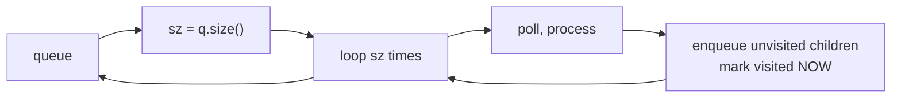

# BFS

> Part of [[README|20 DSA Patterns]] • `Coding Patterns/05_Trees_Graphs` • Pattern #14

## Intent
Explore level by level using a queue — the shortest-path-in-unweighted-graphs and level-order-traversal pattern. Capturing `queue.size()` at the start of each level is what makes a level a level.

## Why it Matters
- **Level order (LC 102):** `while (!q.isEmpty()) { int sz = q.size(); for (int i=0; i<sz; i++) { pop, process, enqueue children; } }` — the `sz` capture is the key.
- **Shortest path unweighted:** same loop, count steps instead of collecting levels. First time you reach target = shortest distance.
- **Word Ladder (LC 127):** bidirectional BFS from both ends cuts search space exponentially — `O(b^(d/2))` vs `O(b^d)`.
- **Visited timing:** mark visited **when enqueuing**, not when dequeuing — otherwise you enqueue the same node multiple times.
- Senior signal: bidirectional BFS for word ladder / shortest path in large graphs — two frontiers meeting in the middle.

## Diagram



## Problems

### 102. Binary Tree Level Order Traversal (Medium)
> [LeetCode 102](https://leetcode.com/problems/binary-tree-level-order-traversal/) • Tags: Tree, Breadth-First Search, Binary Tree

**Problem Statement:**

Given the root of a binary tree, return the level order traversal of its nodes' values. (i.e., from left to right, level by level).

**Examples:**

Example 1:

Input: root = [3,9,20,null,null,15,7]
Output: [[3],[9,20],[15,7]]

Example 2:

Input: root = [1]
Output: [[1]]

Example 3:

Input: root = []
Output: []

---

### 107. Binary Tree Level Order Traversal II (Medium)
> [LeetCode 107](https://leetcode.com/problems/binary-tree-level-order-traversal-ii/) • Tags: Tree, Breadth-First Search, Binary Tree

**Problem Statement:**

Given the root of a binary tree, return the bottom-up level order traversal of its nodes' values. (i.e., from left to right, level by level from leaf to root).

**Examples:**

Example 1:

Input: root = [3,9,20,null,null,15,7]
Output: [[15,7],[9,20],[3]]

Example 2:

Input: root = [1]
Output: [[1]]

Example 3:

Input: root = []
Output: []

---

### 127. Word Ladder (Hard)
> [LeetCode 127](https://leetcode.com/problems/word-ladder/) • Tags: Hash Table, String, Breadth-First Search, Bidirectional Search

**Problem Statement:**

A transformation sequence from word beginWord to word endWord using a dictionary wordList is a sequence of words beginWord -> s_1_ -> s_2_ -> ... -> s_k_ such that:

	Every adjacent pair of words differs by a single letter.
	Every s_i_ for 1 <= i <= k is in wordList. Note that beginWord does not need to be in wordList.
	s_k_ == endWord

Given two words, beginWord and endWord, and a dictionary wordList, return the number of words in the shortest transformation sequence from beginWord to endWord, or 0 if no such sequence exists.

**Examples:**

Example 1:

Input: beginWord = "hit", endWord = "cog", wordList = ["hot","dot","dog","lot","log","cog"]
Output: 5
Explanation: One shortest transformation sequence is "hit" -> "hot" -> "dot" -> "dog" -> cog", which is 5 words long.

Example 2:

Input: beginWord = "hit", endWord = "cog", wordList = ["hot","dot","dog","lot","log"]
Output: 0
Explanation: The endWord "cog" is not in wordList, therefore there is no valid transformation sequence.

---


## Code / Example
```java
record TreeNode(int val, TreeNode left, TreeNode right) {}

// Binary Tree Level Order — LC 102
java.util.List<java.util.List<Integer>> levelOrder(TreeNode root) {
    var res = new java.util.ArrayList<java.util.List<Integer>>();
    if (root == null) return res;
    var q = new java.util.ArrayDeque<TreeNode>();
    q.offer(root);
    while (!q.isEmpty()) {
        int sz = q.size();
        var level = new java.util.ArrayList<Integer>();
        for (int i = 0; i < sz; i++) {
            var cur = q.poll();
            level.add(cur.val());
            if (cur.left() != null) q.offer(cur.left());
            if (cur.right() != null) q.offer(cur.right());
        }
        res.add(level);
    }
    return res;
}

// Word Ladder — LC 127 (bidirectional BFS)
int ladderLength(String begin, String end, java.util.List<String> wordList) {
    var dict = new java.util.HashSet<>(wordList);
    if (!dict.contains(end)) return 0;
    var beginSet = new java.util.HashSet<String>();
    var endSet = new java.util.HashSet<String>();
    beginSet.add(begin);
    endSet.add(end);
    int len = 1;
    while (!beginSet.isEmpty() && !endSet.isEmpty()) {
        if (beginSet.size() > endSet.size()) { var tmp = beginSet; beginSet = endSet; endSet = tmp; }
        var nextSet = new java.util.HashSet<String>();
        for (String w : beginSet) {
            char[] ch = w.toCharArray();
            for (int i = 0; i < ch.length; i++) {
                char old = ch[i];
                for (char c = 'a'; c <= 'z'; c++) {
                    ch[i] = c;
                    String nw = new String(ch);
                    if (endSet.contains(nw)) return len + 1;
                    if (dict.contains(nw)) {
                        nextSet.add(nw);
                        dict.remove(nw);
                    }
                }
                ch[i] = old;
            }
        }
        beginSet = nextSet;
        len++;
    }
    return 0;
}

// Rotting Oranges — LC 994 (multi-source BFS)
int orangesRotting(int[][] grid) {
    int m = grid.length, n = grid[0].length;
    var q = new java.util.ArrayDeque<int[]>();
    int fresh = 0;
    for (int i = 0; i < m; i++)
        for (int j = 0; j < n; j++) {
            if (grid[i][j] == 2) q.offer(new int[]{i, j});
            else if (grid[i][j] == 1) fresh++;
        }
    int[][] dirs = {{1,0},{-1,0},{0,1},{0,-1}};
    int minutes = 0;
    while (!q.isEmpty() && fresh > 0) {
        int sz = q.size();
        while (sz-- > 0) {
            var cur = q.poll();
            for (int[] d : dirs) {
                int r = cur[0] + d[0], c = cur[1] + d[1];
                if (r >= 0 && r < m && c >= 0 && c < n && grid[r][c] == 1) {
                    grid[r][c] = 2;
                    fresh--;
                    q.offer(new int[]{r, c});
                }
            }
        }
        minutes++;
    }
    return fresh == 0 ? minutes : -1;
}
```

## When to Use / When NOT
- **Use:** shortest path in unweighted graph; level order; word ladder; rotting oranges; multi-source BFS; minimum steps / nearest.
- **NOT:** weighted graphs (use Dijkstra); all paths / exhaustive (use DFS); deep graphs with narrow width (DFS uses less space).

## Trade-offs
| Scenario | Time | Space |
|----------|------|-------|
| Tree / Graph | O(V+E) | O(V) for queue + visited |
| Bidirectional | O(b^(d/2)) | O(b^(d/2)) |

## Vs Table
| Aspect | BFS | DFS | Dijkstra (Weighted) |
|--------|-----|-----|---------------------|
| Shortest path | Yes, unweighted | No (a path, not shortest) | Yes, non-negative weights |
| Frontier | FIFO queue | LIFO stack | Priority queue by distance |
| Time | O(V+E) | O(V+E) | O((V+E) log V) |
| Memory | O(w) widest level | O(depth) | O(V) |
| Pick when | "minimum steps", "nearest", levels | "all paths", "can reach", backtracking | edge weights exist |

## Pitfalls
- **Save `q.size()` at start of each level.** Reading it inside the inner loop shifts the level boundary.
- **Mark visited when you enqueue**, not when you dequeue — otherwise the same node enters the queue multiple times.
- For bidirectional BFS, always expand the *smaller* frontier (`if (beginSet.size() > endSet.size()) swap`).
- Java 25: `ArrayDeque` is the queue. `record` for grid cell: `record Cell(int r, int c) {}`.

## Interview Q&A (Senior Depth)

**Q: Why does capturing `sz = q.size()` before the inner loop give correct level separation?**
**A:** At the start of a level, the queue contains exactly all nodes at that depth. The inner loop processes exactly those `sz` nodes. Children enqueued during the inner loop belong to the *next* level and won't be processed until the next outer iteration when `sz` is recalculated. Without capturing `sz`, the loop condition `i < q.size()` would grow as children are added, mixing levels.

**Q: Word Ladder — why bidirectional BFS? What's the complexity win?**
**A:** Standard BFS: `O(b^d)` where b = branching factor, d = distance. Bidirectional: two frontiers of depth `d/2` meet in middle → `O(b^(d/2) + b^(d/2)) = O(b^(d/2))`. Exponential speedup for large d. Always expand the smaller frontier to keep the branching factor minimal.

**Q: Rotting Oranges (LC 994) — why multi-source BFS instead of single-source per rotten orange?**
**A:** All rotten oranges rot simultaneously. Multi-source BFS (enqueue all rotten at start) processes them in parallel — first level = minute 1, second level = minute 2. Running BFS from each rotten separately would give sequential minutes, not parallel. The `minutes` counter increments once per level = per minute.

**Q: Can BFS find shortest path in a weighted graph if all weights are positive integers?**
**A:** No — BFS assumes unit weight per edge. For integer weights, you can "expand" each edge of weight w into w unit edges, but that blows up the graph. Dijkstra with priority queue is the correct generalization. BFS is Dijkstra with a FIFO queue (all distances equal).

## Related
- [[05_Trees_Graphs/02 - DFS|DFS]] (exhaustive exploration)
- [[05_Trees_Graphs/04 - Shortest Path|Shortest Path]] (weighted version)
- [[07_Backtracking_DP/01 - Backtracking|Backtracking]] (all solutions)
- [[Java/07_DSA/Trees]] · [[Java/07_DSA/Graph]] · [[Java/07_DSA/Heap]]

---
*Category: Coding Patterns/05_Trees_Graphs*
