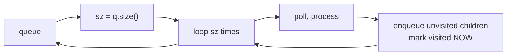

## Why it Matters

Explore level by level using a queue. Each pass processes one depth. Track level size to know when a layer ends. Example: `[1,2,3]` level order → queue starts `[1]` → process 1, queue `[2,3]` → process 2 and 3, done → `[[1],[2,3]]`.

For graphs, a visited set avoids revisiting.

## Diagram


Capturing `q.size()` before the inner loop is what makes a level a level, the queue keeps mutating while you drain it.

## Code

```java
record TreeNode(int val, TreeNode left, TreeNode right) {}

java.util.List<java.util.List<Integer>> levelOrder(TreeNode root) {
 var res = new java.util.ArrayList<java.util.List<Integer>>();
 if (root == null) return res;
 var q = new java.util.ArrayDeque<TreeNode>();
 q.offer(root);
 while (!q.isEmpty()) {
 int sz = q.size();
 var level = new java.util.ArrayList<Integer>();
 for (var i = 0; i < sz; i++) {
 var cur = q.poll();
 level.add(cur.val());
 if (cur.left() != null) q.offer(cur.left());
 if (cur.right() != null) q.offer(cur.right());
 }
 res.add(level);
 }
 return res;
}

// Unweighted shortest path, same loop, count steps instead of collecting levels
```
Java 25 `ArrayDeque` is the queue. `var` keeps declarations short.

## When to use / not

- Shortest path in unweighted graph, level order, word ladder, rotting oranges, minimum steps

## Trade-offs

| time | space |
|---|---|
| O(V+E) | O(V) for queue and visited |

## Vs

| | BFS | DFS | Dijkstra (weighted analog) |
|---|---|---|---|
| shortest path | yes, unweighted | no (a path, not shortest) | yes, non-negative weights |
| frontier | FIFO queue | LIFO stack | priority queue by distance |
| time | O(V+E) | O(V+E) | O((V+E) log V) |
| memory | O(w) widest level | O(depth) | O(V) |
| pick when | "minimum steps", "nearest", levels | "all paths", "can reach", backtracking | edge weights exist |

## Pitfalls

- Save `q.size()` at start of each level. Do not read it inside the inner loop or the level boundary shifts.
- Mark visited when you enqueue, not when you dequeue, or you enqueue the same node many times.

## Interview q&a

- [102. Binary Tree Level Order Traversal](https://leetcode.com/problems/binary-tree-level-order-traversal/)
- [107. Binary Tree Level Order Traversal II](https://leetcode.com/problems/binary-tree-level-order-traversal-ii/)
- [127. Word Ladder](https://leetcode.com/problems/word-ladder/)

## Related

- [[Java/07_DSA/Trees]]
- [[Java/07_DSA/Graph]]

# Breadth First Search

> Part of [[README|20 DSA Patterns]], Pattern #14
