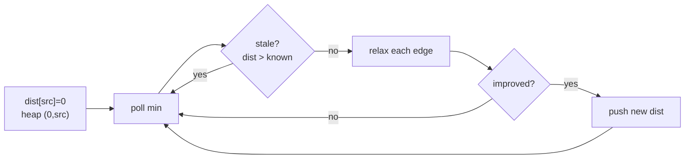

## Why it Matters

Weighted graph, need cheapest distance between nodes. Two main tools: Dijkstra for non-negative weights (greedy plus min-heap), Bellman-Ford for negative weights (detects negative cycles). Example: edges `2→1(1), 2→3(1), 3→4(1)` from source `2` → distances `1:1, 2:0, 3:1, 4:2`, max is `2`.

BFS works only when every edge costs the same.

## Diagram


The stale-entry skip is not optional hygiene: without it, each node is reprocessed once per heap entry instead of once.

## Code

```java
record Edge(int to, int w) {}
record State(int dist, int node) {}

// Dijkstra, LC 743 Network Delay Time
int[] dijkstra(int n, java.util.List<java.util.List<Edge>> g, int src) {
 var dist = new int[n];
 java.util.Arrays.fill(dist, Integer.MAX_VALUE);
 dist[src] = 0;
 var pq = new java.util.PriorityQueue<State>((a,b) -> a.dist() - b.dist());
 pq.offer(new State(0, src));
 while (!pq.isEmpty()) {
 var cur = pq.poll();
 if (cur.dist() > dist[cur.node()]) continue; // stale
 for (var e : g.get(cur.node())) {
 int nd = cur.dist() + e.w();
 if (nd < dist[e.to()]) {
 dist[e.to()] = nd;
 pq.offer(new State(nd, e.to()));
 }
 }
 }
 return dist;
}
```
Use `long` for distances if weights are large. Skip stale heap entries or you process outdated distances many times.

## When to use / not

- Minimum cost, network delay, cheapest flight with k stops, any "weighted shortest" phrasing
- Keywords: "shortest", "minimum cost", "weighted graph", "network delay"

## Trade-offs

| algorithm | time | when |
|---|---|---|
| Dijkstra with heap | O((V+E) log V) | weights >= 0 |
| Bellman-Ford | O(VE) | negative weights, detect cycle |
| BFS | O(V+E) | unweighted only |

## Vs

| | Dijkstra | Bellman-Ford | Floyd-Warshall | BFS |
|---|---|---|---|---|
| weights | non-negative | any, detects negative cycles | any | unit only |
| solves | single source | single source | all pairs | single source, unweighted |
| time | O((V+E) log V) | O(VE) | O(V³) | O(V+E) |
| pick when | standard weighted shortest | negative weights or k-hop limit | dense graph, every pair | no weights at all |

## Pitfalls

- Dijkstra breaks with negative weights. Switch to Bellman-Ford.
- 0-index vs 1-index graph building is a common off-by-one.
- For "k stops" the edge count matters, not just cost, Bellman-Ford style relaxation per stop is used.

## Interview q&a

- [743. Network Delay Time](https://leetcode.com/problems/network-delay-time/)
- [787. Cheapest Flights Within K Stops](https://leetcode.com/problems/cheapest-flights-within-k-stops/)
- [1334. Find the City With the Smallest Number of Neighbors](https://leetcode.com/problems/find-the-city-with-the-smallest-number-of-neighbors-at-a-threshold-distance/)

## Related

- [[Java/07_DSA/Graph]]
- [[Java/07_DSA/Heap]]

# Shortest Path

> Part of [[README|20 DSA Patterns]], Pattern #15
